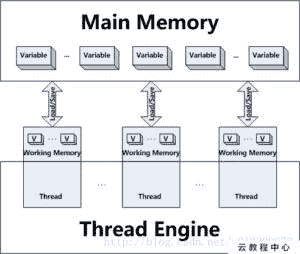
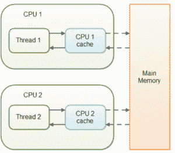

# Java `volatile`示例

> 原文： [https://javatutorial.net/java-volatile-example](https://javatutorial.net/java-volatile-example)

在本教程中，我们将讨论 Java volatile 示例。

## 什么是 Java `volatile`？

Java volatile 关键字用于检查 Java 变量是否为“被存放在基本内存中”。 更具决定性的意义是，将无法从 PC 的主内存中读取每次无法预测的变量，而不是从 CPU 储备中读取，并且每次与不稳定变量保持联系都将与基本内存保持联系，而不是 只需到 CPU 存储。

实际上，由于 Java 5，不稳定的标语确保了除了不可预测因素之外还可以从基本内存中读取内容。 我将在随附领域中对此进行澄清。

## 如何在 Java 中使用`volatile`关键字？

什么是 Java 中的 volatile 变量？何时使用 Java 中的 volatile 变量是 Java 访谈中众所周知的多字符串查询问题？ 尽管有许多软件工程师认识到什么是易失性变量，但是他们在第二部分进行了轰炸，例如在 Java 中利用易失性变量的地方很少，因为在 Java 中很少有明确的理解和动手操作的易失性。 在本教学练习中，我们将通过简单说明 Java 中 volatile 变量的情况并检查何时使用 Java 中的 volatile 变量来解决此漏洞。 无论如何，Java 中不可预测的流行语被用作指向 Java 编译器和 Thread 的指针，这些编译器和 Thread 不存储该变量的估计值，而可靠地从主内存中仔细研究了该变量。 因此，如果您需要共享任何因执行而导致读写活动至关重要的因素，例如细读和写 int 或布尔变量，则可以将它们声明为 volatile 变量。

除了 Java 5 以及诸如自动装箱，枚举，泛型和变量争用之类的实际更改之外，Java 还在 Java 内存模型（JMM）中进行了一些调整，从而确保了感知从一个字符串到另一个字符串产生的更改的可能性，就像“以前发生过的事情”一样，它照顾了 出现在一个字符串中的内存组合问题可能“溢出”并被另一字符串看到。

Java volatile 关键字不能与策略或类一起使用，而必须与变量一起使用。 Java volatile 关键字同样确保可感知性和请求，在 Java 5 与任何不稳定变量保持联系之后，再对不稳定变量进行任何读取。 通过 volatile 关键字的路由利用，同样可以预期编译器或 [JVM](https://javatutorial.net/jvm-explained) 从代码的重新排序或移动而不会从同步边界结束它们。

```java
/**
 * Java program to demonstrate where to use Volatile keyword in Java.
 * In this example Singleton Instance is declared as volatile variable to ensure
 * every thread see updated value for _instance.
 * 
 * @author Javin Paul
 */
public class Singleton{
private static volatile Singleton _instance; //volatile variable 

public static Singleton getInstance(){

   if(_instance == null){
            synchronized(Singleton.class){
              if(_instance == null)
              _instance = new Singleton();
            }

   }
   return _instance;

}
```

**当您谨慎地仔细阅读代码时，您可能会发现：**

1）我们只是做一个案例

2）在主要招募的季节来临时，使我们昏昏欲睡。

如果我们不使 _instance 变量变得比 Thread 更易变，这使 Singleton 无法传递其他字符串，那么这种情况一直到它离开 [Singleton](https://javatutorial.net/java-singleton-design-pattern-example) 正方形为止，所以如果 Thread 一个正在处理的 Singleton 情况，在创建后不久就失去了 CPU，所有其他字符串可能不会观察到 _instance 的估计为无效，因此他们会相信 _instance 仍然无效。



Java volatile 示例

为什么？ 由于 Peruser 字符串不做任何保留，并且在作者字符串离开同步的正方形之前，内存不会同步，并且 _instance 的估计在原则上不会刷新。 使用 Java 中的 Volatile 关键字，此问题由 Java 自己负责，并且所有用户字符串均会注意到这种更新。

因此，在摘要中，与 Java 中的同步流行语分开，另外使用 volatile 关键字在字符串之间传递内存的内容。

## `volatile`可见性问题

Java 不稳定的流行语确保跨字符串的因素变化的可感知性。 这听起来可能有些消化，所以给我一个扩展的机会。

在字符串处理不稳定因素的多线程应用程序中，由于执行原因，每个字符串可能会将基本存储器中的因素复制到 CPU 存储中，同时又将它们切掉。 如果您的 PC 包含一个以上的 CPU，则每个字符串可能会在另一个 CPU 上继续运行。 这意味着，每个字符串可能会将这些因素复制到各种 CPU 的 CPU 储备中。 如图所示：



Java volatile 示例

由于存在非易失性因素，因此没有关于 [Java 虚拟机（JVM）](https://javatutorial.net/jvm-explained)何时将基本存储器中的信息细读到 CPU 存储中或将信息从 CPU 保留区组成的信息写入主存储器的证明。 这可能会引起一些问题，我将在随附的区域中予以澄清。

设想一种情况，其中至少两个字符串接近共同的文章，其中包含以这种方式宣布的反因素：

```java
public class SharedObject {

    public int counter = 0;

}
```