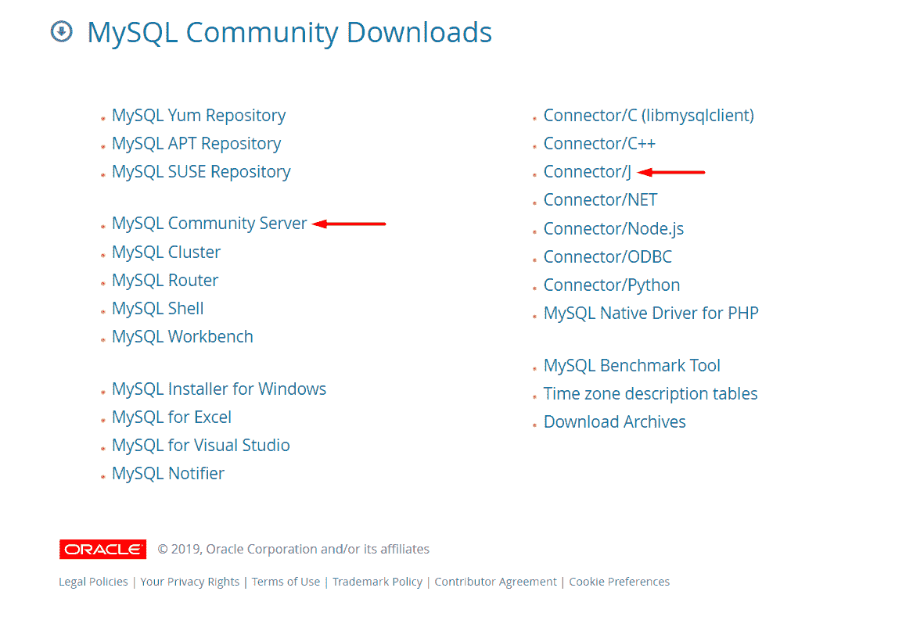
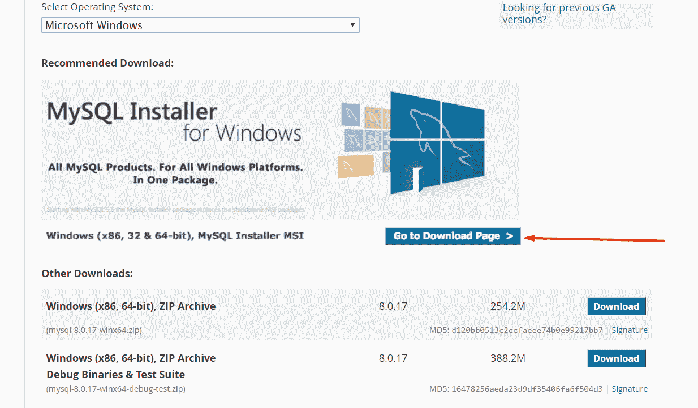
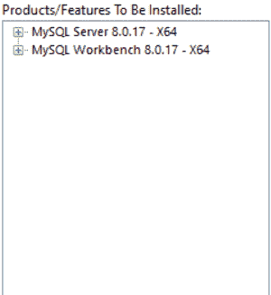
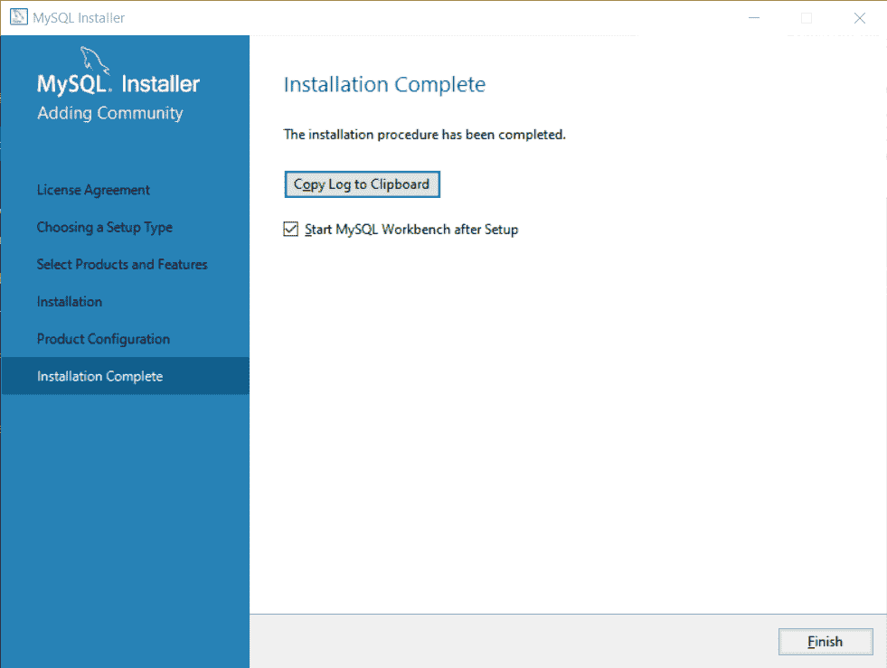
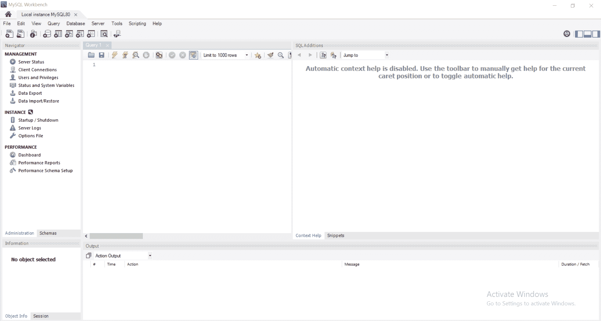

# 安装和配置 MySQL 数据库和服务器以供 Spring 使用

> [https://javatutorial.net/installing-and-configuring-mysql-database-and-server-for-spring-usage](https://javatutorial.net/installing-and-configuring-mysql-database-and-server-for-spring-usage)

在本教程的最后，您将安装在 Spring 中开发应用程序所需的正确的 MySQL 产品。 您将需要两件事：MySQL 数据库和 MySQL 服务器。 请按照以下步骤操作。

## 配置 MySQL 数据库

访问 [https://www.mysql.com/downloads/](https://www.mysql.com/downloads/) ，然后选择“社区下载”，如下所示：

社区下载 MySQL

在下一页上，您将看到许多列表。 我们感兴趣的是 **MySQL Community 服务器**和 **Connector / J** ，其中 J 代表 Java。

社区服务器和 Java 开发 MySQL

## 配置 MySQL 服务器

从下载页面单击 MySQL Community Server 之后，您可以看到不同的安装选项。 选择您的选项并下载。 如果要下载 MSI 安装程序，请单击“转到下载页面”：

然后，在下一页上，选择 mysql-installer-community：

这将下载一个可执行文件。 下载完成后，双击文件，您将看到安装界面。 接受许可条款和条件后，您将看到子窗口“ **选择安装类型**”。 单击“自定义”，因为我们不需要所有 MySQL 产品。 更具体地说，我们只需要“ MySQL Server – X64”和“ MySQL Workbench – X64”。

在“安装”子窗口上，单击“执行”以开始安装。

安装向导中的下一步是选择服务器配置。 这可能包括添加用户，设置密码和密码。 尽可能使用默认说明。

选择所有配置选项后，您将看到一个带有“执行”按钮的子窗口。 单击它继续。

之后，只需单击“完成”。 您将具有“安装后启动 MySQL 工作台”选项，这意味着当您单击“完成”时，它将启动工作台。

所以你去了！ 您已成功将 MySQL 数据库和 MySQL 服务器安装到计算机上。 这是 MySQL Workbench 的样子：

MySQL 工作台界面

您可以尝试运行一个简单的查询，看看它是如何工作的。