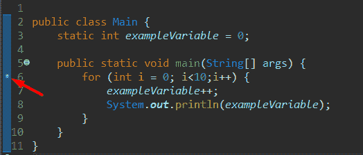
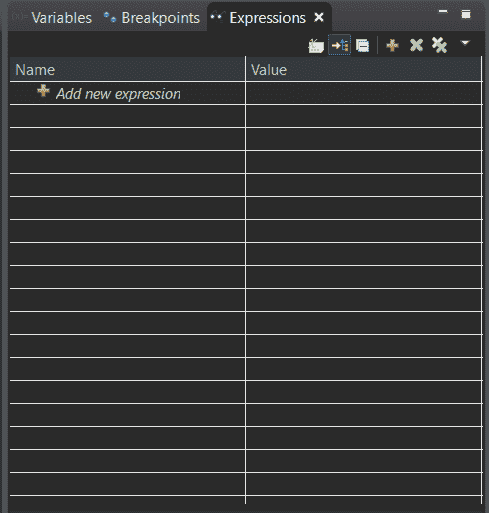
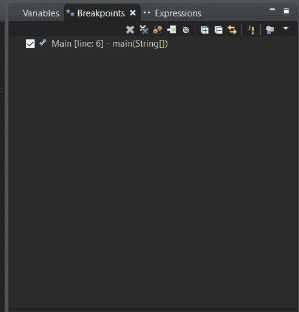
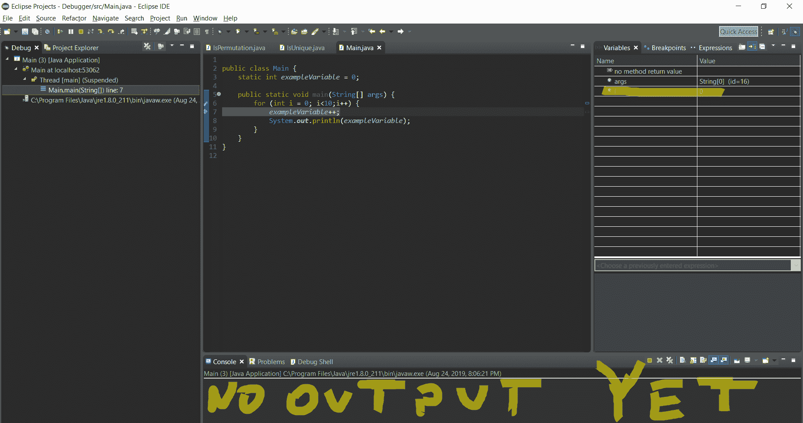
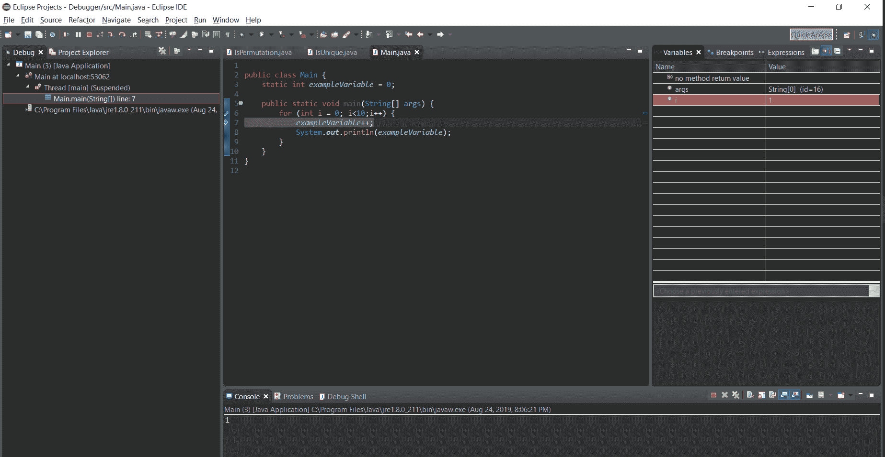
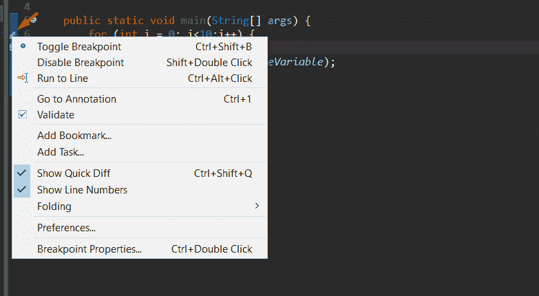
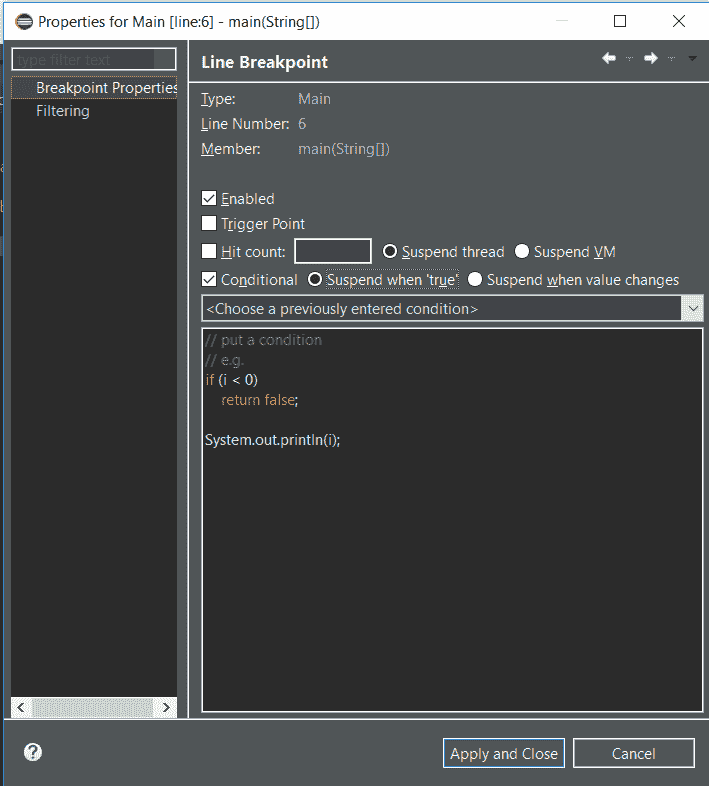

# 如何使用 Eclipse 调试 Java

> 原文： [https://javatutorial.net/how-to-debug-java-with-eclipse](https://javatutorial.net/how-to-debug-java-with-eclipse)

调试–一种使用最多且不可避免的技术。 如果只有一种工具可以使我们使这个有时繁琐的任务变得更加轻松和不那么繁琐……等等。 有。

Eclipse 允许在所谓的 **Debug 模式**中启动 Java 程序。 最有用的是它允许您使用调试命令来控制执行流程。

您可以设置行断点，条件断点和/或异常断点。

## 开始调试过程

要在代码中初始化一个断点，请在 Java 编辑器中右键单击左边界，然后选择 Toggle Breakpoint，，如下所示：

您还可以做的是（我想这是一种较快的方法）再次双击左边缘（红色箭头指向的位置）。 无论哪种方法适合您，它们都是完全相同的方法。

就我而言，我在 for 循环的开头添加了一个断点：

现在是时候在“调试”模式下运行程序了。 有 3 种方法：

*   单击主菜单中的“运行”命令，然后选择“调试”
*   按 F11
*   单击顶部面板上的类似 bug 的图标，然后选择“调试为 Java 应用程序”

请注意，要调试程序，您需要定义断点。

从上方的图片中选择“ Java 应用程序”后，将提示此屏幕。 单击确定。

之所以会调用此窗口，是因为 Eclipse 想知道在到达停止点后是否要切换到 Debug 透视图。 点击“切换”。

## 控制调试过程

您将在顶部面板上找到按钮，这些按钮的目的是帮助您控制决定调试的程序的执行。

但是，您也可以使用以下键绑定：
：此按钮的作用是恢复程序的执行，直到到达下一个断点。**（F8）**

：终止当前正在运行的服务器，而不是蚀**（CTRL + F2）**

：执行当前突出显示的行并跳过下一行。 重要的是要注意，如果当前突出显示的行是函数调用，则调试器将进入功能**（F5）**

：执行一种方法，而调试器实际上不会进入该方法，也称为“跳过” **（F6）**

：完成当前方法的执行并跳回到该方法的调用者。**（F7）**

#### 调试视图

#### 变量&表达式视图

这些视图提供了已声明变量及其关联值的展示。

#### 断点视图

它基本上执行其名称，即显示所有断点。 就我而言，我只有 1 个断点，恰好在第 6 行。

#### 控制台视图

使用此视图，您可能已经很熟悉–这是程序的实际输出。

### 使用这些视图的简单示例

从上面的代码的第 6 行开始（从 for 循环开始），单击 F5 后，我们得到以下结果：

因此，点击 F5 后，我们进入循环（第 7 行），如果您查看“变量”视图，则会看到“ i”已初始化为 0（第 6 行）。

现在，让我们再次单击 F5。

没什么变化，因为我们在 exampleVariable 中添加了 1，仅此而已。 现在我们在第 8 行，让我们单击 F5 看看会发生什么。

我们得到了第一输出！ 那是因为我们运行了 System.out.println（）语句。 当我按 F5 键时，您认为现在会发生什么？

如果您说“ i”将更改为 1，那么您将是对的！ 您可以在右侧看到“ i”随着其值的变化而突出显示。

那是调试的基本过程。

让我们看一下 Eclipse 的调试器工具提供的更多功能。

## 观察点

与断点不同，观察点用于在文件字段的值发生更改（不指定要更改）时停止执行复制。

您可以通过在“断点属性”中指定监视点来轻松启用监视点。 要访问断点属性，请右键单击您在代码左侧放置的断点，然后选择“断点属性”，如下所示：

然后，您有两个选择。 您可以勾选“视情况而定”，然后选择“在'true'时暂停”或“在值更改时暂停”。 甚至，您可以在下面的空间中指定一个条件，如果条件为 true，它将终止终止。

这些称为“条件断点”。