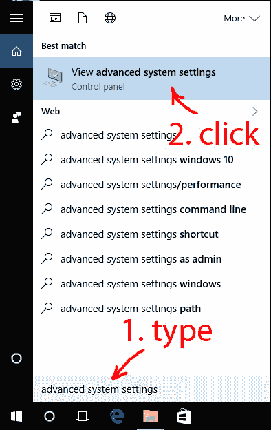
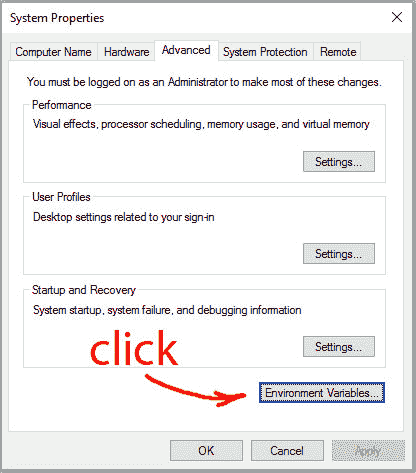

# 如何在 Windows 10 中设置`JAVA_HOME`

> 原文： [https://javatutorial.net/set-java-home-windows-10](https://javatutorial.net/set-java-home-windows-10)

在本教程中，我将向您展示如何**在 **Windows 10** 操作系统中将 JAVA_HOME** 设置为环境变量。

## 为什么需要设置`JAVA_HOME`？

许多基于 Java 的程序（例如 Tomcat）都要求将 JAVA_HOME 设置为环境变量才能正常工作。 请注意 JAVA_HOME 应该指向一个 JDK 目录而不是 JRE 目录。 设置环境变量的目的是让程序知道可以在其中找到诸如 javac 之类的目录可执行文件。

## 1.打开高级系统设置

在 Windows 10 中，按 Windows 键+暂停键，这将打开“系统设置”窗口。 转到`Change settings`并选择`Advanced`标签。

**或者：**

打开“ Windows 搜索” –您会在 Windows 徽标旁边找到它


打开 Windows 10 搜索

1.在搜索字段中输入– `advanced system settings`

2.单击列表顶部的匹配项



在 Windows 10 中搜索高级系统设置

## 2.设置`JAVA_HOME`环境变量

在“系统属性窗口”中，单击“环境变量...”



系统属性窗口环境变量

在“系统变量”下，单击“新建…”按钮，然后输入 JAVA_HOME 作为“变量名称”，并在“变量值”下输入 Java JDK 目录的路径。


将 JAVA_HOME 添加为系统变量

## 3.更新系统路径

1.在“环境变量”窗口的“系统变量”下，选择路径

2.点击“编辑...”

3.在“编辑环境变量”窗口中，单击“新建”

4.输入`%JAVA_HOME%\bin`


更新系统路径

## 4.测试您的配置

打开一个新的命令提示符，然后键入：

```java
echo %JAVA_HOME%
```

如果环境变量设置不正确，它将打印出目录 JAVA_HOME 指向的目录或为空行

现在输入：

```java
javac -version
```

如果正确设置了 Path 变量或“无法将 javac 识别为内部或外部命令…”，则将打印出 Java 编译器的版本…否则为


测试 JAVA_HOME 和系统路径