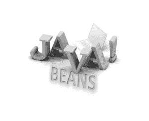
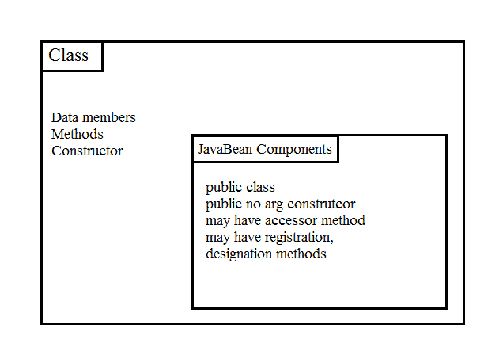

# JavaBeans 及其组件简介

> 原文： [https://javatutorial.net/introduction-javabeans-components](https://javatutorial.net/introduction-javabeans-components)

本教程介绍了 JavaBeans 的基础知识，其组件以及 JavaBeans 的帮助方式。

## 简介

软件组件模型中最重要的主题之一是可重用性。 在“一次开发，在任何地方运行和重用它们”的主题下编写自包含软件是最需要和赞赏的。 因此，借助于 JavaBeans，可重用性被添加到 Java 编程语言中。

## 什么是 JavaBean？

JavaBeans 由 Sun Microsystem 于 1996 年引入，其定义为

**“ JavaBean 是可重用的，平台无关的组件，可以在构建器工具中直观地对其进行操作。”**

在计算中，基于 Java 平台的 JavaBean 是将许多对象封装为单个对象（bean）的类。 使用 Builder 工具，您可以创建和使用 bean 来进行应用程序开发。 简单来说，JavaBean 就是 Java 类。 在其他应用程序中使用这些 JavaBean 时，这些组件的内部工作对应用程序开发人员来说是隐藏的。

**示例：**

所有的 Swing 和 AWT 类都是 JavaBean。 GUI 组件是理想的 JavaBean。



JavaBean

## JavaBeans 的组件

包含 bean 定义的类称为 JavaBeans 组件。 这些类遵循某些设计约定。 它包括属性，事件，方法和持久性。 有两种类型的组件，基于 GUI 和非基于 GUI。 例如，JButton 是组件的示例，而不是类。

**属性（日期成员）：**属性是 Bean 的命名属性，它包括颜色，标签，字体，字体大小，显示大小。 它确定 bean 的外观，行为和状态。

**方法：** JavaBean 中的方法与类中的常规 Java 方法相同。 它没有遵循任何特定的命名约定。 所有属性都应具有 accessor 和 getter 方法。

**事件：JavaBean 中的**事件与 SWING / AWT 事件处理相同。

**持久性：**可序列化的接口使 JavaBean 可以存储其状态。

JavaBean 没有参数构造函数。



JavaBean 组件

## JavaBeans 属性

对象的用户可以访问 JavaBean 属性，它可以被读取，写入，只读或仅写入。 我们可以借助在 bean 的实现类中编写的 getPropertyName（）方法（也称为 getter 或 accessor）和 setPropertyName（）方法（即 setter）来访问这些 JavaBeans 属性。

**GetPropertyName（）：**例如，如果属性名称为标题，则您的方法名称为 geTitle（）。

**SetPropertyName（）：**例如，如果属性名称为标题，则您的方法名称将为 setTitle（）。

## JavaBeans 的示例

在编写 JavaBean 之前，这里有一些基本规则。 JavaBean 应该是公共的，应该没有参数默认构造函数，并且应该实现可序列化的接口。 在编写 JavaBean 之前，请牢记这些基本规则。

这是 JavaBean 的简单示例。

```java
public class BankAccount implements java.io.Serializable {

		   private String accountNumber = null;
		   private String totalAmount = null; 
		   private String accountHolderName = null;
		   private int accountHolderAge = 0;
		   private String accountHolderAddress = null;

		public String getAccountNumber() {
			return accountNumber;
		}
		public void setAccountNumber(String accountNumber) {
			this.accountNumber = accountNumber;
		}
		public String getTotalAmount() {
			return totalAmount;
		}
		public void setTotalAmount(String totalAmount) {
			this.totalAmount = totalAmount;
		}
		public String getAccountHolderName() {
			return accountHolderName;
		}
		public void setAccountHolderName(String accountHolderName) {
			this.accountHolderName = accountHolderName;
		}
		public int getAccountHolderAge() {
			return accountHolderAge;
		}
		public void setAccountHolderAge(int accountHolderAge) {
			this.accountHolderAge = accountHolderAge;
		}
		public String getAccountHolderAddress() {
			return accountHolderAddress;
		}
		public void setAccountHolderAddress(String accountHolderAddress) {
			this.accountHolderAddress = accountHolderAddress;
		}	  

}

```

## JavaBeans 的优点

以下是 JavaBeans 的一些优点：

*   在不同环境中的可重用性。
*   用于创建小程序，servlet，应用程序或其他组件。
*   JavaBeans 是动态的，可以自定义。
*   可以部署在网络系统中

这是源代码的链接，您可以从[此处](https://github.com/NeelumAyub/Tutorials/tree/master/JavaBeanExample)下载