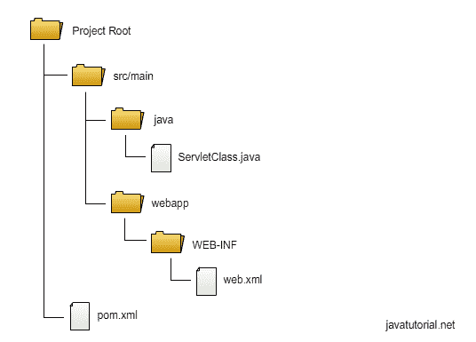
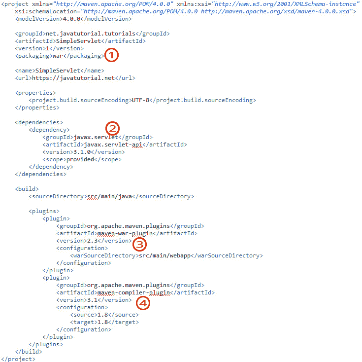
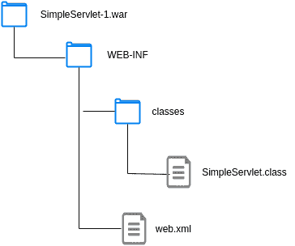

# Java Servlet 示例

> 原文： [https://javatutorial.net/java-servlet-example](https://javatutorial.net/java-servlet-example)

在本教程中，我将向您展示如何创建 Servlet 并将其部署在 [Apache Tomcat 8](https://javatutorial.net/run-tomcat-from-eclipse) 中

## 什么是 Servlet？

Servlet 是几乎每个 Java Web 应用程序的构建块。 它们提供了接受 HTTP 请求并将 HTTP 响应返回给用户的核心功能。 即使您使用 JSP 来构建网页，JSP 文件最终还是会被应用服务器或 Web 容器（例如 Glassfish 或 Tomcat）编译为 Servlet。 Servlet 对于您的 Web 容器完成其工作，服务 GET，POST，HEAD，PUT，DELETE，OPTIONS 和 TRACE 请求并向 Web 客户端返回响应至关重要。 您最可能熟悉 GET 和 POST 请求。 我强烈建议您花些时间阅读上面列出的其他类型的请求。 如果您还不了解它们，请立即阅读本文 [https://www.w3.org/Protocols/rfc2616/rfc2616-sec9.html](https://www.w3.org/Protocols/rfc2616/rfc2616-sec9.html) 。

## Servlet 项目结构

在我们的第一个示例中，我们将构建一个简单的 Servlet，在您的浏览器中打印消息“ Hello world”，这不是很简单。 我们将使用 Maven 构建项目。 我们将创建一个 Servlet 类和一个`web.xml`文件。 `web.xml`文件也称为部署描述符，它向 Web 容器提供有关如何处理 servlet 的信息。 将其视为配置文件。 下图显示了我们项目的文件结构



项目文件结构

您可以在 GitHub [https://github.com/JavaTutorialNetwork/Tutorials/tree/master/SimpleServlet](https://github.com/JavaTutorialNetwork/Tutorials/tree/master/SimpleServlet) 中找到我们 Servlet 示例的完整源代码。

## 项目 POM 文件

我们的 Servlet 项目的 maven 构建`pom.xml`文件如下所示：

```java
<project xmlns="http://maven.apache.org/POM/4.0.0" xmlns:xsi="http://www.w3.org/2001/XMLSchema-instance"
	xsi:schemaLocation="http://maven.apache.org/POM/4.0.0 http://maven.apache.org/xsd/maven-4.0.0.xsd">
	<modelVersion>4.0.0</modelVersion>

	<groupId>net.javatutorial.tutorials</groupId>
	<artifactId>SimpleServlet</artifactId>
	<version>1</version>
	<packaging>war</packaging>

	<name>SimpleServlet</name>
	<url>https://javatutorial.net</url>

	<properties>
		<project.build.sourceEncoding>UTF-8</project.build.sourceEncoding>
	</properties>

	<dependencies>
		<dependency>
			<groupId>javax.servlet</groupId>
			<artifactId>javax.servlet-api</artifactId>
			<version>3.1.0</version>
			<scope>provided</scope>
		</dependency>
	</dependencies>

	<build>
		<sourceDirectory>src/main/java</sourceDirectory>

		<plugins>
			<plugin>
				<groupId>org.apache.maven.plugins</groupId>
				<artifactId>maven-war-plugin</artifactId>
				<version>2.3</version>
				<configuration>
					<warSourceDirectory>src/main/webapp</warSourceDirectory>
				</configuration>
			</plugin>
			<plugin>
				<groupId>org.apache.maven.plugins</groupId>
				<artifactId>maven-compiler-plugin</artifactId>
				<version>3.1</version>
				<configuration>
					<source>1.8</source>
					<target>1.8</target>
				</configuration>
			</plugin>
		</plugins>
	</build>
</project>

```

让我们拆解`pom`文件，看一下重要的东西：

1.  我们需要将包装设置为`war`。 Tomcat 中的 Web 应用程序打包到 WAR 文件（Web 归档文件）中，封装了该应用程序的所有数据。 WAR 文件的名称基于您在 maven pom 文件中设置的`arifactId`和`version`参数建立。 在这种情况下，我们的 WAR 文件的名称为`SimpleServlet-1.war`
2.  我们创建 servlet 所需的依赖关系为`javax.servlet-api`。 我们将范围设置为“已提供”，因为 Tomcat 已经内置了所需的所有库。
3.  我们需要 Maven WAR 插件才能创建 WAR 文件
4.  在 WAR 插件的编译器部分中设置 1.8。 这意味着将使用 Java 8 编译类



## 简单的 Servlet 示例

让我们看一个非常基本的 servlet 的源代码，在 Web 浏览器中打印消息“ Hello World！”。

```java
package net.javatutorial.tutorials;

import java.io.IOException;

import javax.servlet.ServletException;
import javax.servlet.http.HttpServlet;
import javax.servlet.http.HttpServletRequest;
import javax.servlet.http.HttpServletResponse;

public class SimpleServlet extends HttpServlet {

	private static final long serialVersionUID = -4751096228274971485L;

	@Override
	protected void doGet(HttpServletRequest reqest, HttpServletResponse response) 
			throws ServletException, IOException {
		response.getWriter().println("Hello World!");
	}

	@Override
	public void init() throws ServletException {
		System.out.println("Servlet " + this.getServletName() + " has started");
	}

	@Override
	public void destroy() {
		System.out.println("Servlet " + this.getServletName() + " has stopped");
	}

}

```

所有 servlet 都需要扩展抽象类 HttpServlet。 HttpServlet 提供了构建 HTTP 响应的所有方法-我们在这里所做的是重写某些方法以放置我们自己的逻辑。

当客户端（浏览器）向我们的 Servlet 发出 GET 请求时，将执行 **doGet** 方法。 在我们的示例中，它将仅返回文本响应“ Hello World！”。

当 Web 容器首次启动 servlet 时，将一次调用 **init（）**方法。 这发生在应用程序部署或第一次调用此 servlet 时。 初始化方法可用于设置数据库连接或其他耗时的初始化操作。

当 Web 容器终止 Servlet 时，将调用 **destroy（）**方法。 我们可以使用这种方法来关闭与数据库或其他开放资源的连接。

## 创建 web.xml 部署描述符

`web.xml`文件用于告诉 Web 容器如何处理 Web 应用程序中的文件。 将其视为配置文件。

```java
<?xml version="1.0" encoding="UTF-8"?>

<web-app xmlns="http://xmlns.jcp.org/xml/ns/javaee" 
	xmlns:xsi="http://www.w3.org/2001/XMLSchema-instance"
	xsi:schemaLocation="http://xmlns.jcp.org/xml/ns/javaee http://xmlns.jcp.org/xml/ns/javaee/web-app_3_1.xsd"
	version="3.1">

	<display-name>Simple Servlet Application</display-name>

	<servlet>
		<servlet-name>simpleServlet</servlet-name>
		<servlet-class>net.javatutorial.tutorials.SimpleServlet</servlet-class>
		<load-on-startup>1</load-on-startup>
	</servlet>

	<servlet-mapping>
		<servlet-name>simpleServlet</servlet-name>
		<url-pattern>/hello</url-pattern>
	</servlet-mapping>

</web-app>
```

**显示名称**该应用程序将在 Tomcat 管理器中以该名称列出。 阅读本教程，学习[如何配置 Tomcat 管理器](https://javatutorial.net/how-to-install-and-configure-tomcat-8)和[如何使用 Tomcat 管理器](https://javatutorial.net/how-to-deploy-and-undeploy-applications-in-tomcat)部署应用程序。

**&lt; Servlet &gt;** 标签保存了我们 Servlet 的配置。 **&lt; Servlet 名称&gt;** 是我们 Servlet 的别名，用于在`web.xml`文件中配置 Servlet 的其他属性。 **&lt; Servlet 类&gt;** 是我们的 Servlet 的路径。 **&lt;启动时加载&gt; 1 &lt; /启动时加载&gt;** 表示，当 Tomcat 启动时，该 servlet 将被加载到 Web 容器中。 如果您的项目中还有其他 servlet，则可以设置启动时加载的值，例如 2,3、100 等。值最低的 servlet 具有更高的优先级，并且将首先加载。

**&lt; servlet 映射&gt;** 用于为 servlet 提供 URL。 在我们的示例中，将/ hello 模式赋予我们的 servlet，这意味着访问您本地服务器上的 servlet 的完整 URL 为 http：// localhost：8080 / SimpleServlet / hello

## 构建和部署示例

构建源代码后，您将准备好部署 WAR 文件。 WAR 将包含已编译的 servlet 类和部署描述符文件`web.xml`。



WAR 文件结构

如果您需要有关如何部署 WAR 文件的其他信息，请参考本教程[如何在 Tomcat 中部署和取消部署应用程序](https://javatutorial.net/how-to-deploy-and-undeploy-applications-in-tomcat)