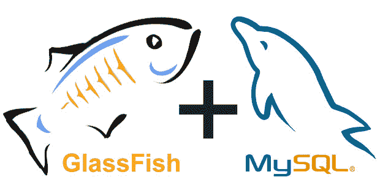
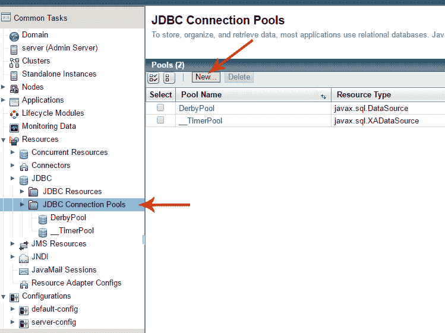
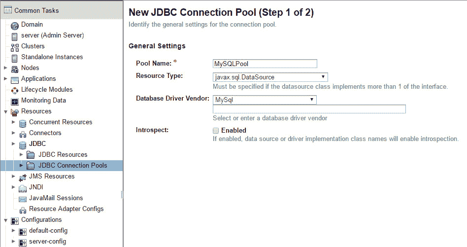
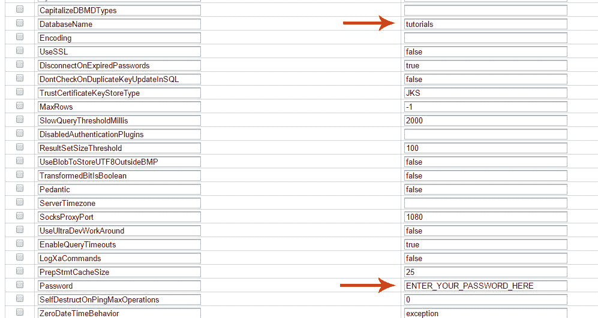

# 如何使用 MySQL 配置 Glassfish 4

> 原文： [https://javatutorial.net/configure-glassfish-mysql](https://javatutorial.net/configure-glassfish-mysql)

本文介绍了如何使用 Glassfish 应用服务器  设置和配置 MySQL 数据库



如今，MySQL 已在生产和开发环境中广泛使用。 Glassfish 4（及先前版本）具有易于管理数据库连接的界面。 您可以使用 Glassfish 的管理控制台来设置和配置 MySQL 数据库，或者，如果您愿意，可以编辑包含数据库首选项的配置文件。 我将在本教程中向您展示这两种方法。 核心部分本教程也适用于 Payara。

## 要求

MySQL Server 安装在本地或远程计算机上。 另外，您将需要一个现有用户（带有密码）和一个对该用户具有读/写权限的数据库

Glassfish（或 Payara）4 应用程序服务器

## 在 Glassfish 上安装 MySQL Java Connector

MySQL 的官方 JDBC（Java 数据库连接）驱动程序称为 MySQL Connector / J。 您可以在 [https://dev.mysql.com/downloads/connector/j/](https://dev.mysql.com/downloads/connector/j/) 找到下载页面。

1.  下载 TAR 或 ZIP 归档文件-无论您喜欢使用什么文件。 解压缩档案后，您会发现一个名为 mysql-connector-java-X.X.XX-bin.jar 的 JAR 文件（其中 X.X.XX 是版本号）。
2.  将 JAR 文件粘贴到您的`GLASSFISH_HOME/glassfish/bin`目录中
3.  重新启动 Glassfish，以使更改生效

## 创建 Glassfish JDBC 连接池

在本地主机上打开 Glassfish 管理控制台：4848

展开 JDBC，然后单击“ JDBC 连接池”

单击“新建…”按钮以创建新的连接池



Glassfish 创建新的 JDBC 连接池

在“池名称”中输入连接池的名称

选择`javax.sql.DataSource`作为“资源类型”

选择 MySql 作为“数据库驱动程序供应商”

点击“下一步”按钮进行下一步



创建 JDBC 连接池

在屏幕＃2 上，检查“数据源类名”，应将其设置为`com.mysql.jdbc.jdbc2.optional.MysqlDataSource`

启用“ Ping”


创建 JDBC 连接池的步骤 2

现在在同一屏幕上向下滚动。

填写以下必填字段：

*   用户–输入数据库用户名
*   DatabaseName –输入数据库的名称
*   密码–是您在第一个字段中输入的用户密码
*   URL 和网址–在`jdbc:mysql://:3306/`之后添加数据库的名称，因此它成为`jdbc:mysql://:3306/tutorials`





您可能要根据项目的偏好填写其他一些字段，这完全取决于您！

单击“完成”按钮以保存您的配置。 发送到数据库的 ping 命令以检查连接。 如果一切正常，您将看到以下消息：


如果看到错误消息，请单击“编辑”，然后检查输入的数据是否正确。

## 在 Glassfish 中创建 JDBC 资源

创建 JDBC 资源不一定是 MySQL 配置教程的一部分，但是您将需要使用它来将项目连接到数据库，因此在这里进行介绍：

选择“ JDBC 资源”，然后单击“新建...”按钮


Glassfish JDBC 资源

在“ JNDI 名称”下，输入`jdbc/`，然后输入您要为此资源指定的名称。 例如`jdbc/tutorialsDS`

在“池名称”下，选择您在上一步中刚刚创建的连接池的名称

保存新创建的 JDBC 资源


Glassfish 创建新的 JDBC 资源

好的！ 现在，您可以将 MySQL 数据库与在 Glassfish 服务器上部署的应用程序一起使用了。

## 替代配置方法

如果您希望通过编辑配置文件来创建连接池和 JDBC 资源，则可以通过在`&lt;resources&gt;...&lt;/resources&gt;`标记之间的以下行中为选定域的`GLASSFISH_HOME/glassfish/domains/domain1/config/domain.xml`插入 Glassfish 的配置文件中来轻松完成此操作

```java
<jdbc-connection-pool ping="true" datasource-classname="com.mysql.jdbc.jdbc2.optional.MysqlDataSource" name="MySQLPool" res-type="javax.sql.DataSource">
      <property name="SelfDestructOnPingSecondsLifetime" value="0"></property>
      <property name="UseUsageAdvisor" value="false"></property>
      <property name="AllowSlaveDownConnections" value="false"></property>
      <property name="LoadBalanceBlacklistTimeout" value="0"></property>
      <property name="QueryTimeoutKillsConnection" value="false"></property>
      <property name="CacheServerConfiguration" value="false"></property>
      <property name="RoundRobinLoadBalance" value="false"></property>
      <property name="UseCursorFetch" value="false"></property>
      <property name="JdbcCompliantTruncation" value="true"></property>
      <property name="UseOnlyServerErrorMessages" value="true"></property>
      <property name="AllowPublicKeyRetrieval" value="false"></property>
      <property name="DefaultAuthenticationPlugin" value="com.mysql.jdbc.authentication.MysqlNativePasswordPlugin"></property>
      <property name="DontTrackOpenResources" value="false"></property>
      <property name="UseInformationSchema" value="false"></property>
      <property name="UseNanosForElapsedTime" value="false"></property>
      <property name="UseCompression" value="false"></property>
      <property name="EnableEscapeProcessing" value="true"></property>
      <property name="PasswordCharacterEncoding" value="UTF-8"></property>
      <property name="AutoDeserialize" value="false"></property>
      <property name="TcpRcvBuf" value="0"></property>
      <property name="CallableStatementCacheSize" value="100"></property>
      <property name="AutoSlowLog" value="true"></property>
      <property name="IgnoreNonTxTables" value="false"></property>
      <property name="UseJDBCCompliantTimezoneShift" value="false"></property>
      <property name="AllowNanAndInf" value="false"></property>
      <property name="TcpSndBuf" value="0"></property>
      <property name="ContinueBatchOnError" value="true"></property>
      <property name="Logger" value="com.mysql.jdbc.log.StandardLogger"></property>
      <property name="MaxAllowedPacket" value="-1"></property>
      <property name="PrepStmtCacheSqlLimit" value="256"></property>
      <property name="AllowMultiQueries" value="false"></property>
      <property name="StrictFloatingPoint" value="false"></property>
      <property name="PreparedStatementCacheSqlLimit" value="256"></property>
      <property name="CachePreparedStatements" value="false"></property>
      <property name="InitialTimeout" value="2"></property>
      <property name="UseUnicode" value="true"></property>
      <property name="AutoClosePStmtStreams" value="false"></property>
      <property name="UseServerPrepStmts" value="false"></property>
      <property name="IncludeThreadNamesAsStatementComment" value="false"></property>
      <property name="PreparedStatementCacheSize" value="25"></property>
      <property name="CreateDatabaseIfNotExist" value="false"></property>
      <property name="RollbackOnPooledClose" value="true"></property>
      <property name="SocketFactoryClassName" value="com.mysql.jdbc.StandardSocketFactory"></property>
      <property name="LoadBalanceValidateConnectionOnSwapServer" value="false"></property>
      <property name="CompensateOnDuplicateKeyUpdateCounts" value="false"></property>
      <property name="EnablePacketDebug" value="false"></property>
      <property name="JdbcCompliantTruncationForReads" value="true"></property>
      <property name="PadCharsWithSpace" value="false"></property>
      <property name="NoAccessToProcedureBodies" value="false"></property>
      <property name="UseTimezone" value="false"></property>
      <property name="ClientCertificateKeyStoreType" value="JKS"></property>
      <property name="Port" value="3306"></property>
      <property name="ClientInfoProvider" value="com.mysql.jdbc.JDBC4CommentClientInfoProvider"></property>
      <property name="IsInteractiveClient" value="false"></property>
      <property name="CachePrepStmts" value="false"></property>
      <property name="ProfileSQL" value="false"></property>
      <property name="ProfileSql" value="false"></property>
      <property name="MaxQuerySizeToLog" value="2048"></property>
      <property name="LoadBalanceHostRemovalGracePeriod" value="15000"></property>
      <property name="TreatUtilDateAsTimestamp" value="true"></property>
      <property name="DynamicCalendars" value="false"></property>
      <property name="DatabaseName" value="tutorials"></property>
      <property name="UseSSL" value="false"></property>
      <property name="DisconnectOnExpiredPasswords" value="true"></property>
      <property name="DontCheckOnDuplicateKeyUpdateInSQL" value="false"></property>
      <property name="TrustCertificateKeyStoreType" value="JKS"></property>
      <property name="MaxRows" value="-1"></property>
      <property name="SlowQueryThresholdMillis" value="2000"></property>
      <property name="ResultSetSizeThreshold" value="100"></property>
      <property name="UseBlobToStoreUTF8OutsideBMP" value="false"></property>
      <property name="TransformedBitIsBoolean" value="false"></property>
      <property name="Pedantic" value="false"></property>
      <property name="SocksProxyPort" value="1080"></property>
      <property name="UseUltraDevWorkAround" value="false"></property>
      <property name="EnableQueryTimeouts" value="true"></property>
      <property name="LogXaCommands" value="false"></property>
      <property name="PrepStmtCacheSize" value="25"></property>
      <property name="Password" value="YOUR_DB_PASSWORD_HERE"></property>
      <property name="SelfDestructOnPingMaxOperations" value="0"></property>
      <property name="ZeroDateTimeBehavior" value="exception"></property>
      <property name="CallableStmtCacheSize" value="100"></property>
      <property name="SecondsBeforeRetryMaster" value="30"></property>
      <property name="EmulateLocators" value="false"></property>
      <property name="LoginTimeout" value="0"></property>
      <property name="GatherPerfMetrics" value="false"></property>
      <property name="RetriesAllDown" value="120"></property>
      <property name="DetectCustomCollations" value="false"></property>
      <property name="NoDatetimeStringSync" value="false"></property>
      <property name="LoadBalanceStrategy" value="random"></property>
      <property name="UseOldUTF8Behavior" value="false"></property>
      <property name="LoadBalanceAutoCommitStatementThreshold" value="0"></property>
      <property name="UltraDevHack" value="false"></property>
      <property name="UseFastIntParsing" value="true"></property>
      <property name="StrictUpdates" value="true"></property>
      <property name="EmptyStringsConvertToZero" value="true"></property>
      <property name="UseLocalSessionState" value="false"></property>
      <property name="LoggerClassName" value="com.mysql.jdbc.log.StandardLogger"></property>
      <property name="NullNamePatternMatchesAll" value="true"></property>
      <property name="PopulateInsertRowWithDefaultValues" value="false"></property>
      <property name="ProfilerEventHandler" value="com.mysql.jdbc.profiler.LoggingProfilerEventHandler"></property>
      <property name="UseStreamLengthsInPrepStmts" value="true"></property>
      <property name="RunningCTS13" value="false"></property>
      <property name="UseOldAliasMetadataBehavior" value="false"></property>
      <property name="ReadOnlyPropagatesToServer" value="true"></property>
      <property name="SocketFactory" value="com.mysql.jdbc.StandardSocketFactory"></property>
      <property name="MaxReconnects" value="3"></property>
      <property name="ReportMetricsIntervalMillis" value="30000"></property>
      <property name="BlobsAreStrings" value="false"></property>
      <property name="SendFractionalSeconds" value="true"></property>
      <property name="CacheResultSetMetadata" value="false"></property>
      <property name="Paranoid" value="false"></property>
      <property name="AllowUrlInLocalInfile" value="false"></property>
      <property name="NoTimezoneConversionForTimeType" value="false"></property>
      <property name="EmulateUnsupportedPstmts" value="true"></property>
      <property name="ReconnectAtTxEnd" value="false"></property>
      <property name="RequireSSL" value="false"></property>
      <property name="UseHostsInPrivileges" value="true"></property>
      <property name="UseSSPSCompatibleTimezoneShift" value="false"></property>
      <property name="UseReadAheadInput" value="true"></property>
      <property name="ParseInfoCacheFactory" value="com.mysql.jdbc.PerConnectionLRUFactory"></property>
      <property name="DefaultFetchSize" value="0"></property>
      <property name="URL" value="jdbc:mysql://localhost:3306/tutorials"></property>
      <property name="Url" value="jdbc:mysql://localhost:3306/tutorials"></property>
      <property name="AllowMasterDownConnections" value="false"></property>
      <property name="CacheDefaultTimezone" value="true"></property>
      <property name="QueriesBeforeRetryMaster" value="50"></property>
      <property name="FunctionsNeverReturnBlobs" value="false"></property>
      <property name="DumpQueriesOnException" value="false"></property>
      <property name="LoadBalanceExceptionChecker" value="com.mysql.jdbc.StandardLoadBalanceExceptionChecker"></property>
      <property name="VerifyServerCertificate" value="true"></property>
      <property name="NetTimeoutForStreamingResults" value="600"></property>
      <property name="ProcessEscapeCodesForPrepStmts" value="true"></property>
      <property name="UseAffectedRows" value="false"></property>
      <property name="GatherPerformanceMetrics" value="false"></property>
      <property name="TinyInt1isBit" value="true"></property>
      <property name="MetadataCacheSize" value="50"></property>
      <property name="RewriteBatchedStatements" value="false"></property>
      <property name="CacheCallableStatements" value="false"></property>
      <property name="ServerName" value="localhost"></property>
      <property name="GetProceduresReturnsFunctions" value="true"></property>
      <property name="UseGmtMillisForDatetimes" value="false"></property>
      <property name="CapitalizeTypeNames" value="true"></property>
      <property name="ServerConfigCacheFactory" value="com.mysql.jdbc.PerVmServerConfigCacheFactory"></property>
      <property name="NoTimezoneConversionForDateType" value="true"></property>
      <property name="TcpTrafficClass" value="0"></property>
      <property name="AutoGenerateTestcaseScript" value="false"></property>
      <property name="CacheCallableStmts" value="false"></property>
      <property name="FailOverReadOnly" value="true"></property>
      <property name="LoadBalancePingTimeout" value="0"></property>
      <property name="LocatorFetchBufferSize" value="1048576"></property>
      <property name="RelaxAutoCommit" value="false"></property>
      <property name="UseFastDateParsing" value="true"></property>
      <property name="LoadBalanceEnableJMX" value="false"></property>
      <property name="OverrideSupportsIntegrityEnhancementFacility" value="false"></property>
      <property name="HoldResultsOpenOverStatementClose" value="false"></property>
      <property name="InteractiveClient" value="false"></property>
      <property name="UseJvmCharsetConverters" value="false"></property>
      <property name="PortNumber" value="3306"></property>
      <property name="UseDynamicCharsetInfo" value="true"></property>
      <property name="LogSlowQueries" value="false"></property>
      <property name="IncludeThreadDumpInDeadlockExceptions" value="false"></property>
      <property name="ReplicationEnableJMX" value="false"></property>
      <property name="SlowQueryThresholdNanos" value="0"></property>
      <property name="UseDirectRowUnpack" value="true"></property>
      <property name="UseSqlStateCodes" value="true"></property>
      <property name="IncludeInnodbStatusInDeadlockExceptions" value="false"></property>
      <property name="MaintainTimeStats" value="true"></property>
      <property name="PinGlobalTxToPhysicalConnection" value="false"></property>
      <property name="TcpNoDelay" value="true"></property>
      <property name="TraceProtocol" value="false"></property>
      <property name="AlwaysSendSetIsolation" value="true"></property>
      <property name="NullCatalogMeansCurrent" value="true"></property>
      <property name="YearIsDateType" value="true"></property>
      <property name="SocketTimeout" value="0"></property>
      <property name="UseServerPreparedStmts" value="false"></property>
      <property name="UseLocalTransactionState" value="false"></property>
      <property name="GenerateSimpleParameterMetadata" value="false"></property>
      <property name="ExplainSlowQueries" value="false"></property>
      <property name="UseColumnNamesInFindColumn" value="false"></property>
      <property name="ConnectTimeout" value="0"></property>
      <property name="ElideSetAutoCommits" value="false"></property>
      <property name="PacketDebugBufferSize" value="20"></property>
      <property name="RetainStatementAfterResultSetClose" value="false"></property>
      <property name="DumpMetadataOnColumnNotFound" value="false"></property>
      <property name="BlobSendChunkSize" value="1048576"></property>
      <property name="UseLegacyDatetimeCode" value="true"></property>
      <property name="UseUnbufferedInput" value="true"></property>
      <property name="AllowLoadLocalInfile" value="true"></property>
      <property name="ReadFromMasterWhenNoSlaves" value="false"></property>
      <property name="AutoReconnectForPools" value="false"></property>
      <property name="TcpKeepAlive" value="true"></property>
      <property name="ClobberStreamingResults" value="false"></property>
      <property name="User" value="root"></property>
    </jdbc-connection-pool>
    <jdbc-resource pool-name="MySQLPool" jndi-name="jdbc/tutorialsDS"></jdbc-resource>
```

还要在`&lt;server&gt;...&lt;/server&gt;`标签中添加以下行

```java
<resource-ref ref="jdbc/tutorialsDS"></resource-ref>
```

谢谢阅读。 如果您对许多配置属性有任何疑问或建议，请使用下面的注释部分。