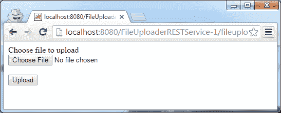

# Java 文件上传 REST 服务

> 原文： [https://javatutorial.net/java-file-upload-rest-service](https://javatutorial.net/java-file-upload-rest-service)

在本教程中，我将解释如何构建 Java REST Web 服务以通过 HTTP 从任何客户端上载文件。

将文件上传到 Web 应用程序是当今的一项常见任务。 许多服务都支持在其网站上上传图片或文档。 使用 Java Web 服务，这很容易实现。 除了 Java Web 容器（由 [Tomcat](http://tomcat.apache.org/) ， [GlassFish](http://www.oracle.com/us/products/middleware/cloud-app-foundation/glassfish-server/overview/index.html) 或 [JBoss](http://wildfly.org/) 等应用服务器提供）之外，我们还需要[球衣框架](https://github.com/jersey) 使它运行。 首先，我将向您展示如何实现 Web 服务，然后为您提供两个使用该服务的客户端示例。



Java 文件上传表格

## 构建文件上传 REST 服务

该文件通过 HTTP POST 以编码类型“ multipart / form-data”从客户端推送到我们的 Web 服务。 这样，除了文件之外，您还可以向 POST 请求添加多个参数。 让我们从需求开始。 您将需要 Web /应用程序服务器（例如 Tomcat，GlassFish 或 JBoss）来部署服务。 另外，我们将使用 jersey 框架来构建我们的服务端点。 请注意，GlassFish 4.x 版本需要 jersey 版本 2 库，因此如果使用 GlassFish 4，则**请在您的 POM 文件中使用 jersey 2.x 依赖项**。

为了快速参考，您可以在我们的 GitHub 存储库中的 [https://github.com/JavaTutorialNetwork/Tutorials/tree/master/FileUploaderRESTService](https://github.com/JavaTutorialNetwork/Tutorials/tree/master/FileUploaderRESTService) 下找到整个项目

我将在此处发布整个 POM 文件，但您需要考虑的是球衣依赖项

```java
<project xmlns="http://maven.apache.org/POM/4.0.0" xmlns:xsi="http://www.w3.org/2001/XMLSchema-instance"
	xsi:schemaLocation="http://maven.apache.org/POM/4.0.0 http://maven.apache.org/xsd/maven-4.0.0.xsd">
	<modelVersion>4.0.0</modelVersion>

	<groupId>net.javatutorial.tutorials</groupId>
	<artifactId>FileUploaderRESTService</artifactId>
	<version>1</version>
	<packaging>war</packaging>

	<name>File Uploader Rest Service</name>
	<url>https://javatutorial.net</url>

	<properties>
		<project.build.sourceEncoding>UTF-8</project.build.sourceEncoding>
	</properties>

	<dependencies>
		<dependency>
			<groupId>com.sun.jersey</groupId>
			<artifactId>jersey-server</artifactId>
			<version>1.8</version>
		</dependency>
		<dependency>
			<groupId>com.sun.jersey</groupId>
			<artifactId>jersey-servlet</artifactId>
			<version>1.17.1</version>
		</dependency>
		<dependency>
			<groupId>com.sun.jersey</groupId>
			<artifactId>jersey-json</artifactId>
			<version>1.8</version>
		</dependency>
		<dependency>
			<groupId>com.sun.jersey.contribs</groupId>
			<artifactId>jersey-multipart</artifactId>
			<version>1.8</version>
		</dependency>
	</dependencies>

	<build>
		<plugins>
			<plugin>
				<groupId>org.apache.maven.plugins</groupId>
				<artifactId>maven-compiler-plugin</artifactId>
				<version>3.1</version>
				<inherited>true</inherited>
				<configuration>
					<source>1.7</source>
					<target>1.7</target>
				</configuration>
			</plugin>
			<plugin>
				<artifactId>maven-war-plugin</artifactId>
				<version>2.3</version>
				<configuration>
					<webXml>src/main/webapp/WEB-INF/web.xml</webXml>
					<webResources>
						<resource>
							<!-- this is relative to the pom.xml directory -->
							<directory>${project.basedir}/src/main/resources
							</directory>
						</resource>
					</webResources>
				</configuration>
			</plugin>
		</plugins>
	</build>

</project>
```

现在拥有所有必需的库，让我们继续实现 REST 服务。 下面的代码中有几个地方我想提醒您注意。 首先请注意@Consumes（MediaType.MULTIPART_FORM_DATA）作为请求的编码类型的用法。 其次，如果愿意，您可能希望向该方法添加其他参数。 例如，您可能要在上传时传递一些描述或其他文本数据。 最后，如果您尝试将文件上传到不存在的目录中，Java 将抛出异常。 为了避免这个问题，我创建了方法 createFolderIfNotExists（StringdirName）。

```java
package net.javatutorial.tutorials.services;

import java.io.File;
import java.io.FileOutputStream;
import java.io.IOException;
import java.io.InputStream;
import java.io.OutputStream;

import javax.ws.rs.Consumes;
import javax.ws.rs.POST;
import javax.ws.rs.Path;
import javax.ws.rs.core.Context;
import javax.ws.rs.core.MediaType;
import javax.ws.rs.core.Response;
import javax.ws.rs.core.UriInfo;

import com.sun.jersey.core.header.FormDataContentDisposition;
import com.sun.jersey.multipart.FormDataParam;

/**
 * This example shows how to build Java REST web-service to upload files
 * accepting POST requests with encoding type "multipart/form-data". For more
 * details please read the full tutorial on
 * https://javatutorial.net/java-file-upload-rest-service
 * 
 * @author javatutorial.net
 */
@Path("/upload")
public class FileUploadService {

	/** The path to the folder where we want to store the uploaded files */
	private static final String UPLOAD_FOLDER = "c:/uploadedFiles/";

	public FileUploadService() {
	}

	@Context
	private UriInfo context;

	/**
	 * Returns text response to caller containing uploaded file location
	 * 
	 * @return error response in case of missing parameters an internal
	 *         exception or success response if file has been stored
	 *         successfully
	 */
	@POST
	@Consumes(MediaType.MULTIPART_FORM_DATA)
	public Response uploadFile(
			@FormDataParam("file") InputStream uploadedInputStream,
			@FormDataParam("file") FormDataContentDisposition fileDetail) {

		// check if all form parameters are provided
		if (uploadedInputStream == null || fileDetail == null)
			return Response.status(400).entity("Invalid form data").build();

		// create our destination folder, if it not exists
		try {
			createFolderIfNotExists(UPLOAD_FOLDER);
		} catch (SecurityException se) {
			return Response.status(500)
					.entity("Can not create destination folder on server")
					.build();
		}

		String uploadedFileLocation = UPLOAD_FOLDER + fileDetail.getFileName();
		try {
			saveToFile(uploadedInputStream, uploadedFileLocation);
		} catch (IOException e) {
			return Response.status(500).entity("Can not save file").build();
		}

		return Response.status(200)
				.entity("File saved to " + uploadedFileLocation).build();
	}

	/**
	 * Utility method to save InputStream data to target location/file
	 * 
	 * @param inStream
	 *            - InputStream to be saved
	 * @param target
	 *            - full path to destination file
	 */
	private void saveToFile(InputStream inStream, String target)
			throws IOException {
		OutputStream out = null;
		int read = 0;
		byte[] bytes = new byte[1024];

		out = new FileOutputStream(new File(target));
		while ((read = inStream.read(bytes)) != -1) {
			out.write(bytes, 0, read);
		}
		out.flush();
		out.close();
	}

	/**
	 * Creates a folder to desired location if it not already exists
	 * 
	 * @param dirName
	 *            - full path to the folder
	 * @throws SecurityException
	 *             - in case you don't have permission to create the folder
	 */
	private void createFolderIfNotExists(String dirName)
			throws SecurityException {
		File theDir = new File(dirName);
		if (!theDir.exists()) {
			theDir.mkdir();
		}
	}

}

```

最后，我们需要配置 web.xml 以将我们的类注册为 Web 服务并使其在启动时运行。

```java
<?xml version="1.0" encoding="UTF-8"?>
<web-app xmlns:xsi="http://www.w3.org/2001/XMLSchema-instance"
	xmlns="http://java.sun.com/xml/ns/javaee" xmlns:web="http://java.sun.com/xml/ns/javaee/web-app_2_5.xsd"
	xsi:schemaLocation="http://java.sun.com/xml/ns/javaee http://java.sun.com/xml/ns/javaee/web-app_2_5.xsd"
	id="WebApp_ID" version="2.5">
	<display-name>net.javatutorial.tutorials.services</display-name>
	<servlet>
		<servlet-name>Jersey REST Service</servlet-name>
		<servlet-class>com.sun.jersey.spi.container.servlet.ServletContainer</servlet-class>
		<init-param>
			<param-name>com.sun.jersey.config.property.packages</param-name>
			<param-value>net.javatutorial.tutorials.services</param-value>
		</init-param>
		<load-on-startup>1</load-on-startup>
	</servlet>
	<servlet-mapping>
		<servlet-name>Jersey REST Service</servlet-name>
		<url-pattern>/rest/*</url-pattern>
	</servlet-mapping>
</web-app>
```

好的！ 现在，您可以构建和部署 WAR 文件。 如果您使用上面代码中提供的完全相同的名称，则您的服务 URL（假设您在 localhost 上运行）将是： http：// localhost：8080 / FileUploaderRESTService-1 / rest / upload

## 文件上传 HTML 表格

您可以使用非常简单的 HTML post 表单作为客户端将文件发送到服务器。

请注意“ multipart / form-data”作为编码类型的用法。 您还需要添加文件类型为[file]的&lt;输入&gt;

```java
Choose file to upload<br>
<form action="http://localhost:8080/FileUploaderRESTService-1/rest/upload" method="post" enctype="multipart/form-data">
	<input name="file" id="filename" type="file" /><br><br>
	<button name="submit" type="submit">Upload</button>
</form>
```

如前所述，您可以向请求中添加其他数据。 在这种情况下，别忘了在网络服务中处理它🙂

## Java 文件上传客户端

您可以为 Android 或 Java 中的独立程序创建文件上传客户端。 在下面的示例中，我将使用 Apache http 库，您将需要以下五个：

*   公共记录
*   httpclient
*   httpclient 缓存
*   httpcore
*   httpmime

```java
package net.javatutorial.tutorials.clienst;

import java.io.File;
import java.io.FileInputStream;
import java.io.IOException;

import org.apache.http.HttpEntity;
import org.apache.http.HttpResponse;
import org.apache.http.client.ClientProtocolException;
import org.apache.http.client.methods.HttpPost;
import org.apache.http.entity.mime.MultipartEntity;
import org.apache.http.entity.mime.content.InputStreamBody;
import org.apache.http.impl.client.DefaultHttpClient;
import org.apache.http.params.BasicHttpParams;
import org.apache.http.util.EntityUtils;

/**
 * This example shows how to upload files using POST requests 
 * with encoding type "multipart/form-data".
 * For more details please read the full tutorial
 * on https://javatutorial.net/java-file-upload-rest-service
 * @author javatutorial.net
 */
public class FileUploaderClient {

	public static void main(String[] args) {

		// the file we want to upload
		File inFile = new File("C:\\Users\\admin\\Desktop\\Yana-make-up.jpg");
		FileInputStream fis = null;
		try {
			fis = new FileInputStream(inFile);
			DefaultHttpClient httpclient = new DefaultHttpClient(new BasicHttpParams());

			// server back-end URL
			HttpPost httppost = new HttpPost("http://localhost:8080/FileUploaderRESTService-1/rest/upload");
			MultipartEntity entity = new MultipartEntity();

			// set the file input stream and file name as arguments
			entity.addPart("file", new InputStreamBody(fis, inFile.getName()));
			httppost.setEntity(entity);

			// execute the request
			HttpResponse response = httpclient.execute(httppost);

			int statusCode = response.getStatusLine().getStatusCode();
			HttpEntity responseEntity = response.getEntity();
			String responseString = EntityUtils.toString(responseEntity, "UTF-8");

			System.out.println("[" + statusCode + "] " + responseString);

		} catch (ClientProtocolException e) {
			System.err.println("Unable to make connection");
			e.printStackTrace();
		} catch (IOException e) {
			System.err.println("Unable to read file");
			e.printStackTrace();
		} finally {
			try {
				if (fis != null) fis.close();
			} catch (IOException e) {}
		}
	}

}

```

您将在我们的 GitHub 存储库中找到项目文件 [https://github.com/JavaTutorialNetwork/Tutorials/tree/master/FileUploaderJavaClient](https://github.com/JavaTutorialNetwork/Tutorials/tree/master/FileUploaderJavaClient)

谢谢阅读。 一如既往欢迎评论🙂