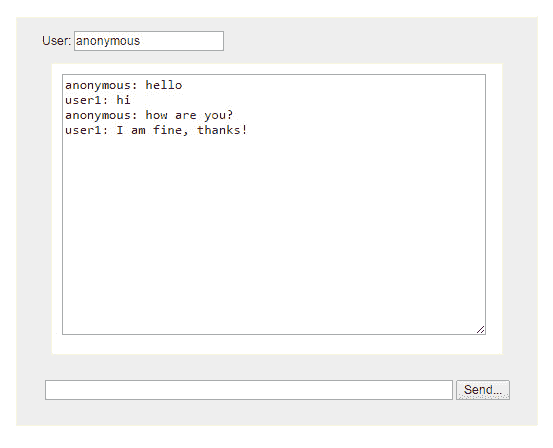

# Glassfish 和 Jetty 的 Java WebSockets 教程

> 原文： [https://javatutorial.net/java-websockets-tutorial](https://javatutorial.net/java-websockets-tutorial)

在本教程中，我将向您展示如何制作一个在 Glassfish 4 上运行的简单聊天应用程序。我将使用两个 API 来实现此目的：Jetty 和 JSON API。

我们将首先从基于 Web 的客户端开始。 看下面的图片。 它的用户名有一个字段，您可以在其中输入聊天消息的一个字段，以及到目前为止保存对话的文本区域。



## 网络客户端和 Javascript

我们可以在 JavaScript 中使用`WebSocket`在客户端和服务器之间创建全双工连接。 JavaScript `Websocket`具有 3 种方法

**onopen** –在客户端和服务器创建连接时调用

**onmessage** –服务器向客户端发送消息时执行此方法

**onclose** –客户端和服务器之间的连接被破坏时调用此方法

用户单击发送按钮后，用户名和消息本身将转换为 JSON 格式并发送到服务器。

您将在下面找到客户端的完整代码：

```java
<?xml version='1.0' encoding='UTF-8' ?>
<!DOCTYPE html PUBLIC "-//W3C//DTD XHTML 1.0 Transitional//EN" "http://www.w3.org/TR/xhtml1/DTD/xhtml1-transitional.dtd">
<html xmlns="http://www.w3.org/1999/xhtml"
	xmlns:h="http://java.sun.com/jsf/html">

<h:head>
	<title>WebSockets Chat</title>
	<meta name="author" content="javatutorial.net" />
	<script type="text/javascript" charset="utf-8" src="js/jquery-1.3.2.js"></script>
	<link type="text/css" rel="stylesheet" href="css/style.css" />
	<script type="text/javascript">
	var ws;

	$(document).ready(
			function() {
				ws = new WebSocket("ws://localhost:8080/chat");
				ws.onopen = function(event) {

				}
				ws.onmessage = function(event) {
					var $textarea = $('#messages');
					var json = JSON.parse(event.data);
					$textarea.val($textarea.val() + json.username + ": " + json.message + "\n");
					$textarea.animate({
						scrollTop : $textarea.height()
					}, 1000);
				}
				ws.onclose = function(event) {

				}

			});

	function sendMessage() {
		var message = {
			    "username": $('#username').val(),
			    "message": $('#message').val() 
			}
		ws.send(JSON.stringify(message));
		$('#message').val('');
	}
	</script>
</h:head>
<h:body>
	<div id="body">
		<div id="menu">
			<p class="welcome">
				User: <input id="username" value="anonymous" />
			</p>
			<div style="clear: both"></div>
		</div>

		<div id="chatbox">
			<textarea id="messages" rows="16" cols="50" readonly="readonly"></textarea>
		</div>

		<form name="message" action="">
			<input name="usermsg" type="text" id="message" size="63" /> <input
				type="button" name="submitmsg" value="Send..."
				onclick="sendMessage();" />
		</form>
	</div>
</h:body>
</html>

```

## 实施 Websocket 服务器

我将使用 Glassfish 4.1 部署 WebSocket 服务器。 我们将使用 Jetty 9.x 作为 Websocket 服务器，而 Glassfish 已在 Jetty 中内置。 我们将使用的另一个 API 是 JSON API，它也是 Glassfish 4 的一部分。请查看下面的 Maven pom 文件以获取所需的依赖关系

```java
<project xmlns="http://maven.apache.org/POM/4.0.0" xmlns:xsi="http://www.w3.org/2001/XMLSchema-instance"
	xsi:schemaLocation="http://maven.apache.org/POM/4.0.0 http://maven.apache.org/xsd/maven-4.0.0.xsd">
	<modelVersion>4.0.0</modelVersion>

	<groupId>net.javatutorial</groupId>
	<artifactId>ChatServer</artifactId>
	<version>0.0.1</version>
	<packaging>war</packaging>

	<name>ChatServer</name>
	<url>http://javatutorial.net</url>

	<properties>
		<project.build.sourceEncoding>UTF-8</project.build.sourceEncoding>
	</properties>

	<dependencies>
		<dependency>
			<groupId>javax</groupId>
			<artifactId>javaee-api</artifactId>
			<version>6.0</version>
			<scope>provided</scope>
		</dependency>
		<dependency>
			<groupId>org.eclipse.jetty</groupId>
			<artifactId>jetty-server</artifactId>
			<version>9.2.7.v20150116</version>
			<scope>provided</scope>
		</dependency>
		<dependency>
			<groupId>org.eclipse.jetty.websocket</groupId>
			<artifactId>javax-websocket-server-impl</artifactId>
			<version>9.2.7.v20150116</version>
			<scope>provided</scope>
		</dependency>
		<dependency>
			<groupId>org.eclipse.jetty</groupId>
			<artifactId>jetty-annotations</artifactId>
			<version>9.2.7.v20150116</version>
			<scope>provided</scope>
		</dependency>
		<dependency>
			<groupId>org.eclipse.jetty</groupId>
			<artifactId>jetty-webapp</artifactId>
			<version>9.2.7.v20150116</version>
			<scope>provided</scope>
		</dependency>
		<dependency>
    		<groupId>javax.json</groupId>
    		<artifactId>javax.json-api</artifactId>
    		<version>1.0</version>
    		<scope>provided</scope>
		</dependency>
	</dependencies>
	<build>
		<plugins>
			<plugin>
				<groupId>org.apache.maven.plugins</groupId>
				<artifactId>maven-compiler-plugin</artifactId>
				<version>3.1</version>
				<inherited>true</inherited>
				<configuration>
					<source>1.6</source>
					<target>1.6</target>
				</configuration>
			</plugin>
			<plugin>
				<artifactId>maven-war-plugin</artifactId>
				<version>2.3</version>
				<configuration>
					<webXml>src/main/webapp/WEB-INF/web.xml</webXml>
				</configuration>
			</plugin>
		</plugins>
	</build>
</project>
```

ChatMessage 对象保存用户名和消息字符串，以提供 Decoder 和 Encoder 将结构转换为 JSON 格式。

```java
package net.javatutorial.chatserver.pojos;

import java.io.StringReader;
import java.util.Collections;

import javax.json.Json;
import javax.json.JsonObject;
import javax.json.JsonReader;
import javax.json.JsonReaderFactory;
import javax.websocket.DecodeException;
import javax.websocket.Decoder;
import javax.websocket.EncodeException;
import javax.websocket.Encoder;
import javax.websocket.EndpointConfig;

public class ChatMessage {

	public static class MessageEncoder implements Encoder.Text<ChatMessage> {
		@Override
		public void init(EndpointConfig config) {
		}

		@Override
		public String encode(ChatMessage message) throws EncodeException {
			return Json.createObjectBuilder()
					.add("username", message.getUsername())
					.add("message", message.getMessage()).build().toString();
		}

		@Override
		public void destroy() {
		}
	}

	public static class MessageDecoder implements Decoder.Text<ChatMessage> {
		private JsonReaderFactory factory = Json
				.createReaderFactory(Collections.<String, Object> emptyMap());

		@Override
		public void init(EndpointConfig config) {
		}

		@Override
		public ChatMessage decode(String str) throws DecodeException {
			ChatMessage message = new ChatMessage();

			JsonReader reader = factory.createReader(new StringReader(str));
			JsonObject json = reader.readObject();
			message.setUsername(json.getString("username"));
			message.setMessage(json.getString("message"));

			return message;
		}

		@Override
		public boolean willDecode(String str) {
			return true;
		}

		@Override
		public void destroy() {
		}
	}

	private String username;
	private String message;

	public ChatMessage() {
	}

	public ChatMessage(String username, String message) {
		super();
		this.username = username;
		this.message = message;
	}

	public String getUsername() {
		return username;
	}

	public void setUsername(String username) {
		this.username = username;
	}

	public String getMessage() {
		return message;
	}

	public void setMessage(String message) {
		this.message = message;
	}

}
```

最后，我们将需要 Websocket 服务器端点。

```java
package net.javatutorial.chatserver.sockets;

import java.io.IOException;
import java.util.Collections;
import java.util.HashSet;
import java.util.Set;

import javax.websocket.EncodeException;
import javax.websocket.OnClose;
import javax.websocket.OnMessage;
import javax.websocket.OnOpen;
import javax.websocket.Session;
import javax.websocket.server.ServerEndpoint;

import net.javatutorial.chatserver.pojos.ChatMessage;
import net.javatutorial.chatserver.pojos.ChatMessage.MessageDecoder;
import net.javatutorial.chatserver.pojos.ChatMessage.MessageEncoder;

@ServerEndpoint(value = "/chat", encoders = { MessageEncoder.class }, decoders = { MessageDecoder.class })
public class ChatServerEndpoint {
	private static final Set<Session> sessions = Collections
			.synchronizedSet(new HashSet<Session>());

	@OnOpen
	public void onOpen(Session session) {
		sessions.add(session);
	}

	@OnClose
	public void onClose(Session session) {
		sessions.remove(session);
	}

	@OnMessage
	public void onMessage(ChatMessage message, Session client)
			throws IOException, EncodeException {
		for (Session session : sessions) {
			session.getBasicRemote().sendObject(message);
		}
	}
}
```

您可以在此处下载完整的[源代码和 Eclipse 项目](http://javatutorial.net/downloads/WebSocketsChat.zip "Web Sochets Chat source code download")。