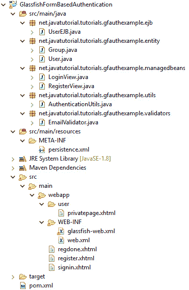
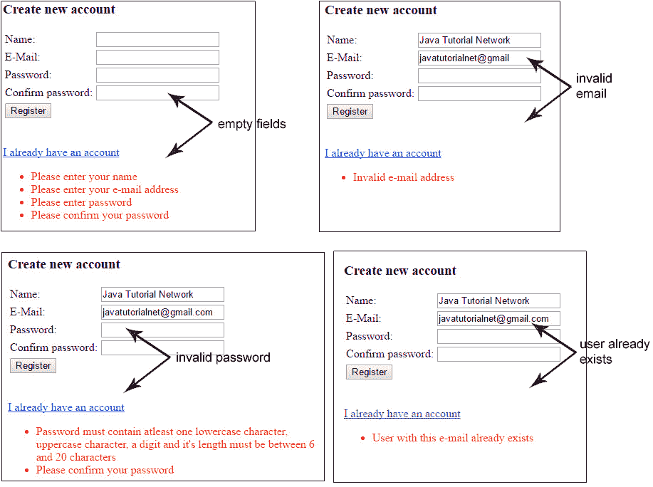
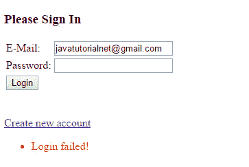

# 基于 Glassfish 表单的身份验证示例

> 原文： [https://javatutorial.net/glassfish-form-b​​ased-authentication-example](https://javatutorial.net/glassfish-form-based-authentication-example)

在本教程中，我将向您展示如何使用内置的 Glassfish 身份验证机制通过用户登录创建基于 Web 的应用程序。


如今，身份验证已广泛用于所有类型的 Web 应用程序中。 从网上商店，低谷社交媒体和要求用户登录的其他服务。Glassfish 带有集成的身份验证和授权机制，可让用户登录并维护应用程序中的会话。 我们将利用此功能并构建和应用程序，以允许用户注册和登录以访问授权的内容。 最后，我将向您展示如何创建注销功能以允许用户终止会话。

这是一个完整的 Java EE 教程，它要求 DB 设置，Glassfish 配置，身份验证后端逻辑的开发以及创建前端部分。 我将使用 Glassfish 4，MySQL 数据库和 JSF 2.2 来构建前端。 该代码也可以在 Payara 4 Server 和其他数据库（MSSQL，Oracle 等）上运行，而无需进行任何修改。

## 项目描述

我们将创建一个简单的 Web 应用程序，其中包含一个注册表格，一个登录表格和一个私人页面。 用户登录后即可访问该私人页面。 表单中的所有字段都将根据错误的用户输入进行验证。

## 创建数据库表

在继续之前，请确保已使用数据库配置了 Glassfish 服务器。 如果尚未执行此操作，请先阅读[如何使用 MySQL 配置 Glassfish 4](https://javatutorial.net/configure-glassfish-mysql) 。 当然，您可以使用您喜欢的任何其他数据库来学习本教程。 您不仅限于 MySQL。

您可以在多个位置存储用户凭据，例如数据库，文件，LDAP 等。在本教程中，我们将使用数据库存储用户名和密码。 在 Glassfish 中，这称为 JDBC 安全领域。 创建安全领域需要两张表-第一个用于存储用户凭据，第二个用于将特定用户映射到角色。 Glassfish 并未预定义角色，这意味着我们可以创建自己的角色-管理员，用户，主持人，查看者等。为了使本教程尽可能简短，我将只实现一个角色：user

第一个表称为`users`，具有以下字段：

*   电子邮件–唯一的主要字段。 我们将使用用户的电子邮件地址作为用户名，如果您愿意，可以使用简单的旧用户名
*   密码– SHA-256 编码的用户密码。 切勿将用户密码存储为纯文本格式-不好😉
*   名称–用户名

Glassfishe 的安全领域只有用户名和密码字段为必填项。 我在此处添加了名称，以说明您可以在同一表格中为用户添加其他信息

```java
CREATE TABLE `users` (
  `email` varchar(255) NOT NULL,
  `password` varchar(64) NOT NULL,
  `name` varchar(30) NOT NULL,
  PRIMARY KEY (`email`)  
) ENGINE=InnoDB DEFAULT CHARSET=utf8;
```

`user_groups`表具有 2 个必填字段：

*   电子邮件-这是用户名
*   组名–存储用户的角色，例如管理员，用户，主持人，查看者等。

```java
CREATE TABLE `user_groups` ( 
    `email` VARCHAR(255) NOT NULL, 
    `groupname` VARCHAR(32) NOT NULL, 
    PRIMARY KEY (`email`)
) ENGINE=InnoDB DEFAULT CHARSET=utf8;
```

## 项目结构

在开始实施项目的后端部分之前，我想向您展示项目结构。 这样，您将知道所有文件所在的位置



您可以在 GitHub 上找到完整的源代码，网址为 [https://github.com/JavaTutorialNetwork/Tutorials/tree/master/GlassfishFormBasedAuthentication](https://github.com/JavaTutorialNetwork/Tutorials/tree/master/GlassfishFormBasedAuthentication)

## 项目依赖关系（pom.xml 文件）

这是纯 Java EE 7 的实现，除了 Java Enterprise API 本身之外，我们在项目中不需要其他依赖项。 该 API 已包含在 Glassfish 中，因此您应将依赖项标记为`provided`

```java
<project xmlns="http://maven.apache.org/POM/4.0.0" xmlns:xsi="http://www.w3.org/2001/XMLSchema-instance"
	xsi:schemaLocation="http://maven.apache.org/POM/4.0.0 http://maven.apache.org/xsd/maven-4.0.0.xsd">

	<modelVersion>4.0.0</modelVersion>

	<groupId>net.javatutorial.tutorials</groupId>
	<artifactId>GlassfishFormBasedAuthentication</artifactId>
	<version>1</version>
	<packaging>war</packaging>

	<properties>
		<project.build.sourceEncoding>UTF-8</project.build.sourceEncoding>
	</properties>

	<dependencies>
		<dependency>
			<groupId>javax</groupId>
			<artifactId>javaee-api</artifactId>
			<version>7.0</version>
			<scope>provided</scope>
		</dependency>
	</dependencies>

	<build>
		<finalName>authexample</finalName>
		<plugins>
			<plugin>
				<groupId>org.apache.maven.plugins</groupId>
				<artifactId>maven-war-plugin</artifactId>
				<version>2.3</version>
				<configuration>
					<webXml>src/main/webapp/WEB-INF/web.xml</webXml>
				</configuration>
			</plugin>
			<plugin>
				<groupId>org.apache.maven.plugins</groupId>
				<artifactId>maven-compiler-plugin</artifactId>
				<version>3.1</version>
				<configuration>
					<source>1.8</source>
					<target>1.8</target>
				</configuration>
			</plugin>
		</plugins>
	</build>

</project>
```

## 用户和组实体

在数据库中添加表`users`和`user_groups`后，必须为这两个表创建 JPA 实体。 实体会将数据库表映射到 Java 对象，因此您可以使用实体对象中的 getter 和 setter 方法轻松地修改或获取数据库。 使用@Entity 批注将 Java 类标记为实体。 该类还必须实现 Serializable 接口。

这是**用户实体**的代码

```java
package net.javatutorial.tutorials.gfauthexample.entity;

import java.io.Serializable;

import javax.persistence.Column;
import javax.persistence.Entity;
import javax.persistence.Id;
import javax.persistence.NamedQueries;
import javax.persistence.NamedQuery;
import javax.persistence.Table;

@Entity
@NamedQueries({
	@NamedQuery(name = "findUserById", query = "SELECT u FROM User u WHERE u.email = :email")
})
@Table(name="users")
public class User implements Serializable {

	private static final long serialVersionUID = -5892169641074303723L;

	@Id
	@Column(name="email", nullable=false, length=255)
	private String email;

	@Column(name="password", nullable=false, length=64)
	private String password;

	@Column(name="name", nullable=false, length=30)
	private String name;

	public User(){}

	public User(String email, String password, String name) {
		this.email = email;
		this.password = password;
		this.name = name;
	}

	public String getEmail() {
		return email;
	}

	public void setEmail(String email) {
		this.email = email;
	}

	public String getPassword() {
		return password;
	}

	public void setPassword(String password) {
		this.password = password;
	}

	public String getName() {
		return name;
	}

	public void setName(String name) {
		this.name = name;
	}
}

```

在第 14 行，定义了 NamedQuery“ findUserById”。 我们稍后将在项目中使用此查询来：

*   验证注册期间提供的电子邮件是否尚未用于其他注册
*   登录后显示用户名和电子邮件

在第 11 行，用户实体通过@Table 注释映射到数据库表“ users”

在第 18 行，@ Id 注释用于将“电子邮件”表示为主字段

@Column 批注用于将字段从 Java 类映射到表中的字段

**团体实体**

```java
package net.javatutorial.tutorials.gfauthexample.entity;

import java.io.Serializable;

import javax.persistence.Column;
import javax.persistence.Entity;
import javax.persistence.Id;
import javax.persistence.Table;

@Entity
@Table(name="user_groups")
public class Group implements Serializable {

	private static final long serialVersionUID = 1528447384986169065L;

	public static final String USERS_GROUP = "users";

	@Id
	@Column(name="email", nullable=false, length=255)
	private String email;

	@Column(name="groupname", nullable=false, length=32)
	private String groupname;

	public Group() {}

	public Group(String email, String groupname) {
		this.email = email;
		this.groupname = groupname;
	}

	public String getEmail() {
		return email;
	}

	public void setEmail(String email) {
		this.email = email;
	}

	public String getGroupname() {
		return groupname;
	}

	public void setGroupname(String groupname) {
		this.groupname = groupname;
	}

}

```

字段`groupname`用于给定用户角色。 该表是一个映射表，用户 ID 映射到某个角色。 为了使此示例简单，在本教程中创建的所有帐户都将具有“用户”角色。 您可以根据需要添加更多角色。 角色不是预定义的，您可以随意命名。 角色之间的区别在于实现。 例如，如果您具有“管理员”角色，则将要赋予它比“用户”更多的特权。 您必须以编程方式限制一个角色，并以编程方式为另一个角色提供更多选择，并在您自己的代码中进行管理。

## persistence.xml 文件

```java
<?xml version="1.0" encoding="UTF-8"?>

<persistence xmlns="http://java.sun.com/xml/ns/persistence"
	xmlns:xsi="http://www.w3.org/2001/XMLSchema-instance"
	xsi:schemaLocation="http://java.sun.com/xml/ns/persistence
	http://java.sun.com/xml/ns/persistence/persistence_2_0.xsd"
	version="2.0">

	<persistence-unit name="tutorialsPU" transaction-type="JTA">
		<provider>org.eclipse.persistence.jpa.PersistenceProvider</provider>
		<jta-data-source>jdbc/tutorialsDS</jta-data-source>
		<class>net.javatutorial.tutorials.gfauthexample.entity.User</class>
		<class>net.javatutorial.tutorials.gfauthexample.entity.Group</class>

		<properties>
			<!--  tables will be created only if they do not exist. Use for production 
			<property name="eclipselink.ddl-generation" value="create-tables"/>
			-->

			<!--  will first drop the existing table, and then create the new table. Use for development 
			<property name="eclipselink.ddl-generation" value="drop-and-create-tables"/>
			-->
			<property name="eclipselink.logging.level" value="INFO"/>
		</properties>
	</persistence-unit>

</persistence>
```

在此文件中，我们指定持久层属性。 首先，我们创建一个命名的持久性单元`tutorialsPU`。 我们将在 EJB 中使用此持久性单元为`EntityManager`创建隔离的`PersistenceContext`。 其次，我们指定将用于此持久性单元的数据源。 数据源在 Glassfish 管理控制台中配置（有关更多详细信息，请阅读[如何使用 MySQL 配置 Glassfish 4](https://javatutorial.net/configure-glassfish-mysql) ）。 第三，我们列出要包含在持久性单元中的实体类。 在我们的例子中，这是我们在上一步中创建的 User 和 Group 类。

我还包括了两个其他有用的属性。 您可以根据需要将其注释掉：

如果数据库表不存在，此属性将生成数据库表

```java
<property name="eclipselink.ddl-generation" value="create-tables"/>
```

部署应用程序时，此属性将擦除现有表，并根据您的实体类创建新的（空）表。 您可以将其用于开发

```java
<property name="eclipselink.ddl-generation" value="drop-and-create-tables"/>
```

## 编写业务层– UserEJB

在这一步中，我们将编写一个 Enterprise Java Bean（EJB），以在数据库中插入新用户并对其进行查询。 EJB 通常用作持久层（数据库实体）和表示层（托管 Bean 和 JSF 页面）之间的中介。

```java
package net.javatutorial.tutorials.gfauthexample.ejb;

import java.util.logging.Level;
import java.util.logging.Logger;

import javax.ejb.Stateless;
import javax.persistence.EntityManager;
import javax.persistence.PersistenceContext;
import javax.persistence.TypedQuery;

import net.javatutorial.tutorials.gfauthexample.entity.Group;
import net.javatutorial.tutorials.gfauthexample.entity.User;
import net.javatutorial.tutorials.gfauthexample.utils.AuthenticationUtils;

@Stateless
public class UserEJB {

	@PersistenceContext(unitName="tutorialsPU")
	private EntityManager em;

	public User createUser(User user) {
		try {
			user.setPassword(AuthenticationUtils.encodeSHA256(user.getPassword()));
		} catch (Exception e) {
			Logger.getLogger(getClass().getName()).log(Level.SEVERE, null, e);
			e.printStackTrace();
		}

		Group group = new Group();
		group.setEmail(user.getEmail());
		group.setGroupname(Group.USERS_GROUP);

		em.persist(user);
		em.persist(group);

		return user;
	}

	public User findUserById(String id) {
		TypedQuery<User> query = em.createNamedQuery("findUserById", User.class);
		query.setParameter("email", id);
		User user = null;
		try {
			user = query.getSingleResult();
		} catch (Exception e) {
			// getSingleResult throws NoResultException in case there is no user in DB
			// ignore exception and return NULL for user instead
		}
		return user;
	}
}

```

请注意，第 16 行的 Bean 被注释为@Stateless。

在第 19 行，EntityManager 指向“ tutorialsPU”作为持久性单元，全部通过@PersistenceContext 批注完成。 我们在`persistence.xml`文件中指定了持久性单元

`createUser`方法首先将纯文本密码编码为 SHA-256 字符串，然后将两个对象（用户和组）存储到数据库中。

如果在数据库中找不到该用户，则`findUserById`方法将返回一个 User 对象或 NULL。 请注意此处 try-catch 的用法。 如果未找到具有给定 ID（电子邮件）的用户，则对`query.getSingleResult()`的调用将引发`NoResultException`。 我们将忽略该异常，而是返回一个 NULL 用户。 稍后，我们将在托管 Bean 中处理 NULL。

实用程序将密码编码为 SHA-256 的方法

```java
package net.javatutorial.tutorials.gfauthexample.utils;

import java.io.UnsupportedEncodingException;
import java.security.MessageDigest;
import java.security.NoSuchAlgorithmException;

import javax.xml.bind.DatatypeConverter;

public final class AuthenticationUtils {

	/**
	 * Returns SHA-256 encoded string
	 * @param password - the string to be encoded
	 * @return SHA-256 encoded string
	 * @throws UnsupportedEncodingException if UTF-8 is not supported by the system
	 * @throws NoSuchAlgorithmException if SHA-256 is not supported by the system
	 */
	public static String encodeSHA256(String password) 
			throws UnsupportedEncodingException, NoSuchAlgorithmException {
		MessageDigest md = MessageDigest.getInstance("SHA-256");
		md.update(password.getBytes("UTF-8"));
        byte[] digest = md.digest();
        return DatatypeConverter.printBase64Binary(digest).toString();
    }

}
```

## 配置 Glassfish 安全领域

我们需要在 Glassfish 中创建和配置一个新的 JDBC 安全领域。

在 localhost：4848 打开 Glassfish 管理控制台。 打开配置-&gt;服务器配置-&gt;安全-&gt;领域，然后单击“新建…”按钮以创建新的安全领域。


Glassfish 服务器配置安全领域


创建新的 JDBC 安全领域

填写以下字段：

*   **名称** – jdbc-realm
*   **类名称** – com.sun.enterprise.security.auth.realm.jdbc.JDBCRealm
*   **JAAS 上下文** – jdbcRealm
*   **JNDI** – jdbc / tutorialsDS
*   **用户表** –用户
*   **用户名列** –电子邮件
*   **密码列**-密码
*   **组表** – user_groups
*   **组表用户名列** –电子邮件
*   **组名列** –组名
*   **密码加密算法**-无（我们通过编程方式对密码进行加密）
*   **摘要算法** – SHA-256
*   **编码** – Base64

## glassfish-web.xml 文件

```java
<?xml version="1.0" encoding="UTF-8"?>
<!DOCTYPE glassfish-web-app PUBLIC "-//GlassFish.org//DTD GlassFish Application Server 3.1 Servlet 3.0//EN" "http://glassfish.org/dtds/glassfish-web-app_3_0-1.dtd">
<glassfish-web-app error-url="">
	<security-role-mapping>
		<role-name>users</role-name>
		<group-name>users</group-name>
	</security-role-mapping>
	<class-loader delegate="true" />
	<jsp-config>
		<property name="keepgenerated" value="true">
			<description>Keep a copy of the generated servlet class' java code.</description>
		</property>
	</jsp-config>
	<parameter-encoding default-charset="UTF-8" />
</glassfish-web-app>
```

我们必须在`glassfish-web.xml`文件中指定`security-role-mapping`，并添加角色名称和组名称

## web.xml 文件

```java
<?xml version="1.0" encoding="UTF-8"?>
<web-app xmlns="http://xmlns.jcp.org/xml/ns/javaee" 
	xmlns:xsi="http://www.w3.org/2001/XMLSchema-instance"
	xsi:schemaLocation="http://xmlns.jcp.org/xml/ns/javaee http://xmlns.jcp.org/xml/ns/javaee/web-app_3_1.xsd"
	version="3.1">

    <display-name>Form Based Auth Example</display-name>

    <context-param>
        <param-name>javax.faces.PROJECT_STAGE</param-name>
        <param-value>Development</param-value>
    </context-param>
    <context-param>
        <param-name>javax.faces.DEFAULT_SUFFIX</param-name>
        <param-value>.xhtml</param-value>
    </context-param>     
    <servlet>
        <servlet-name>Faces Servlet</servlet-name>
        <servlet-class>javax.faces.webapp.FacesServlet</servlet-class>
        <load-on-startup>1</load-on-startup>
    </servlet>

    <servlet-mapping>
        <servlet-name>Faces Servlet</servlet-name>
        <url-pattern>*.xhtml</url-pattern>
    </servlet-mapping>

    <session-config>
        <session-timeout>
            300
        </session-timeout>
    </session-config>

    <welcome-file-list>
        <welcome-file>signin.xhtml</welcome-file>
    </welcome-file-list>

    <!-- SECURITY -->
    <login-config>
	<auth-method>FORM</auth-method>
        <realm-name>jdbc-realm</realm-name>
	<form-login-config>
		<form-login-page>/signin.xhtml</form-login-page>
		<form-error-page>/signin.xhtml</form-error-page>
	</form-login-config>
    </login-config>

    <security-role>
        <description/>
        <role-name>users</role-name>
    </security-role>

    <security-constraint>
        <display-name>Restricted to users</display-name>
        <web-resource-collection>
            <web-resource-name>Restricted Access</web-resource-name>
            <url-pattern>/user/*</url-pattern>
        </web-resource-collection>
        <auth-constraint>
            <role-name>users</role-name>
        </auth-constraint>
        <user-data-constraint>
		<transport-guarantee>NONE</transport-guarantee>
	</user-data-constraint>
    </security-constraint>
</web-app>
```

web.xml 部署描述符也需要进行一些更改。 我们将在此处配置安全规则。

首先，我们配置会话超时。 这是使用户会话保持活动状态的时间。 当会话超时时，用户不必再次登录。 该值以分钟为单位。 300 表示用户会话将持续 5 个小时。

其次，我们将`welcome-file`设置为`signin.xhtml`。 当用户打开应用程序时，将显示登录屏幕。

在`&lt;login-config&gt;`中设置以下内容：

*   `auth-method`是 FORM –用户使用 Web 表单输入用户名和密码
*   `realm-name`是 jdbc-realm –这是我们在上一步中配置的安全领域的名称
*   `form-login-page`和`form-error-page`是带有登录表单的 xhtml 文件和在发生登录错误时显示的 xhtml 文件（我们都指向 signin.xhtml，因为在此文件中进行了错误处理）

我们只有一个安全角色–用户

在`&lt;security-constraints&gt;`标签中，我们为特定用户角色定义了受限资源。 换句话说– `user`目录中的每个文件都需要登录才能访问。 我们将在其中放置私有 XHTML 文件。

## 创建表示层


报名表格

### 注册表表格页面

在注册表中，我们要求提供用户名，电子邮件地址和密码。 我们还要求用户确认密码。 我们将验证电子邮件，密码和确认密码字段中的用户输入。

首先让我们看一下 JSF XHTML 文件和 Managed Bean

```java
<!DOCTYPE html PUBLIC "-//W3C//DTD XHTML 1.0 Transitional//EN" "http://www.w3.org/TR/xhtml1/DTD/xhtml1-transitional.dtd">
<html xmlns="http://www.w3.org/1999/xhtml"
	xmlns:h="http://java.sun.com/jsf/html"
	xmlns:f="http://java.sun.com/jsf/core">
<h:head>
	<title>register</title>
</h:head>
<h:body>

	<h:form>

		<!-- register a PostValidateEvent -->
		<f:event listener="#{registerView.validatePassword}"
			type="postValidate" />

		<h3>Create new account</h3>
		<h:panelGrid columns="2">
			<h:outputLabel for="name">Name:</h:outputLabel>
			<h:inputText id="name" value="#{registerView.name}" required="true"
				requiredMessage="Please enter your name" maxlength="30"></h:inputText>

			<h:outputLabel for="email">E-Mail:</h:outputLabel>
			<h:inputText id="email" value="#{registerView.email}" required="true"
				requiredMessage="Please enter your e-mail address">
				<f:validator validatorId="emailValidator" />
			</h:inputText>

			<h:outputLabel for="password">Password:</h:outputLabel>
			<h:inputSecret id="password" value="#{registerView.password}"
				required="true" requiredMessage="Please enter password"
				validatorMessage="Password must contain atleast one lowercase character, 
					uppercase character, a digit and it's length must be between 6 and 20 characters">
				<f:validateRegex pattern="((?=.*\d)(?=.*[a-z])(?=.*[A-Z]).{6,20})" />
			</h:inputSecret>

			<h:outputLabel for="confirmpassword">Confirm password:</h:outputLabel>
			<h:inputSecret id="confirmpassword"
				value="#{registerView.confirmPassword}" required="true"
				requiredMessage="Please confirm your password"></h:inputSecret>

			<h:commandButton action="#{registerView.register}" value="Register"></h:commandButton>

		</h:panelGrid>

	</h:form>

	<br />
	<br />
	<h:link value="I already have an account" outcome="signin" />

</h:body>
</html>
```

注册查看

```java
package net.javatutorial.tutorials.gfauthexample.managedbeans;

import java.io.Serializable;
import java.util.logging.Logger;

import javax.faces.application.FacesMessage;
import javax.faces.bean.ManagedBean;
import javax.faces.bean.SessionScoped;
import javax.faces.component.UIComponent;
import javax.faces.component.UIInput;
import javax.faces.context.FacesContext;
import javax.faces.event.ComponentSystemEvent;
import javax.inject.Inject;

import net.javatutorial.tutorials.gfauthexample.ejb.UserEJB;
import net.javatutorial.tutorials.gfauthexample.entity.User;

@ManagedBean
@SessionScoped
public class RegisterView implements Serializable {

	private static final long serialVersionUID = 1685823449195612778L;

	private static Logger log = Logger.getLogger(RegisterView.class.getName());

	@Inject
	private UserEJB userEJB;

	private String name;
	private String email;
	private String password;
	private String confirmPassword;

	public void validatePassword(ComponentSystemEvent event) {

		FacesContext facesContext = FacesContext.getCurrentInstance();

		UIComponent components = event.getComponent();

		// get password
		UIInput uiInputPassword = (UIInput) components.findComponent("password");
		String password = uiInputPassword.getLocalValue() == null ? "" : uiInputPassword.getLocalValue().toString();
		String passwordId = uiInputPassword.getClientId();

		// get confirm password
		UIInput uiInputConfirmPassword = (UIInput) components.findComponent("confirmpassword");
		String confirmPassword = uiInputConfirmPassword.getLocalValue() == null ? ""
				: uiInputConfirmPassword.getLocalValue().toString();

		// Let required="true" do its job.
		if (password.isEmpty() || confirmPassword.isEmpty()) {
			return;
		}

		if (!password.equals(confirmPassword)) {
			FacesMessage msg = new FacesMessage("Confirm password does not match password");
			msg.setSeverity(FacesMessage.SEVERITY_ERROR);
			facesContext.addMessage(passwordId, msg);
			facesContext.renderResponse();
		}

		if (userEJB.findUserById(email) != null) {
			FacesMessage msg = new FacesMessage("User with this e-mail already exists");
			msg.setSeverity(FacesMessage.SEVERITY_ERROR);
			facesContext.addMessage(passwordId, msg);
			facesContext.renderResponse();
		}

	}

	public String register() {
		User user = new User(email, password, name);
		userEJB.createUser(user);
		log.info("New user created with e-mail: " + email + " and name: " + name);
		return "regdone";
	}

	public String getName() {
		return name;
	}

	public void setName(String name) {
		this.name = name;
	}

	public String getEmail() {
		return email;
	}

	public void setEmail(String email) {
		this.email = email;
	}

	public String getPassword() {
		return password;
	}

	public void setPassword(String password) {
		this.password = password;
	}

	public String getConfirmPassword() {
		return confirmPassword;
	}

	public void setConfirmPassword(String confirmPassword) {
		this.confirmPassword = confirmPassword;
	}
}

```

### 用户输入验证

验证规则：

*   所有字段均为必填项（不允许使用任何空字段）
*   合法的邮件地址
*   密码必须至少包含 1 个小写字符，1 个大写字符，1 个数字
*   密码长度必须在 6 到 20 个字符之间
*   确认密码必须等于密码
*   用户电子邮件应该是唯一的（不用于其他注册）



用户输入表单验证

有 3 种可能的方法来验证 JSF 2 中的字段。我将演示全部 3 种方法。

**使用 JSFvalidateRegex**

我们使用此方法验证密码字段。 我们要做的就是插入具有给定正则表达式模式的`f:validateRegex`标签。 如果您想了解更多有关正则表达式的信息，请阅读[基本 Java 正则表达式](https://javatutorial.net/basic-java-regular-expressions)教程

```java
<f:validateRegex pattern="((?=.*\d)(?=.*[a-z])(?=.*[A-Z]).{6,20})" />
```

我们还在`validatorMessage`属性内的 JSF 文件中指定了错误消息

**在系统事件（PostValidateEvent）中验证**

确认密码字段通过名为`PostValidateEvent`的系统事件进行验证。

我们在 XHTML 文件中注册了一个新事件：

```java
<f:event listener="#{registerView.validatePassword}" type="postValidate" />
```

用户单击“注册”按钮时，将触发`RegisterView` bean 中的`public void validatePassword(ComponentSystemEvent event)`方法

**使用自定义验证程序类**

对于电子邮件验证，我们使用一个自定义类，该类实现`javax.faces.validator.Validator`接口

Validator 类必须实现一个称为`validate`的方法

```java
public void validate(FacesContext context, UIComponent component, Object value) throws ValidatorException
```

在此方法中，我们根据正则表达式模式验证用户输入，如果该模式不正确，我们将抛出`ValidatorException`

```java
package net.javatutorial.tutorials.gfauthexample.validators;

import java.util.regex.Matcher;
import java.util.regex.Pattern;

import javax.faces.application.FacesMessage;
import javax.faces.component.UIComponent;
import javax.faces.context.FacesContext;
import javax.faces.validator.FacesValidator;
import javax.faces.validator.Validator;
import javax.faces.validator.ValidatorException;

@FacesValidator("emailValidator")
public class EmailValidator implements Validator {

	private static final String EMAIL_PATTERN = "^[_A-Za-z0-9-]+(\\."
			+ "[_A-Za-z0-9-]+)*@[A-Za-z0-9]+(\\.[A-Za-z0-9]+)*" + "(\\.[A-Za-z]{2,})$";

	private Pattern pattern;
	private Matcher matcher;

	public EmailValidator() {
		pattern = Pattern.compile(EMAIL_PATTERN);
	}

	@Override
	public void validate(FacesContext context, UIComponent component, Object value) throws ValidatorException {
		matcher = pattern.matcher(value.toString());
		if (!matcher.matches()) {
			throw new ValidatorException(new FacesMessage(FacesMessage.SEVERITY_ERROR, "Invalid e-mail address", null));
		}
	}

}

```

我们必须使用以下行在 XHTML 文件中包含给定字段的自定义验证器

```java
<f:validator validatorId="emailValidator" />
```

**检查电子邮件是否已在另一个注册中使用**

为此，我们不需要验证器。 您可以在 Managed Bean – RegisterView 中使用类似这样的简单检查

```java
if (userEJB.findUserById(email) != null) { // email is already used }
```

## 成功注册

如果用户在注册表中输入正确的数据，则将创建一个新的`User`对象并将其插入数据库中。

```java
User user = new User(email, password, name);
userEJB.createUser(user);
```

请注意，我们还在`UserEJB#createUser`方法内为该用户创建了`Group`对象

```java
Group group = new Group();
group.setEmail(user.getEmail());
group.setGroupname(Group.USERS_GROUP);
em.persist(user);
em.persist(group);
```

数据库条目如下所示：


用户表中的条目


用户组表中的条目

最后，用户被重定向到`regdone.xhtml`页面


regdone.xhtml 页面

```java
<!DOCTYPE html PUBLIC "-//W3C//DTD XHTML 1.0 Transitional//EN" "http://www.w3.org/TR/xhtml1/DTD/xhtml1-transitional.dtd">
<html xmlns="http://www.w3.org/1999/xhtml" 
		xmlns:h="http://java.sun.com/jsf/html" >
<h:head>
	<title>Registration done</title>
</h:head>
<h:body>
	<h3>Your account has been successfully created</h3>
	<br/><br/>
	<h:link value="Sign in with your new account" outcome="signin" />
</h:body>
</html>
```

## 登录表格

在此表格中，我们需要用户的电子邮件地址和密码。 表单针对空白字段进行了验证。 在`LoginView`中检查用户名和密码的有效性。



登录表格

如果用户输入了有效的登录数据，则会创建一个新的`java.security.Principal`对象。 我们还将用户添加到`externalContext`的会话地图中

```java
ExternalContext externalContext = FacesContext.getCurrentInstance().getExternalContext();
Map<String, Object> sessionMap = externalContext.getSessionMap();
sessionMap.put("User", user);
```

signin.xhtml 文件

```java
<!DOCTYPE html PUBLIC "-//W3C//DTD XHTML 1.0 Transitional//EN" "http://www.w3.org/TR/xhtml1/DTD/xhtml1-transitional.dtd">
<html xmlns="http://www.w3.org/1999/xhtml"
	xmlns:h="http://java.sun.com/jsf/html">
<h:head>
	<title>login</title>
</h:head>
<h:body>

	<h:form>
		<h3>Please Sign In</h3>
		<h:panelGrid columns="2">
			<h:outputLabel for="email">E-Mail:</h:outputLabel>
			<h:inputText id="email" value="#{loginView.email}" required="true"
				requiredMessage="Please enter your e-mail address"></h:inputText>

			<h:outputLabel for="password">Password:</h:outputLabel>
			<h:inputSecret id="password" value="#{loginView.password}"
				required="true" requiredMessage="Please enter password"></h:inputSecret>

			<h:commandButton action="#{loginView.login}" value="Login"></h:commandButton>
		</h:panelGrid>
	</h:form>

	<br />
	<br />
	<h:link value="Create new account" outcome="register" />

</h:body>
</html>
```

LoginView ManagedBean

```java
package net.javatutorial.tutorials.gfauthexample.managedbeans;

import java.io.Serializable;
import java.security.Principal;
import java.util.Map;
import java.util.logging.Level;
import java.util.logging.Logger;

import javax.faces.application.FacesMessage;
import javax.faces.bean.ManagedBean;
import javax.faces.bean.SessionScoped;
import javax.faces.context.ExternalContext;
import javax.faces.context.FacesContext;
import javax.inject.Inject;
import javax.servlet.ServletException;
import javax.servlet.http.HttpServletRequest;
import javax.servlet.http.HttpSession;

import net.javatutorial.tutorials.gfauthexample.ejb.UserEJB;
import net.javatutorial.tutorials.gfauthexample.entity.User;

@ManagedBean
@SessionScoped
public class LoginView implements Serializable {

	private static final long serialVersionUID = 3254181235309041386L;

	private static Logger log = Logger.getLogger(LoginView.class.getName());

	@Inject
	private UserEJB userEJB;

	private String email;
	private String password;

	private User user;

	public String login() {
		FacesContext context = FacesContext.getCurrentInstance();
		HttpServletRequest request = (HttpServletRequest) context.getExternalContext().getRequest();

		try {
			request.login(email, password);
		} catch (ServletException e) {
			context.addMessage(null, new FacesMessage(FacesMessage.SEVERITY_ERROR, "Login failed!", null));
			return "signin";
		}

		Principal principal = request.getUserPrincipal();

		this.user = userEJB.findUserById(principal.getName());

		log.info("Authentication done for user: " + principal.getName());

		ExternalContext externalContext = FacesContext.getCurrentInstance().getExternalContext();
		Map<String, Object> sessionMap = externalContext.getSessionMap();
		sessionMap.put("User", user);

		if (request.isUserInRole("users")) {
			return "/user/privatepage?faces-redirect=true";
		} else {
			return "signin";
		}
	}

	public String logout() {
		FacesContext context = FacesContext.getCurrentInstance();
		HttpServletRequest request = (HttpServletRequest) context.getExternalContext().getRequest();

		try {
			this.user = null;
			request.logout();
			// clear the session
			((HttpSession) context.getExternalContext().getSession(false)).invalidate();
		} catch (ServletException e) {
			log.log(Level.SEVERE, "Failed to logout user!", e);
		}

		return "/signin?faces-redirect=true";
	}

	public User getAuthenticatedUser() {
		return user;
	}

	public String getEmail() {
		return email;
	}

	public void setEmail(String email) {
		this.email = email;
	}

	public String getPassword() {
		return password;
	}

	public void setPassword(String password) {
		this.password = password;
	}
}

```

最后，用户被重定向到`/user/privatepage.xhtml`


私人页面

## 登出功能

注销很简单。 我们只需要执行注销请求并使会话无效

```java
public String logout() {
	FacesContext context = FacesContext.getCurrentInstance();
	HttpServletRequest request = (HttpServletRequest) context.getExternalContext().getRequest();
	try {
		this.user = null;
		request.logout();
		// clear the session
		((HttpSession) context.getExternalContext().getSession(false)).invalidate();
	} catch (ServletException e) {
		log.log(Level.SEVERE, "Failed to logout user!", e);
	}
	return "/signin?faces-redirect=true";
}
```

## 故障排除

对安全代码进行故障排除非常困难。 大多数组件不会引发有意义的异常。 这样做是故意进行的，以防止黑客在尝试破解应用程序的安全性时获得有用的信息。 不幸的是，我们也没有获得这些有用的信息。 如果发现一些问题，请尝试遵循例外。 两次检查您的安全领域配置，并检查所有密码编码是否正确。