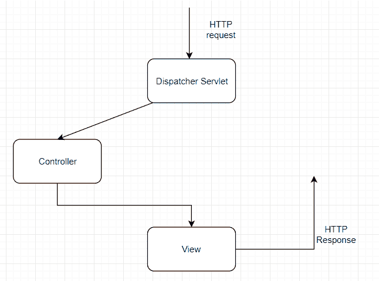

# 在 Spring 中实现控制器

> 原文： [https://javatutorial.net/implementing-controllers-in-spring](https://javatutorial.net/implementing-controllers-in-spring)

控制器在 Spring 中的主要目的是拦截传入的 http 请求，将数据发送到 Model 进行处理，最后从 Model 中获取处理后的数据，然后将完全相同的数据传递给要呈现它的 View。


上面所写内容的顶级概述：



春季工作流程

现在，让我们构建一个简单的应用程序，作为在 Spring 中实现控制器的示例。

当您要“声明”一个类作为控制器时，就像使用 @Controller 对其进行注释一样简单。 在类级别使用时，控制器现在可以处理 REST API 请求。

### GetMapping 注解

当使用 @Controller 注解时，可以通过使用该方法的 RequestMapping 注解来提供请求映射。 还有 @ RequestMapping，@ PostMapping，@ PutMapping 可以简化常见 HTTP 方法类型的映射。

```java
package com.example.demo;

import org.springframework.boot.SpringApplication;
import org.springframework.boot.autoconfigure.SpringBootApplication;
import org.springframework.stereotype.Controller;
import org.springframework.web.bind.annotation.RequestMapping;
import org.springframework.web.bind.annotation.ResponseBody;

@RestController
@SpringBootApplication
public class DemoApplication {

	@GetMapping("/")
	String home() {
		return "Greetings from Java Tutorial Network";
	}

	public static void main(String[] args) {
		SpringApplication.run(DemoApplication.class, args);
	}

}

```

上面的代码段，我们创建了一个 DemoApplication，其注释为@Controller 和@SpringBootApplication。 请注意 **@GetRequest（“ /”）**的使用。 这就是说 home（）方法将显示注释中放置的内容，在本例中为“ /”，即 http：// localhost：8080 **/。**

在示例中，我使用的是 @RestConroller ，它基本上是控制器的专用版本，其中包括 @Controller 和@ ResponseBody 注解。 它只是简化了控制器的实现。

当我们运行上面的代码时，我们得到以下结果：


输出量

如果我们想实现一个简单的登录功能，我们将执行以下操作：

```java
package com.example.demo;

import org.springframework.stereotype.Controller;
import org.springframework.web.bind.annotation.RequestMapping;

@Controller
@RequestMapping("/account/*")
public class AccountController {
	@RequestMapping
	public String login() {
		return "login";
	}
}

```

我们在这里所做的是，我们对类 AccountController 和方法 login（）都进行了注释。 当访问 http：// localhost：8080 / account /时，我们将被带到登录页面。 请注意网址末尾的“ /”。 如果不存在，例如 http：// localhost：8080 / account，将导致错误。

我在 account /之后加上“ *”的原因是，如果我们想向其添加更多内容（例如注册），则该 URL 将能够处理具有不同路径的所有请求。

但就目前而言，我们将仅坚持登录。 接下来，我们需要为 Login 创建一个类，并将其注释为@Controller：

```java
package com.example.demo;

import org.springframework.stereotype.Controller;
import org.springframework.web.bind.annotation.RequestMapping;
import org.springframework.web.bind.annotation.RequestMethod;

@Controller
@RequestMapping("/account/login")
public class Login {
	@GetMapping
	public String login() {
		return "login";
	}
}

```

现在，当我们访问 http：// localhost：8080 / account / login 时，它将返回“ login.jsp”文件中的内容。