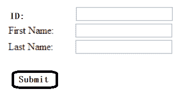

# Spring 中的`RequestParam`注解

> 原文： [https://javatutorial.net/requestparam-annotation-in-spring](https://javatutorial.net/requestparam-annotation-in-spring)

当我们想在控制器类中读取 Web 请求参数时，将使用 RequestParam 注解。 换句话说，前端正在向我们发送一些带有键的参数（例如，从填充的表单中）。


### 用例

假设我们有一个表单，目的是向数据库中添加一个雇员。 每位员工将具有：

1.  ID
2.  名字
3.  姓

因此，我们的表单如下所示（假设 ID 不会自动递增）：



员工表格示例

想象一下，上面看起来丑陋的表格中填充了以下信息：

Id = 1

名字=乔

姓氏=母鹿

现在假设我们有以下代码：

```java
@Controller
@RequestMapping("/employee/*")
public class EmployeeController {
   @GetMapping("/fill")
   public String fill() {
      return "employeeForm";
   }

   @PostMapping("/fill/process")
   public String processForm(ModelMap model, @RequestParam("id") int id, @RequestParam("First Name") String firstName, @RequestParam("Last Name") String lastName) {
      model.addAttribute("id", id);
      model.addAttribute("firstName", firstName);
      model.addAttribute("lastName", lastName);
      return "index";
   }
}
```

我们只是将 Web 请求参数绑定到方法参数（id，firstName，lastName）。 但是，为了使此示例正常工作，我们需要从前端接收相应的密钥，否则它们将为 null。

在上面的示例代码中，我们为请求参数提供了值，例如@RequestParam（“ id”）。 但是，如果目标变量名称与参数名称相同，则可以忽略该值。 因此，我们可以将上述代码片段进行如下操作：

```java
@Controller
@RequestMapping("/employee/*")
public class EmployeeController {
   @GetMapping("/fill")
   public String fill() {
      return "employeeForm";
   }

   @PostMapping("/fill/process")
   public String processForm(ModelMap model, @RequestParam int id, @RequestParam("First Name") String firstName, @RequestParam("Last Name") String lastName) {
      model.addAttribute("id", id);
      model.addAttribute("firstName", firstName);
      model.addAttribute("lastName", lastName);
      return "index";
   }
}
```

它之所以起作用，是因为“ id”与我们作为方法参数给出的名称相同，实际上是“ id”。 此外，我们无法对其他参数执行相同的操作，因为“名字”与“名字”不同。

#### `@RequestParam`的必需元素

RequestParam 还支持“ required”元素，该元素几乎完成了所要表达的内容–它指定是否需要特定的参数。 对于我们的示例，我们可以说名字不是必需的。 默认情况下，requried 将设置为 true。

```java
@Controller
@RequestMapping("/employee/*")
public class EmployeeController {
   @GetMapping("/fill")
   public String fill() {
      return "employeeForm";
   }

   @PostMapping("/fill/process")
   public String processForm(ModelMap model, @RequestParam int id, @RequestParam(value = "First Name", requried=false) String firstName, @RequestParam("Last Name") String lastName) {
      model.addAttribute("id", id);
      model.addAttribute("lastName", lastName);
      return "index";
   }
}
```

现在，firstName 不是必需的参数，因此我们没有将其添加到模型/地图中。

#### `@RequestParam`还具有`defaultValue`元素

如果我们需要在表单中填写一个值，但是我们并不真正在意那个值是什么，则可以将其设置为默认值，这样，如果用户没有填写它，它将只包含我们为它设置的任何内容。 请参阅以下代码片段作为参考：

```java
@Controller
@RequestMapping("/employee/*")
public class EmployeeController {
   @GetMapping("/fill")
   public String fill() {
      return "employeeForm";
   }

   @PostMapping("/fill/process")
   public String processForm(ModelMap model, @RequestParam int id, @RequestParam(value = "First Name", requried=false) String firstName, @RequestParam(value = "Last Name", defaultValue="Doe") String lastName) {
      model.addAttribute("id", id);
      model.addAttribute("lastName", lastName);
      return "index";
   }
}
```

现在，即使表单没有完全填写（用户省略了姓氏字段），如果我们引用了 lastName 参数，也将在其中存储“ Doe”。 我们为什么要使用“ defaultValue”元素的一个著名示例是日期。 假设我们具有与上面相同的形式，但是那里也有一个“日期”字段。 好吧，如果用户/员工没有在该字段中输入任何内容，我们可以假设是今天，因此我们将今天的日期作为默认值输入。 这只是许多例子中的一个。