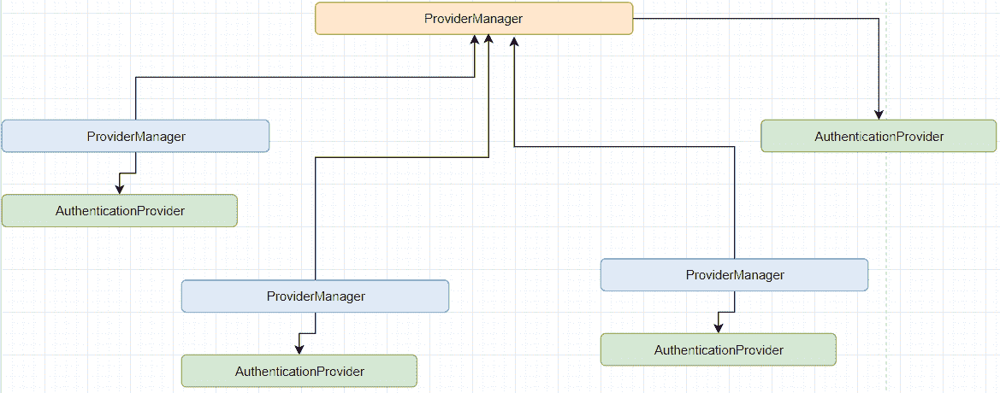

# Spring Security 简介及其设置

> [https://javatutorial.net/introduction-to-spring-security-and-how-to-to-set-up](https://javatutorial.net/introduction-to-spring-security-and-how-to-set-it-up)

在本教程中，您将学习如何使用 Spring Security 来保护 Web 应用程序的安全，包括用户身份验证，授权等。


## Spring Security 简介

Spring Security 是一个可定制的身份验证框架。 在保护基于 Spring 的应用程序时，这是标准。 它提供身份验证和授权。 授权也称为“访问控制”。

## Spring Security 的核心构建块

1.  `SecurityContextHolder`：将当前[`SecurityContext`](https://docs.spring.io/spring-security/site/docs/4.2.6.RELEASE/apidocs/org/springframework/security/core/context/SecurityContext.html)与当前执行线程相关联。 它包含当前正在与应用程序交互的`SecurityContext`的信息。 安全上下文信息存储在`ThreadLocal`对象中，该对象可用于当前线程中运行的所有成员。
2.  `SecurityContext`：接口，用于定义与当前执行线程关联的最小安全信息。 换句话说，它包含身份验证对象和特定于请求的安全性信息。
3.  身份验证：表示身份验证请求所需的令牌。 一旦请求通过身份验证，令牌通常将存储在由`SecurityContextHolder`管理的线程本地`SecurityContext`中。 用户身份验证之后，将使用`UserDetails`对象构建`Authentication`对象，然后将其存储在`SecurityContextHolder`中。
4.  `UserDetails`：提供有关用户的核心信息。
5.  `UserDetailsS​​ervice`：加载特定的用户数据。 它是一个接口，允许从数据库加载与用户相关的信息。 该接口仅需要一种只读方法，从而简化了对新数据访问策略的支持。
6.  `GrantedAuthority`：通常由`UserDetailsS​​ervice`加载。 表示授予身份验证对象的权限。

## 认证方式

身份验证（如前所述）表示与应用程序交互的主体信息（用户，设备，外部系统等）。 处理用户身份验证时，将从传入请求中检索用户名和密码，然后将其作为`UsernamePasswordAuthenticationToken`的实例。 然后将此令牌传递给`AuthenticationManager`，该管理器针对数据库中的主体身份验证主体身份。 如果身份验证成功，则`AuthenticationManager`返回存储主体详细信息的身份验证对象。 最后，在`SecurityContextHolder`方法的帮助下，将身份验证对象填充到安全上下文中。

让我们看一下`AuthenticationManager`界面的外观：

```java
public interface AuthenticationManager {

  Authentication authenticate(Authentication authentication)
    throws AuthenticationException;

}
```

如您所见，它只有一种方法。 但是，这一方法可以用来完成三件事：

1.  返回身份验证（请参阅上面的文本）
2.  抛出`AuthenticationException`
3.  返回`null`

`AuthenticationManager`通常用作`ProviderManager`的实现，然后将其委派给[`AuthenticationProvider`](https://spring.io/guides/topicals/spring-security-architecture/)实例链。`AuthenticationProvider`与`AuthenticationManager`非常相似，只是它有另外一种方法：

```java
public interface AuthenticationProvider {

	Authentication authenticate(Authentication authentication)
			throws AuthenticationException;

	boolean supports(Class<?> authentication);

}
```



## 授权书

授权的工作是确定是否允许用户访问给定的资源，换句话说，是否具有许可权。 在此阶段，Spring 为我们提供了授权组件，称为 [`AccessDecisionManager`](https://docs.spring.io/spring-security/site/docs/4.2.4.RELEASE/apidocs/org/springframework/security/access/AccessDecisionManager.html)。 这对我们有帮助，是为我们提供了 API。

多亏了 AOP，我们可以实现授权。 AOP 决定是否允许调用该方法的用户进行方法调用。

## 如何在 Spring 应用程序中设置 Spring Security

在 Maven `pom.xml`文件中，粘贴以下内容：

```java
<dependencies>
   <dependency>
      <groupId>org.springframework.security</groupId>
      <artifcatId>spring-security-web</artifactId>
      <version>4.2.3</version>
   </dependency>
   <dependency>
      <groupId>org.springframework.security</groupId>
      <artifactId>spring-security-config</artifactId>
      <version>4.2.3</version>
   </dependency>
</dependencies>
```