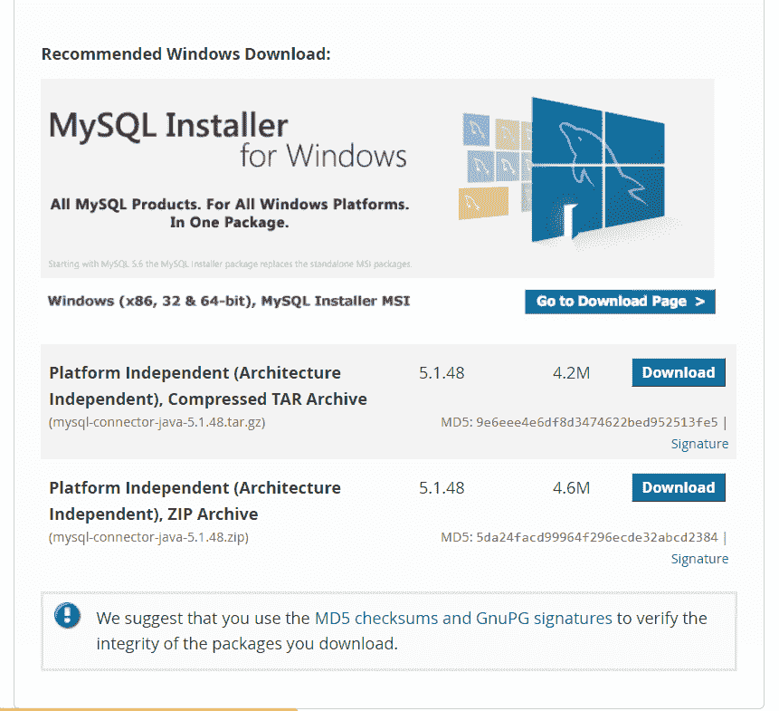
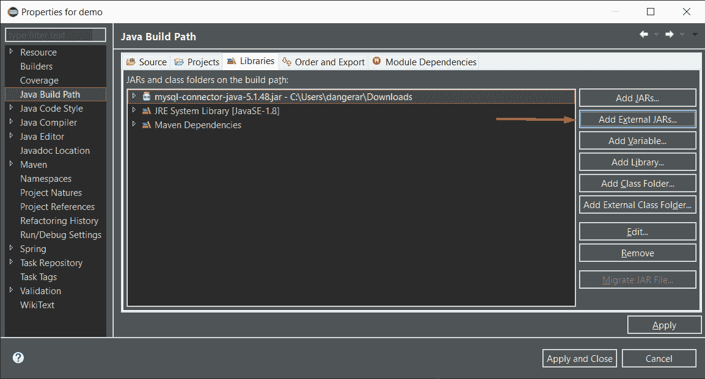

# 如何在 Java 中使用 MySQL 连接器

> [https://javatutorial.net/how-to-use-the-mysql-connector-in-java](https://javatutorial.net/how-to-use-the-mysql-connector-in-java)


在通过 Java 程序测试 MySQL 连接之前，我们需要将 MySQL JDBC 库添加到类路径中。 我们将需要从[下载页面](https://dev.mysql.com/downloads/connector/j/5.1.html)下载`mysql-connector-java-*.jar`文件：



现在，根据您的工作环境（例如 Eclipse 或命令行），您将必须执行以下任一操作：

1.  如果使用 Eclipse IDE，请将 JAR 文件作为库添加到项目属性中的“构建路径”。
2.  如果使用命令控制台，请在执行应用程序时在`-cp`或`-classpath`参数中指定 JAR 文件的路径。

命令行执行的示例如下所示：

```java
java -cp .;/xxx/xxx/xxx/mysql-connector-java-*.jar com.nameapp.ClassName
```

现在我们已经澄清了这一点，让我们从 Java 类连接到 MySQL 数据库。

在 Eclipse 中创建项目，然后右键单击项目名称并选择“属性”。 之后，导航到“Java 构建路径”并通过单击“添加外部 JAR ..”添加`.jar`文件。 您可以查看以下图像以显示步骤：

（1）


（2）



做完了 现在我们添加了 JAR 文件，是时候创建我们的 MySQL 数据库了。 我假设您已经下载了 MySQL 工作台。 如果不是，请从[此处](https://dev.mysql.com/downloads/workbench/)下载。

要创建数据库，只需键入

```java
create database demoapp;
```


然后，要验证确实已创建数据库，请键入

```java
show databases;
```

您应该看到类似以下的内容：


如您所见，`demoapp`显示为数据库。

现在，最后一步是测试 Java 类与该数据库的连接。

这是一个带有主要方法的示例 Java 类，该方法尝试建立与数据库的连接：

```java
package mysqlconnection.mysqlconnection;

import java.sql.Connection;
import java.sql.DriverManager;
import java.sql.SQLException;

public class App 
{
    public static void main( String[] args )
    {
        String url = "jdbc:mysql://localhost:3306/demoapp";

        String username = "root";
        String password = "admin123";

        // try to establish the connection to the database
        try {
        	Connection connection = DriverManager.getConnection(url, username, password);
        	System.out.println("Connection established successfully!");
        }
        // if the connection couldn't be established raise an exception
        catch (SQLException e) {
        	throw new IllegalStateException("Unable to connect to the database. " + e.getMessage());
        }
    }
}

```

**输出**：


现在忽略警告。

**细分**

我们将本地主机的 url 存储在一个名为`url`的变量中。 `jdbc`部分是 API， `demoapp`是数据库的名称。 然后，我们存储用户名和密码。 这里的主要注意事项是，密码必须与安装 MySQL 时选择的密码相同。 之后，我们有一个`Try {} Catch {}`块。 如果无法建立数据库连接，则将执行`catch`块。 在`try`块中，我们获得 url 和用户名/密码的连接。 之后，我们只需打印“连接成功建立！”。

只是一件事-如果您忘记在项目的构建路径中添加.jar 文件，则将无法建立连接，并且**`catch`块**将被执行。 因此，请不要忘记添加 JAR 文件，这一点非常重要。