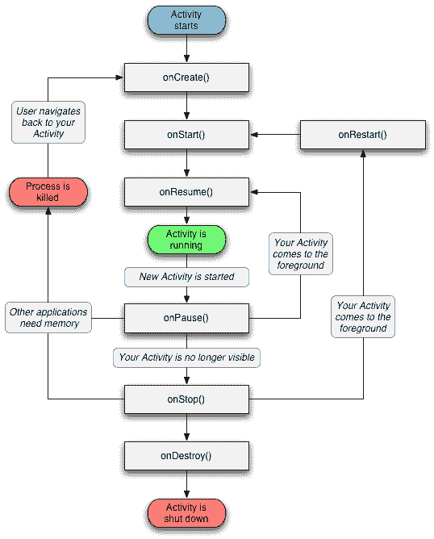

# Android 活动示例

> 原文： [https://javatutorial.net/android-activity-example](https://javatutorial.net/android-activity-example)

本教程介绍了什么是 Android 中的活动，活动周期和示例。

## Android 活动

Activity 是 Android 应用程序开发的基本组成部分之一。 就像带有用户界面的单个屏幕一样。 `ContextThemeWrapper`是 Android 活动的超类。 活动是 Android 应用程序的主要切入点，就像用 Java 或 C ++编写的程序的主要方法一样。 一个活动与用户进行交互，因此它创建了一个放置 UI 元素的窗口。 一个 Android 应用程序可以包含多个活动，这意味着可以相互交互的许多不同屏幕。

## 活动生命周期

在 Android 应用程序中，Android 活动具有其自身的生命周期。 活动存储和管理在称为活动栈的栈中。 新活动位于栈顶部并开始运行，而以前的活动则位于栈中新活动的下方。 当栈中的顶部活动退出时，从下至上的活动将变为活动状态。

### **Android 活动状态**

一个活动有四个状态

**正在运行：**栈顶部的活动处于运行或活动状态，表示该活动位于屏幕的前台。

**已暂停：**处于活动状态但未专注的活动处于暂停状态。 （这是活动中显示的弹出消息）。

**恢复：**暂停的活动变为活动状态后，它将刷新并重新开始。

**已停止：**在屏幕上不再可见的活动处于停止状态。

**调用 Android 活动的方法**

Android 活动实现以下回调方法

**OnCreate（）：**这是 Android 活动的第一个回调方法。 创建活动时调用它。 在这里，您可以设置所有东西，例如按钮和视图。

**OnStart（）：**这是第二次回调。 当活动在屏幕上可见时调用。

**OnResume（）：**如果活动进入前台，则在 OnStart（）之后调用。 这是用户开始与活动进行交互的时间。

**OnPause（）：**然后是 OnResume（）。 恢复上一个活动时将调用此方法。

**OnStop（）：**当另一个活动恢复时该调用不再可见。 它变得隐藏了。

**OnDestroy（）：**这是活动完成时的最后一次回调。

下图显示了 Android 活动的完整生命周期。



Android 活动生命周期

图中的矩形代表 6 种回调方法。

## Android 活动示例

这是 Android 活动的示例。 打开您的 Android Studio 并创建一个新项目。 新建项目向导将允许您创建一个新的活动。 您可以在“ [创建简单的 Android 应用程序](https://javatutorial.net/creating-simple-android-app)”教程中找到有关如何创建新 Android 项目的更多信息。

```java
package com.example.admin.androidactivity;

import android.os.Bundle;
import android.support.annotation.Nullable;
import android.support.design.widget.FloatingActionButton;
import android.support.design.widget.Snackbar;
import android.support.v7.app.AppCompatActivity;
import android.support.v7.widget.Toolbar;
import android.view.View;
import android.view.Menu;
import android.view.MenuItem;

public class ActivityExample extends AppCompatActivity {

    @Override
    protected void onStart() {
        super.onStart();
    }

    @Override
    protected void onCreate(@Nullable Bundle savedInstanceState) {
        super.onCreate(savedInstanceState);
    }

    @Override
    protected void onStop() {
        super.onStop();
    }

    @Override
    protected void onResume() {
        super.onResume();
    }

    @Override
    protected void onPause() {
        super.onPause();
    }

    @Override
    protected void onDestroy() {
        super.onDestroy();
    }

}

```

这是示例代码，您可以[下载](https://github.com/JavaTutorialNetwork/Tutorials/blob/master/AndroidActivity.rar)。