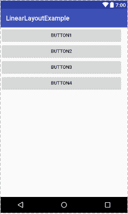
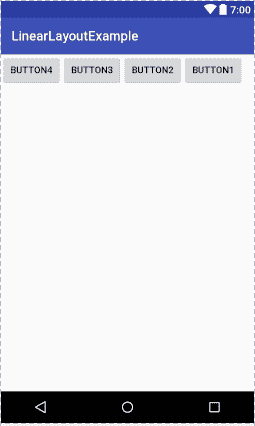

# Android 线性布局示例

> 原文： [https://javatutorial.net/android-linear-layout-example](https://javatutorial.net/android-linear-layout-example)

在先前的教程中，您了解了 Android [意图](https://javatutorial.net/android-intent-example)，[服务](https://javatutorial.net/android-service-example)和[活动](https://javatutorial.net/android-activity-example)。 本教程和接下来的几本教程将介绍有关 Android 中不同布局的信息。

布局是事物以特定方式进行排列的方式。 Android 还提供了不同的布局，以不同的方式排列不同的组件。 其中一些是线性布局，相对布局，Web 视图布局等。布局对于 UI 应用程序的开发非常重要。 本教程的主要重点是线性布局。

## 线性布局

Android 中的线性布局使我们可以将组件水平排列在单列中或垂直排列在单行中。 垂直或水平方向取决于属性 **android：方向。** 线性布局简单易用，如果窗口的长度超过屏幕的长度，则会创建滚动条。 垂直线性布局每行只有一项。 线性布局具有许多不同的属性，可用于根据需要自定义线性布局。 下图显示了水平和垂直线性布局。


线性布局

## 线性布局的属性

以下是 Android 线性布局的一些属性。

*   **ID：**布局的唯一标识符。
*   **方向：**用于将线性布局方向设置为垂直或水平的属性。
*   **Layout_Weight：**此属性在每个组件处分配“重要性”值。
*   **重力：**此属性显示对象在 x-y 平面中的位置，例如中心，右侧，顶部，底部和左侧。
*   **Weight_sum：**此属性定义最大加权和。
*   **分隔线：**绘图可用作按钮之间的垂直分隔线。

除了这些属性，线性布局还具有许多不同的构造函数。

## 线性布局的构造函数

以下是线性布局的构造函数

*   **LinearLayout（上下文上下文）**
*   **LinearLayout（上下文上下文，AttributeSet 属性）**
*   **LinearLayout（Context context，AttributeSet attrs，int styleAttribute）**
*   **LinearLayout（Context context，AttributeSet attrs，int styleAttribute，int styleRes）**

## Android 中的线性布局示例

如果为两个线性布局（例如垂直线性布局或水平线性布局）设置了不同的属性值，则线性布局看起来会有所不同。

以下示例显示垂直线性布局。 这是 activity_linear_vertical.xml

```java
<?xml version="1.0" encoding="utf-8"?>
<LinearLayout android:layout_width="368dp"
    android:layout_height="495dp"
    xmlns:tools="http://schemas.android.com/tools"
    android:orientation="vertical"
    tools:layout_editor_absoluteX="8dp"
    tools:layout_editor_absoluteY="8dp"
    xmlns:android="http://schemas.android.com/apk/res/android">

        <Button
            android:id="@+id/button5"
            android:layout_width="match_parent"
            android:layout_height="wrap_content"
            android:text="Button1" />

        <Button
            android:id="@+id/button6"
            android:layout_width="match_parent"
            android:layout_height="wrap_content"
            android:text="Button2" />

        <Button
            android:id="@+id/button7"
            android:layout_width="match_parent"
            android:layout_height="wrap_content"
            android:text="Button3" />

        <Button
            android:id="@+id/button8"
            android:layout_width="match_parent"
            android:layout_height="wrap_content"
            android:text="Button4" />
    </LinearLayout>

```

这是输出的样子



线性布局垂直

这是另一个显示水平线性布局的示例。 以下是 activity_linear_horizo​​ntal.xml 的代码

```java
<?xml version="1.0" encoding="utf-8"?>

<LinearLayout android:layout_width="368dp"
    android:layout_height="495dp"
    xmlns:tools="http://schemas.android.com/tools"
    android:orientation="horizontal"
    tools:layout_editor_absoluteX="8dp"
    tools:layout_editor_absoluteY="8dp"
    xmlns:android="http://schemas.android.com/apk/res/android">

        <Button
            android:id="@+id/button4"
            android:layout_width="wrap_content"
            android:layout_height="wrap_content"
            android:layout_weight="1"
            android:text="Button4" />

        <Button
            android:id="@+id/button3"
            android:layout_width="wrap_content"
            android:layout_height="wrap_content"
            android:layout_weight="1"
            android:text="Button3" />

        <Button
            android:id="@+id/button2"
            android:layout_width="wrap_content"
            android:layout_height="wrap_content"
            android:layout_weight="1"
            android:text="Button2" />

        <Button
            android:id="@+id/button"
            android:layout_width="wrap_content"
            android:layout_height="wrap_content"
            android:layout_weight="1"
            android:text="Button1" />
    </LinearLayout>

```

这是输出的样子



线性布局水平

您可以从[链接](https://github.com/JavaTutorialNetwork/Tutorials/blob/master/LinearLayoutExample.rar)下载示例代码。 有关更多 Android 布局，请遵循以下教程。