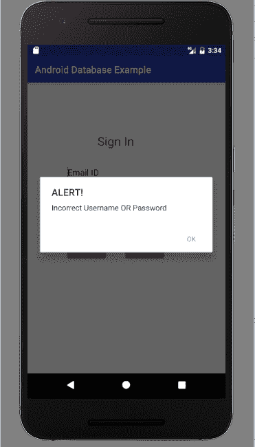
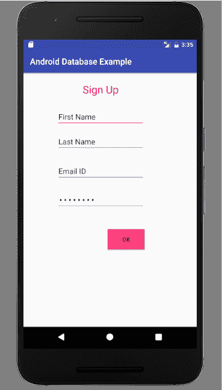

# Android SQLite 数据库示例

> 原文： [https://javatutorial.net/android-sqlite-database-example](https://javatutorial.net/android-sqlite-database-example)

上一教程对 Android 中的 SQLite 数据库进行了[简介。 本教程以示例说明了所有 CRUD（创建，检索，更新，删除）功能。](https://javatutorial.net/android-sqlite-database-introduction)

## 示例背景

让我们开始使用 SQLite 数据库。 本示例全部有关注册和登录过程以及将用户凭据存储到数据库中的逐步说明。 当用户单击“注册”按钮时，将出现一个新活动，并且用户填写该表单，该表单具有四个值，分别是名字，姓氏，电子邮件 ID 和密码。 当用户单击“确定”按钮时，这些值将保存到数据库中。 下图显示了数据库中的注册表的外观


登录表

## 第 1 步：活动布局

让我们开始创建用于注册和登录的 xml 布局。如上所述，注册有四个字段和一个确定按钮。 用户单击确定按钮时，将显示一个对话框，因为已保存值，然后将开始登录活动。

这是 activity_main.xml 的代码

```java
<?xml version="1.0" encoding="utf-8"?>

<RelativeLayout android:layout_width="368dp"
    android:layout_height="495dp"
    xmlns:tools="http://schemas.android.com/tools"
    tools:layout_editor_absoluteX="8dp"
    tools:layout_editor_absoluteY="8dp"
    xmlns:android="http://schemas.android.com/apk/res/android">

    <TextView
        android:id="@+id/textView2"
        android:layout_width="wrap_content"
        android:layout_height="wrap_content"
        android:layout_alignParentTop="true"
        android:layout_centerHorizontal="true"
        android:layout_marginTop="104dp"
        android:text="Sign In"
        android:textColor="@android:color/holo_red_dark"
        android:textSize="25sp" />

    <EditText
        android:id="@+id/Email"
        android:layout_width="wrap_content"
        android:layout_height="wrap_content"
        android:layout_below="@+id/textView2"
        android:layout_centerHorizontal="true"
        android:layout_marginTop="26dp"
        android:ems="10"
        android:inputType="textPersonName"
        android:text="Email ID" />

    <EditText
        android:id="@+id/Password"
        android:layout_width="wrap_content"
        android:layout_height="wrap_content"
        android:layout_alignEnd="@+id/Email"
        android:layout_alignRight="@+id/Email"
        android:layout_centerVertical="true"
        android:ems="10"
        android:inputType="textPassword"
        android:text="password" />

    <Button
        android:id="@+id/buttonSignIn"
        android:layout_width="wrap_content"
        android:layout_height="wrap_content"
        android:layout_alignLeft="@+id/Password"
        android:layout_alignStart="@+id/Password"
        android:layout_below="@+id/Password"
        android:layout_marginTop="52dp"
        android:backgroundTint="@color/colorAccent"
        android:onClick="SignIN"
        android:text="Sign In" />

    <Button
        android:id="@+id/buttonSignUp"
        android:layout_width="wrap_content"
        android:layout_height="wrap_content"
        android:layout_alignEnd="@+id/Password"
        android:layout_alignRight="@+id/Password"
        android:layout_alignTop="@+id/buttonSignIn"
        android:backgroundTint="@color/colorAccent"
        android:onClick="SignUP"
        android:text="Sign Up" />

</RelativeLayout>

```

现在为 activity_sign_up.xml 创建另一个布局。 登录有两个字段和两个按钮，分别是“登录”和“登录”。 如果您已经有一个帐户，请输入 ID 和密码并登录。如果没有，请单击“注册”按钮并为您创建帐户。

```java
<?xml version="1.0" encoding="utf-8"?>
<RelativeLayout android:layout_width="368dp"
    android:layout_height="495dp"
    xmlns:tools="http://schemas.android.com/tools"
    tools:layout_editor_absoluteX="8dp"
    tools:layout_editor_absoluteY="8dp"
    xmlns:android="http://schemas.android.com/apk/res/android">

    <TextView
        android:id="@+id/tSignUP"
        android:layout_width="wrap_content"
        android:layout_height="wrap_content"
        android:text="Sign Up"
        android:textColor="@android:color/holo_red_dark"
        android:textSize="25sp"
        android:layout_alignParentTop="true"
        android:layout_centerHorizontal="true"
        android:layout_marginTop="22dp" />

    <EditText
        android:id="@+id/tFirstName"
        android:layout_width="wrap_content"
        android:layout_height="wrap_content"
        android:layout_below="@+id/tSignUP"
        android:layout_centerHorizontal="true"
        android:layout_marginTop="26dp"
        android:ems="10"
        android:inputType="textPersonName"
        android:text="First Name" />

    <EditText
        android:id="@+id/tPassword"
        android:layout_width="wrap_content"
        android:layout_height="wrap_content"
        android:ems="10"
        android:inputType="textPassword"
        android:text="password"
        android:layout_below="@+id/tEmail"
        android:layout_alignLeft="@+id/tEmail"
        android:layout_alignStart="@+id/tEmail"
        android:layout_marginTop="23dp"  />

    <EditText
        android:id="@+id/tLastName"
        android:layout_width="wrap_content"
        android:layout_height="wrap_content"
        android:layout_alignLeft="@+id/tFirstName"
        android:layout_alignStart="@+id/tFirstName"
        android:layout_below="@+id/tFirstName"
        android:layout_marginTop="14dp"
        android:ems="10"
        android:inputType="textPersonName"
        android:text="Last Name" />

    <EditText
        android:id="@+id/tEmail"
        android:layout_width="wrap_content"
        android:layout_height="wrap_content"
        android:layout_alignEnd="@+id/tLastName"
        android:layout_alignRight="@+id/tLastName"
        android:layout_below="@+id/tLastName"
        android:layout_marginTop="25dp"
        android:ems="10"
        android:inputType="textPersonName"
        android:text="Email ID" />

    <Button
        android:id="@+id/buttonOK"
        android:layout_width="wrap_content"
        android:layout_height="wrap_content"
        android:layout_alignEnd="@+id/tPassword"
        android:layout_alignRight="@+id/tPassword"
        android:layout_below="@+id/tPassword"
        android:layout_marginTop="47dp"
        android:background="@color/colorAccent"
        android:onClick="OK"
        android:text="OK" />
</RelativeLayout>

```

## 步骤 2：创建数据库助手类

此类在磁盘上创建数据库。

```java
package com.example.admin.androiddatabaseexample;

        import android.content.Context;
        import android.database.sqlite.SQLiteDatabase;
        import android.database.sqlite.SQLiteDatabase.CursorFactory;
        import android.database.sqlite.SQLiteOpenHelper;
        import android.util.Log;

public class DataBaseHelper extends SQLiteOpenHelper {
    public DataBaseHelper(Context context, String name, CursorFactory factory, int version) {
        super(context, name, factory, version);
    }

    // Called when no database exists in disk and the helper class needs
    // to create a new one.
    @Override
    public void onCreate(SQLiteDatabase _db) {
        try {
            _db.execSQL(LoginDatabaseAdapter.DATABASE_CREATE);

        }catch(Exception er){

            Log.e("Error","exceptioin");
        }

    }

    // Called when there is a database version mismatch meaning that the version
    // of the database on disk needs to be upgraded to the current version.
    @Override
    public void onUpgrade(SQLiteDatabase _db, int _oldVersion, int _newVersion)
    {
        // Log the version upgrade.
        Log.w("TaskDBAdapter", "Upgrading from version " +_oldVersion + " to " +_newVersion + ", which will destroy all old data");

        // Upgrade the existing database to conform to the new version. Multiple
        // previous versions can be handled by comparing _oldVersion and _newVersion
        // values.
        // The simplest case is to drop the old table and create a new one.
        _db.execSQL("DROP TABLE IF EXISTS " + "LOGIN");

        // Create a new one.
        onCreate(_db);
    }

}
```

## 步骤 3：创建登录数据库类

登录数据库是一类，您在其中实现所有数据库编码。 首先使用四个字段创建用于登录的表，然后实现所有其他方法。

```java
package com.example.admin.androiddatabaseexample;

        import android.app.AlertDialog;
        import android.content.ContentValues;
        import android.content.Context;
        import android.content.DialogInterface;
        import android.database.Cursor;
        import android.database.SQLException;
        import android.database.sqlite.SQLiteDatabase;
        import android.util.Log;
        import android.widget.Toast;

        import java.util.ArrayList;
        import java.util.List;

public class LoginDatabaseAdapter {

    static final String DATABASE_NAME = "database.db";
    String ok="OK";
    static final int DATABASE_VERSION = 1;
    public  static String getPassword="";

    public static final int NAME_COLUMN = 1;
    // TODO: Create public field for each column in your table.
    // SQL Statement to create a new database.
    static final String DATABASE_CREATE = "create table LOGIN( ID integer primary key autoincrement,FIRSTNAME  text,LASTNAME  text,USERNAME text,PASSWORD text); ";

    // Variable to hold the database instance
    public static SQLiteDatabase db;
    // Context of the application using the database.
    private final Context context;
    // Database open/upgrade helper
    private static DataBaseHelper dbHelper;
    public  LoginDatabaseAdapter(Context _context)
    {
        context = _context;
        dbHelper = new DataBaseHelper(context, DATABASE_NAME, null, DATABASE_VERSION);
    }

    // Method to openthe Database
    public  LoginDatabaseAdapter open() throws SQLException
    {
        db = dbHelper.getWritableDatabase();        return this;
    }

    // Method to close the Database
    public void close()
    {
        db.close();
    }

    // method returns an Instance of the Database
    public  SQLiteDatabase getDatabaseInstance()
    {
        return db;
    }

    // method to insert a record in Table
    public String insertEntry(String firstName,String lastName,String Id,String password)
    {

        try {

            ContentValues newValues = new ContentValues();
            // Assign values for each column.
            newValues.put("FIRSTNAME", firstName);
            newValues.put("LASTNAME", lastName);
            newValues.put("USERNAME", Id);
            newValues.put("PASSWORD", password);

            // Insert the row into your table
            db = dbHelper.getWritableDatabase();
            long result=db.insert("LOGIN", null, newValues);
            System.out.print(result);
            Toast.makeText(context, "User Info Saved", Toast.LENGTH_LONG).show();

        }catch(Exception ex) {
            System.out.println("Exceptions " +ex);
            Log.e("Note", "One row entered");
        }
        return ok;
    }
    // method to delete a Record of UserName
    public int deleteEntry(String UserName)
    {

        String where="USERNAME=?";
        int numberOFEntriesDeleted= db.delete("LOGIN", where, new String[]{UserName}) ;
        Toast.makeText(context, "Number fo Entry Deleted Successfully : "+numberOFEntriesDeleted, Toast.LENGTH_LONG).show();
        return numberOFEntriesDeleted;

    }

    // method to get the password  of userName
    public String getSinlgeEntry(String userName)
    {

        db=dbHelper.getReadableDatabase();
        Cursor cursor=db.query("LOGIN", null, "USERNAME=?", new String[]{userName}, null, null, null);
        if(cursor.getCount()<1) // UserName Not Exist
            return "NOT EXIST";
        cursor.moveToFirst();
        getPassword= cursor.getString(cursor.getColumnIndex("PASSWORD"));
        return getPassword;

    }
    // Method to Update an Existing
    public void  updateEntry(String userName,String password)
    {
        //  create object of ContentValues
        ContentValues updatedValues = new ContentValues();
        // Assign values for each Column.
        updatedValues.put("USERNAME", userName);
        updatedValues.put("PASSWORD", password);

        String where="USERNAME = ?";
        db.update("LOGIN",updatedValues, where, new String[]{userName});

    }

}

```

## 步骤 4：`MainActivity.java`

在该类中，您可以从登录活动中获取 ID 和密码，并在点击监听器上实现登录和注册按钮。

```java
package com.example.admin.androiddatabaseexample;

import android.app.AlertDialog;
import android.content.Context;
import android.content.DialogInterface;
import android.content.Intent;
import android.support.v7.app.AppCompatActivity;
import android.os.Bundle;
import android.util.Log;
import android.view.View;
import android.widget.EditText;

public class MainActivity extends AppCompatActivity {

 private EditText etUserEmail;
 private EditText etPassword;
 public String username;
 private String password;
 String storedPassword;
 Context context=this;

 LoginDatabaseAdapter loginDataBaseAdapter;

 @Override
 protected void onCreate(Bundle savedInstanceState) {
     super.onCreate(savedInstanceState);
     setContentView(R.layout.activity_main);
     // create the instance of Databse
     loginDataBaseAdapter=new LoginDatabaseAdapter(getApplicationContext());

     etUserEmail = (EditText) findViewById(R.id.Email);
     etPassword = (EditText) findViewById(R.id.Password);

 }

 public void SignIN(View view) {

   try {

       loginDataBaseAdapter = loginDataBaseAdapter.open();
       username = etUserEmail.getText().toString();
       password = etPassword.getText().toString();

       if (username.equals("") || password.equals("")) {
          AlertDialog alertDialog = new AlertDialog.Builder(this).create();
          alertDialog.setTitle("ALERT!");
          alertDialog.setMessage("Fill All Fields");
          alertDialog.setButton("OK", new DialogInterface.OnClickListener() {
          public void onClick(DialogInterface dialog, int which) {
          }
          });
          alertDialog.show();
       }

      // fetch the Password form database for respective user name
      if (!username.equals("")) {
          storedPassword = loginDataBaseAdapter.getSinlgeEntry(username);

         // check if the Stored password matches with Password entered by user
      if (password.equals(storedPassword)) {
         Intent intent1 = new Intent(MainActivity.this, DisplayInfoActivity.class);
         startActivity(intent1);
         // finish();
       } 
      else
       {
         AlertDialog alertDialog = new AlertDialog.Builder(this).create();
         alertDialog.setTitle("ALERT!");
         alertDialog.setMessage("Incorrect Username OR Password");
         alertDialog.setButton("OK", new DialogInterface.OnClickListener() {
       public void onClick(DialogInterface dialog, int which) {
       }
       });
       alertDialog.show();
       }
       }
       }
    catch (Exception ex)
      {
      Log.e("Error", "error login");
      }

 }

 public void SignUP(View view)
{
      Intent intent = new Intent(MainActivity.this, SignUp.class);
      startActivity(intent);
 }

 @Override
 protected void onDestroy() 
{
     // TODO Auto-generated method stub
     super.onDestroy();

     // Close The Database
      loginDataBaseAdapter.close();
 }
}

```

## 步骤 5：`SignUp.java`

当用户在注册活动中单击“确定”按钮时，将出现一个对话框，指出值已添加到数据库的登录表中。

```java
package com.example.admin.androiddatabaseexample;

import android.support.v7.app.AppCompatActivity;
import android.os.Bundle;
import android.app.AlertDialog;
import android.content.Context;
import android.content.DialogInterface;
import android.content.Intent;
import android.view.View;
import android.widget.EditText;

public class SignUp extends AppCompatActivity {

 Context context=this;
 private EditText et_first_name;
 private EditText et_last_name;
 private EditText et_ID;
 private EditText et_password;
 private String firstName;
 private String lastName;
 private String userName;
 private String password;
 String receieveOk;
 LoginDatabaseAdapter loginDataBaseAdapter;

 @Override
 protected void onCreate(Bundle savedInstanceState) 
{
     super.onCreate(savedInstanceState);
     setContentView(R.layout.activity_sign_up);

     // get Instance of Database Adapter
     loginDataBaseAdapter=new LoginDatabaseAdapter(getApplicationContext());
     loginDataBaseAdapter=loginDataBaseAdapter.open();
     et_first_name = (EditText) findViewById(R.id.tFirstName);
     et_last_name = (EditText) findViewById(R.id.tLastName);
     et_ID = (EditText) findViewById(R.id.tEmail);
     et_password = (EditText) findViewById(R.id.tPassword);

 }

 public void OK(View view)
{

     firstName = et_first_name.getText().toString();
     lastName = et_last_name.getText().toString();
     userName = et_ID.getText().toString();
     password = et_ID.getText().toString();
     if((firstName.equals(""))||(lastName.equals(""))||(userName.equals(""))||(password.equals("")))
     {
         //Display Message
         AlertDialog alertDialog = new AlertDialog.Builder(this).create();
         alertDialog.setTitle("ALERT!");
         alertDialog.setMessage("All fields must be filled");
         alertDialog.setButton("OK", new DialogInterface.OnClickListener() {
         public void onClick(DialogInterface dialog, int which) {

     }
     });
     alertDialog.show();
 }
else
{

       // Save the Data in Database
       receieveOk=loginDataBaseAdapter.insertEntry(firstName,lastName,userName, password);

       AlertDialog alertDialog = new AlertDialog.Builder(this).create();
       alertDialog.setTitle("SUCCESSFUL!");
       alertDialog.setMessage("SIGN IN NOW " + receieveOk);
       alertDialog.setButton("OK", new DialogInterface.OnClickListener() {
       public void onClick(DialogInterface dialog, int which) {

       Intent intent = new Intent(SignUp.this, MainActivity.class);
       startActivity(intent);
       }
       });
       alertDialog.show();
       finish();
       }

 }

 @Override
 protected void onDestroy()
 {
      // TODO Auto-generated method stub
      super.onDestroy();

     loginDataBaseAdapter.close();
 }
}

```

现在运行您的应用程序并进行测试。 这是正在运行的应用程序的屏幕截图


登入



错误的 ID 或密码



注册

您可以从[链接](https://github.com/JavaTutorialNetwork/Tutorials/blob/master/AndroidDatabaseExample.rar)下载此代码。