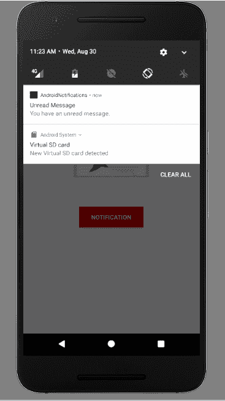

# Android 中的通知

> 原文： [https://javatutorial.net/notifications-in-android](https://javatutorial.net/notifications-in-android)

Android 应用程序中的通知非常有用。 本教程将通过示例说明如何在应用程序中设置通知。

## 通知

通知是通知或通知某事。 Android 应用程序中的通知非常有用。 它提供有关重要信息的信息。 现在，一天的用户希望易于使用，而又不想一次又一次地打开应用以获取新的更新。 取而代之的是，它们启用上推通知。 例如，没有人希望在一天内一次又一次地检查电子邮件，最好是在收到新邮件时调整通知。 为了满足这种通知需求，本教程提供了一个简单的示例来设置通知。

## `NotificationCompat.Builder`

`NotificationCompat`构建器类可帮助我们开发通知布局。 它有许多用于在应用程序中进行通知的方法。 以下是其中一些：

*   `addNotification(NotificationCompat.Action action)`：顾名思义，此方法用于向通知中添加操作。
*   `addPerson(String uri)`：此方法用于将人添加到通知中。 例如，来自特定人的电子邮件。
*   `getNotification()`：用于获取通知。
*   `build()`：用于构建通知。
*   `setCategory(String category)`：此方法用于设置通知类别。
*   `setColor(int argb)`：此方法用于设置通知颜色。
*   `setContentTitle(CharSequence title)`：此方法用于设置通知栏的标题。
*   `setContentText(CharSequence text)`：此方法用于设置通知栏中显示的文本。

## 通知管理器

通知管理器是一个类，用于告知用户后台发生了某些事情。 它通知事件。

## Android 中的通知示例

让我们开始创建一个简单的示例，该示例演示如何在 Android 应用中使用通知。 打开您的 Android Studio 并创建主要活动。 在主要活动中，只有文本视图，图像视图和按钮。 当用户单击按钮时，它将在状态栏中显示通知。 这是`activity_main.xml`的 XML 布局

```java
<?xml version="1.0" encoding="utf-8"?>
<RelativeLayout xmlns:android="http://schemas.android.com/apk/res/android"
    xmlns:tools="http://schemas.android.com/tools"
    android:layout_width="match_parent"
    android:layout_height="match_parent"
    tools:context="MainActivity">

    <TextView
        android:id="@+id/textView2"
        android:layout_width="wrap_content"
        android:layout_height="wrap_content"
        android:layout_centerHorizontal="true"
        android:layout_marginTop="48dp"
        android:text="Java Tutorial "
        android:textColor="@android:color/holo_red_dark"
        android:textSize="30dp" />

    <ImageButton
        android:layout_width="wrap_content"
        android:layout_height="wrap_content"
        android:id="@+id/imageButton"
        android:src="@drawable/message"
        android:layout_below="@+id/textView2"
        android:layout_centerHorizontal="true"
        android:layout_marginTop="42dp" />

    <Button
        android:id="@+id/button"
        android:layout_width="150dp"
        android:layout_height="wrap_content"
        android:layout_below="@+id/imageButton"
        android:layout_centerHorizontal="true"
        android:layout_marginTop="62dp"
        android:background="@android:color/holo_red_dark"
        android:text="Notification"
        android:onClick="notification"
        android:textColor="@android:color/background_light" />

</RelativeLayout>
```

现在为通知创建另一个布局，这是`activity_notification_bar.xml`的代码

```java
<?xml version="1.0" encoding="utf-8"?>
<LinearLayout xmlns:android="http://schemas.android.com/apk/res/android"
    android:orientation="vertical"
    android:layout_width="fill_parent"
    android:layout_height="fill_parent" >

    <TextView
        android:layout_width="fill_parent"
        android:layout_height="400dp"
        android:text="You have a new unread message...." />
</LinearLayout>
```

这是`NotificationBar.java`

```java
package com.example.admin.androidnotifications;

import android.os.Bundle;
import android.app.Activity;

public class NotificationBar extends Activity{
    @Override
    public void onCreate(Bundle savedInstanceState)
    {
        super.onCreate(savedInstanceState);
        setContentView(R.layout.activity_notification_bar);

    }
}

```

现在打开您的`MainActivity.java`并粘贴以下代码

```java
package com.example.admin.androidnotifications;

import android.os.Bundle;
import android.app.Activity;
import android.app.NotificationManager;
import android.app.PendingIntent;
import android.content.Context;
import android.content.Intent;
import android.support.v4.app.NotificationCompat;
import android.view.View;
import android.widget.Button;

public class MainActivity extends Activity {

    @Override
    protected void onCreate(Bundle savedInstanceState)
    {
        super.onCreate(savedInstanceState);
        setContentView(R.layout.activity_main);

    }

    public void notification(View view)
    {
        addNotification();
    }

    private void addNotification()
    {
        NotificationCompat.Builder builder =
        new NotificationCompat.Builder(this)
                .setSmallIcon(R.drawable.message)
                .setContentTitle("Unread Message")   //this is the title of notification
                .setColor(101)
                .setContentText("You have an unread message.");   //this is the message showed in notification

        Intent intent = new Intent(this, MainActivity.class);
        PendingIntent contentIntent = PendingIntent.getActivity(this, 0, intent, PendingIntent.FLAG_UPDATE_CURRENT);
        builder.setContentIntent(contentIntent);

        // Add as notification
        NotificationManager manager = (NotificationManager) getSystemService(Context.NOTIFICATION_SERVICE);
        manager.notify(0, builder.build());
    }
}

```

现在运行您的应用，这是输出


通知示例

单击通知按钮后，新的通知将出现在状态栏中。 这是它的样子



新通知

您可以通过单击[链接](https://github.com/JavaTutorialNetwork/Tutorials/blob/master/AndroidNotifications.rar)下载此项目。