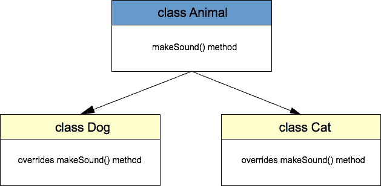

# Java 多态示例

> 原文： [https://javatutorial.net/java-polymorphism-example](https://javatutorial.net/java-polymorphism-example)

该示例演示了 Java 编程语言中多态的用法

## 什么是多态

多态一词来自希腊语，意思是“许多形式”。 Java 中的多态允许类的子类定义其自己的独特行为，而又共享父类的某些相同功能。 我将从继承的角度讨论多态，在继承中，名称相同的多个方法的功能稍有不同。 此技术也称为方法覆盖。

多态是[面向对象编程（OOP）](https://javatutorial.net/java-oop)背后的四个主要概念之一。 OOP 问题在求职面试中很常见，因此您可能会在下次 Java 求职面试中遇到有关多态的问题。

## Java 多态示例

在此示例中，我们将创建 3 个类来演示多态，并创建一个类来测试该概念。 我们的超类称为`Animal`。 动物类的后继者是`Dog`和`Cat`类。 这些也是动物，对不对？ 这就是多态所在-同一对象的多种形式具有不同的行为。 为了说明这一点，我们将使用一种名为`makeSound()`的方法，并在后继类中重写此方法的输出。



Java 多态示例

当我们调用`makeSound()`方法时，通用动物类将输出一些抽象文本：

```java
package net.javatutorial;

public class Animal {

	public void makeSound() {
		System.out.println("the animal makes sounds");
	}

}

```

扩展了`Animal`的`Dog`类将产生稍微不同的结果–狗将吠叫。 为此，我们扩展了`Animal`类并覆盖了`makeSound()`方法

```java
package net.javatutorial;

public class Dog extends Animal{

	@Override
	public void makeSound() {
		System.out.println("the dog barks");
	}

}

```

显然，我们必须对`Cat`类执行相同的操作才能制作出猫叫声。

```java
package net.javatutorial;

public class Cat extends Animal {

	@Override
	public void makeSound() {
		System.out.println("the cat meows");
	}

}

```

最后，让我们测试一下我们的创作。

```java
package net.javatutorial;

public class PolymorphismExample {

	public static void main(String[] args) {
		Animal animal = new Animal();
		animal.makeSound();
		Dog dog = new Dog();
		dog.makeSound();
		animal = new Cat();
		animal.makeSound();
	}

}
```

首先，我们创建一个常规的`Animal`对象并调用`makeSound()`方法。 我们对新创建的`Dog`对象执行相同的操作。 现在请注意对`animal = new Cat()`的调用-我们将新的`Cat`对象分配给`Animal`对象。 猫是动物，还记得吗？ 因此，我们总是可以这样做：

```java
Animal animal = new Cat();
```

通过调用此对象的`makeSound()`方法，实际上将调用`Cat`类中的重写的`makeSound()`方法。

最后，这是程序的输出

```java
the animal makes sounds
the dog barks
the cat meows
```

### 参考文献

官方 Oracle [多态示例](https://docs.oracle.com/javase/tutorial/java/IandI/polymorphism.html)