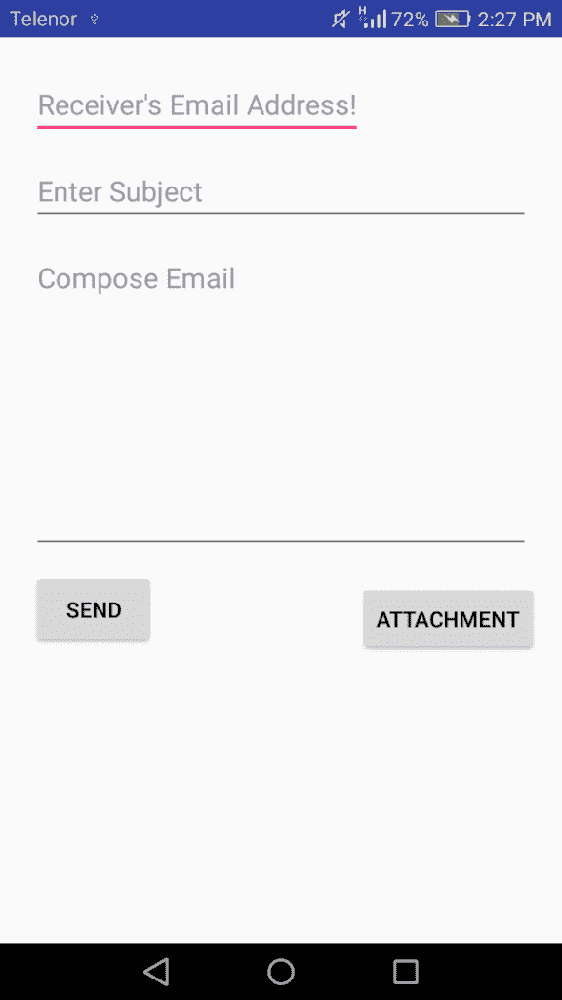
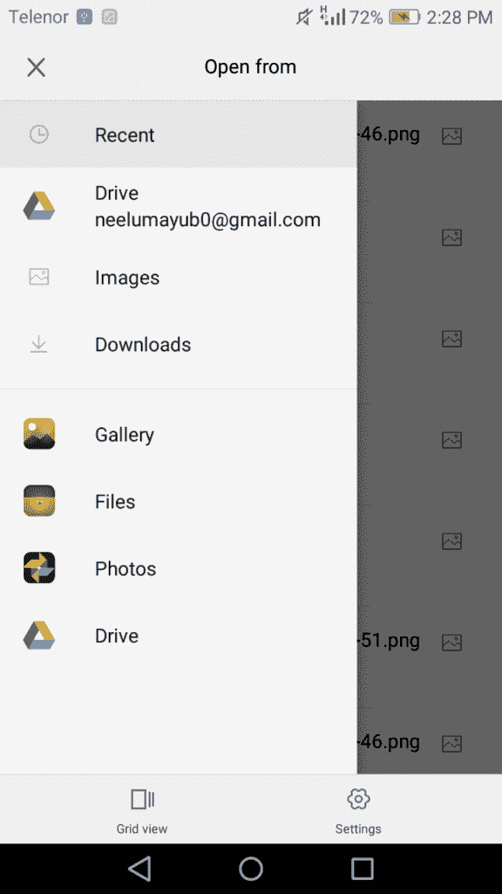
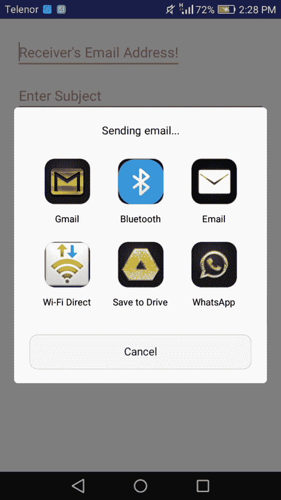

# 如何在 Android 中发送带有附件的电子邮件

> 原文： [https://javatutorial.net/send-email-with-attachments-android](https://javatutorial.net/send-email-with-attachments-android)

在本教程中，您将学习如何在 Android 中以编程方式发送电子邮件以及如何附加文件，图像或视频。

电子邮件通常用于专业和个人对话。 许多应用程序需要电子邮件选项才能将数据发送给其他人。 您可以使用 Android 应用程序轻松发送电子邮件。 附件呢？ 不幸的是，Android 不允许我们附加许多不同的文件格式，但是您可以添加其中的一些格式，例如照片，音频，视频，pdf 和 Word 文档。

## 电子邮件附件的示例

首先创建一个允许用户通过电子邮件发送数据的应用程序。 Intent.ACTION_SEND 用于通过手机中的现有客户端发送电子邮件。 类似地，Intent.ACTION_GET_CONTENT 用于附件。

## `Intent.ACTION_SEND`

ACTION_SEND 用于将数据发送到您应用中的其他活动或其他应用。 两者都很容易理解和使用。 如果要将数据发送到应用程序中的其他活动，则只需指定数据及其类型。 Android 操作系统将完成剩下的工作……它将找到兼容的活动并显示数据。 同样，您可以将数据发送到其他应用程序。 将内容类型设置为简单的纯文本。 这是应该如何编码的

```java
final Intent emailIntent = new Intent(android.content.Intent.ACTION_SEND);
emailIntent.setType("plain/text");
emailIntent.putExtra(android.content.Intent.EXTRA_EMAIL,new String[] { email });
emailIntent.putExtra(android.content.Intent.EXTRA_SUBJECT,subject);

```

## `Intent.ACTION_GET_CONTENT`

ACTION_GET_CONTENT 用于选择多种类型的数据并返回。 您可以通过将 MIME 类型设置为此类数据来直接选择所需的内容类型。 或者，您可以选择所需的任何类型的数据。 为此，请使用选择器包装您的意图，该选择器将启动一个新活动，并让用户选择所需的内容。 这是怎么做的

```java
Intent intent = new Intent();
intent.setType("image/*");
intent.setAction(Intent.ACTION_GET_CONTENT);
intent.putExtra("return-data", true);
startActivityForResult(Intent.createChooser(intent, "Complete action using"), PICK_FROM_GALLERY);

```

## 向清单文件添加权限

向清单文件添加以下权限。

```java
<uses-sdk
android:minSdkVersion="8"
android:targetSdkVersion="16" />
<uses-permission android:name="android.permission.INTERNET" />
<uses-permission android:name="android.permission.READ_EXTERNAL_STORAGE" />
<uses-permission android:name="android.permission.READ_INTERNAL_STORAGE" />
<uses-permission android:name="android.permission.ACCESS_NETWORK_STATE" />

```

打开 [Android Studio](https://javatutorial.net/install-configure-android-studio) 并创建一个新项目。 创建主要活动并将以下代码粘贴到 activity_main.xml 中

```java
<?xml version="1.0" encoding="utf-8"?>
<ScrollView xmlns:android="http://schemas.android.com/apk/res/android"
    xmlns:tools="http://schemas.android.com/tools"
    android:layout_width="match_parent"
    android:layout_height="match_parent"
    android:padding="5dp"
    tools:context=".MainActivity" >

    <RelativeLayout
        android:layout_width="match_parent"
        android:layout_height="match_parent"
        android:layout_margin="5dp"
        android:padding="5dp" >

        <EditText
            android:id="@+id/et_to"
            android:layout_width="wrap_content"
            android:layout_height="wrap_content"
            android:layout_alignParentLeft="true"
            android:layout_alignParentTop="true"
            android:layout_margin="5dp"
            android:hint="Receiver's Email Address!"
            android:inputType="textEmailAddress"
            android:singleLine="true" />

        <EditText
            android:id="@+id/et_subject"
            android:layout_width="match_parent"
            android:layout_height="wrap_content"
            android:layout_below="@id/et_to"
            android:layout_margin="5dp"
            android:hint="Enter Subject"
            android:singleLine="true" />

        <EditText
            android:id="@+id/et_message"
            android:layout_width="match_parent"
            android:layout_height="200dp"
            android:layout_below="@id/et_subject"
            android:layout_margin="5dp"
            android:gravity="top|left"
            android:hint="Compose Email"
            android:inputType="textMultiLine" />

        <Button
            android:id="@+id/bt_send"
            android:layout_width="80dp"
            android:layout_height="50dp"
            android:layout_below="@id/et_message"
            android:layout_margin="5dp"
            android:text="Send" />

        <Button
            android:id="@+id/bt_attachment"
            android:layout_width="wrap_content"
            android:layout_height="wrap_content"
            android:text="attachment"
            android:layout_alignParentBottom="true"
            android:layout_alignParentRight="true"
            android:layout_alignParentEnd="true" />

    </RelativeLayout>

</ScrollView>

```

现在这里是 MainActivity.java

```java
package com.example.admin.emailattachmentexample;

import android.app.Activity;
import android.content.Intent;
import android.database.Cursor;
import android.net.Uri;
import android.os.Bundle;
import android.provider.MediaStore;
import android.util.Log;
import android.view.View;
import android.widget.Button;
import android.widget.EditText;
import android.widget.Toast;

public class MainActivity extends Activity {

    EditText et_email;
    EditText et_subject;
    EditText et_message;
    Button Send;
    Button Attachment;
    String email;
    String subject;
    String message;
    String attachmentFile;
    Uri URI = null;
    private static final int PICK_FROM_GALLERY = 101;
    int columnIndex;

    @Override
    protected void onCreate(Bundle savedInstanceState)
    {
        super.onCreate(savedInstanceState);
        setContentView(R.layout.activity_main);
        et_email = (EditText) findViewById(R.id.et_to);
        et_subject = (EditText) findViewById(R.id.et_subject);
        et_message = (EditText) findViewById(R.id.et_message);
        Attachment = (Button) findViewById(R.id.bt_attachment);
        Send = (Button) findViewById(R.id.bt_send);

        //send button listener
        Send.setOnClickListener(new View.OnClickListener() {
            @Override
            public void onClick(View v) {
                sendEmail();
            }
        });

        //attachment button listener
        Attachment.setOnClickListener(new View.OnClickListener() {
            @Override
            public void onClick(View v) {
                openFolder();
            }
        });
    }

    protected void onActivityResult(int requestCode, int resultCode, Intent data)
    {
        if (requestCode == PICK_FROM_GALLERY && resultCode == RESULT_OK) {
            Uri selectedImage = data.getData();
            String[] filePathColumn = { MediaStore.Images.Media.DATA };
            Cursor cursor = getContentResolver().query(selectedImage,filePathColumn, null, null, null);
            cursor.moveToFirst();
            columnIndex = cursor.getColumnIndex(filePathColumn[0]);
            attachmentFile = cursor.getString(columnIndex);
            Log.e("Attachment Path:", attachmentFile);
            URI = Uri.parse("file://" + attachmentFile);
            cursor.close();
        }

    }

    public void sendEmail()
    {
        try
        {
            email = et_email.getText().toString();
            subject = et_subject.getText().toString();
            message = et_message.getText().toString();
            final Intent emailIntent = new Intent(android.content.Intent.ACTION_SEND);
            emailIntent.setType("plain/text");
            emailIntent.putExtra(android.content.Intent.EXTRA_EMAIL,new String[] { email });
            emailIntent.putExtra(android.content.Intent.EXTRA_SUBJECT,subject);
            if (URI != null) {
                emailIntent.putExtra(Intent.EXTRA_STREAM, URI);
            }
            emailIntent.putExtra(android.content.Intent.EXTRA_TEXT, message);
            this.startActivity(Intent.createChooser(emailIntent,"Sending email..."));

        }
        catch (Throwable t)
        {
            Toast.makeText(this, "Request failed try again: " + t.toString(),Toast.LENGTH_LONG).show();
        }
    }

    public void openFolder()
    {
        Intent intent = new Intent();
        intent.setType("image/*");
        intent.setAction(Intent.ACTION_GET_CONTENT);
        intent.putExtra("return-data", true);
        startActivityForResult(Intent.createChooser(intent, "Complete action using"), PICK_FROM_GALLERY);

    }
}

```

运行您的应用，这是输出



带附件的电子邮件示例

点击添加附件



添加附件

现在点击发送按钮



发电子邮件

您可以通过单击[链接](https://github.com/JavaTutorialNetwork/Tutorials/blob/master/EmailAttachmentExample.rar)下载此项目。

## 参考文献

[Android ACTION_SEND javadoc](https://developer.android.com/reference/android/content/Intent.html#ACTION_SEND)

[Android ACTION_GET_CONTENT javadoc](https://developer.android.com/reference/android/content/Intent.html#ACTION_GET_CONTENT)