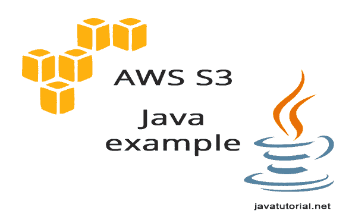

# Java S3 示例

> 原文： [https://javatutorial.net/java-s3-example](https://javatutorial.net/java-s3-example)

在本教程中，我将解释如何通过 Amazon 提供的 Java API 使用 Amazon 的 S3 存储。 该示例说明了如何创建存储分区，列出存储分区的内容，在存储分区中创建文件夹，上传文件，为文件提供公共访问权限以及如何删除所有这些项目。

## 

## 设置项目

1.  您将需要适用于 Java 的 AWS 开发工具包，此示例才能正常工作。 如果您现在尚未下载 SDK，[请在此处下载](http://aws.amazon.com/sdk-for-java/) 。 您还需要将存档中的.JAR 文件集成到您的项目中。 或者，您可以使用具有以下依赖项的 Maven

    ```java
    <dependency>
        <groupId>com.amazonaws</groupId>
        <artifactId>aws-java-sdk</artifactId>
        <version>1.9.2</version>
    </dependency>
    ```
    
2.  如果您没有，请在 Amazon IAM（https://console.aws.amazon.com/iam）中创建一个用户。 在这里您将获得一个``访问密钥''和``秘密访问密钥''。 您将需要此凭据才能连接到 S3。
3.  将 IAM 中的“ AWSConnector”和“ AmazonS3FullAccess”权限添加到新用户。 没有这个，您希望能够通过服务器进行身份验证。

## 使用 Amazon S3 进行身份验证

有 4 种不同的方法可针对 Amazon S3 验证您的请求

**1.使用默认的凭证配置文件** –这是 Amazon 推荐的方法。 创建具有以下结构的文件并填写访问密钥：

```java
# Move this credentials file to (~/.aws/credentials)
# after you fill in your access and secret keys in the default profile

# WARNING: To avoid accidental leakage of your credentials,
#          DO NOT keep this file in your source directory.
[default]
aws_access_key_id=
aws_secret_access_key=
```

默认情况下，将此文件保存为.aws 文件夹中文件名``credentials''下的 Windows 用户或 Linux 中主目录的 C：\ Users \ user \ .aws \ credentials

如果使用此方法，则可以在代码中创建一个 Credentials 对象，如下所示：

```java
AWSCredentials credentials = new ProfileCredentialsProvider().getCredentials();
```

**2.使用环境变量** –设置系统中以下环境变量的值。`AWS_ACCESS_KEY_ID`和`AWS_SECRET_ACCESS_KEY`

**3\. Java 系统属性** – `aws.accessKeyId`和`aws.secretKey`。 使用`SystemPropertiesCredentialsProvider`在程序中加载变量

**4.以编程方式设置凭据** –在此示例中，我将使用此方法，因为它更易于遵循

在代码中使用以下代码：

```java
AWSCredentials credentials = new BasicAWSCredentials("YourAccessKeyID", "YourSecretAccessKey");
```

## 创建 S3 客户端

为了能够与 S3 通信，您必须使用`AmazonS3`的实现。 您将使用实例来解决对服务器的请求

```java
AmazonS3 s3client = new AmazonS3Client(credentials);
```

## 创建桶

存储桶在整个 S3 领域中必须具有唯一的名称

```java
String bucketName = "javatutorial-net-example-bucket";
s3client.createBucket(bucketName);
```

## 列出桶

您可以像这样从所有桶中获得列出

```java
for (Bucket bucket : s3client.listBuckets()) {
	System.out.println(" - " + bucket.getName());
}
```

## 在 S3 存储桶中创建文件夹

使用此代码在存储桶中创建一个空文件夹

```java
public static void createFolder(String bucketName, String folderName, AmazonS3 client) {
	// create meta-data for your folder and set content-length to 0
	ObjectMetadata metadata = new ObjectMetadata();
	metadata.setContentLength(0);

	// create empty content
	InputStream emptyContent = new ByteArrayInputStream(new byte[0]);

	// create a PutObjectRequest passing the folder name suffixed by /
	PutObjectRequest putObjectRequest = new PutObjectRequest(bucketName,
				folderName + SUFFIX, emptyContent, metadata);

	// send request to S3 to create folder
	client.putObject(putObjectRequest);
}
```

## 在 S3 中上传文件

如果要将文件上传到文件夹，请使用此

```java
String fileName = folderName + SUFFIX + "testvideo.mp4";
s3client.putObject(new PutObjectRequest(bucketName, fileName, 
		new File("C:\\Users\\user\\Desktop\\testvideo.mp4")));
```

只需删除文件名中的文件夹和后缀即可直接上传到存储桶。 如果要公开文件（Amazon S3 默认情况下文件为私有文件），请将其设置为 PutObjectRequest（更多信息请参见下面的完整示例）

```java
.withCannedAcl(CannedAccessControlList.PublicRead)
```

## 删除文件，文件夹和存储桶

要删除存储桶，请使用此功能。 储存桶必须为空，否则您无法将其删除

```java
s3client.deleteBucket(bucketName);
```

要删除文件，请使用：

```java
s3client.deleteObject(bucketName, fileName);
```

要删除文件夹，您必须先删除其中的所有文件。 请查看下面的完整示例以获取更多信息。

## 完整的例子

在这里，您可以在一个工作程序中找到以上所有片段。 出于可读性的考虑，排除了异常处理，请不要忘记在代码中添加异常处理

```java
import java.io.ByteArrayInputStream;
import java.io.File;
import java.io.InputStream;
import java.util.List;

import com.amazonaws.auth.AWSCredentials;
import com.amazonaws.auth.BasicAWSCredentials;
import com.amazonaws.services.s3.AmazonS3;
import com.amazonaws.services.s3.AmazonS3Client;
import com.amazonaws.services.s3.model.Bucket;
import com.amazonaws.services.s3.model.CannedAccessControlList;
import com.amazonaws.services.s3.model.ObjectMetadata;
import com.amazonaws.services.s3.model.PutObjectRequest;
import com.amazonaws.services.s3.model.S3ObjectSummary;

public class AmazonS3Example {

	private static final String SUFFIX = "/";

	public static void main(String[] args) {
		// credentials object identifying user for authentication
		// user must have AWSConnector and AmazonS3FullAccess for 
		// this example to work
		AWSCredentials credentials = new BasicAWSCredentials(
				"YourAccessKeyID", 
				"YourSecretAccessKey");

		// create a client connection based on credentials
		AmazonS3 s3client = new AmazonS3Client(credentials);

		// create bucket - name must be unique for all S3 users
		String bucketName = "javatutorial-net-example-bucket";
		s3client.createBucket(bucketName);

		// list buckets
		for (Bucket bucket : s3client.listBuckets()) {
			System.out.println(" - " + bucket.getName());
		}

		// create folder into bucket
		String folderName = "testfolder";
		createFolder(bucketName, folderName, s3client);

		// upload file to folder and set it to public
		String fileName = folderName + SUFFIX + "testvideo.mp4";
		s3client.putObject(new PutObjectRequest(bucketName, fileName, 
				new File("C:\\Users\\user\\Desktop\\testvideo.mp4"))
				.withCannedAcl(CannedAccessControlList.PublicRead));

		deleteFolder(bucketName, folderName, s3client);

		// deletes bucket
		s3client.deleteBucket(bucketName);
	}

	public static void createFolder(String bucketName, String folderName, AmazonS3 client) {
		// create meta-data for your folder and set content-length to 0
		ObjectMetadata metadata = new ObjectMetadata();
		metadata.setContentLength(0);

		// create empty content
		InputStream emptyContent = new ByteArrayInputStream(new byte[0]);

		// create a PutObjectRequest passing the folder name suffixed by /
		PutObjectRequest putObjectRequest = new PutObjectRequest(bucketName,
				folderName + SUFFIX, emptyContent, metadata);

		// send request to S3 to create folder
		client.putObject(putObjectRequest);
	}

	/**
	 * This method first deletes all the files in given folder and than the
	 * folder itself
	 */
	public static void deleteFolder(String bucketName, String folderName, AmazonS3 client) {
		List fileList = 
				client.listObjects(bucketName, folderName).getObjectSummaries();
		for (S3ObjectSummary file : fileList) {
			client.deleteObject(bucketName, file.getKey());
		}
		client.deleteObject(bucketName, folderName);
	}
}

```

如果您认为本教程有帮助，请查看我们的其他教程-我们确定您会在此页面上找到其他有趣的内容。 随时在“评论”部分中提问，或者通过共享本教程向我们展示一些爱意🙂