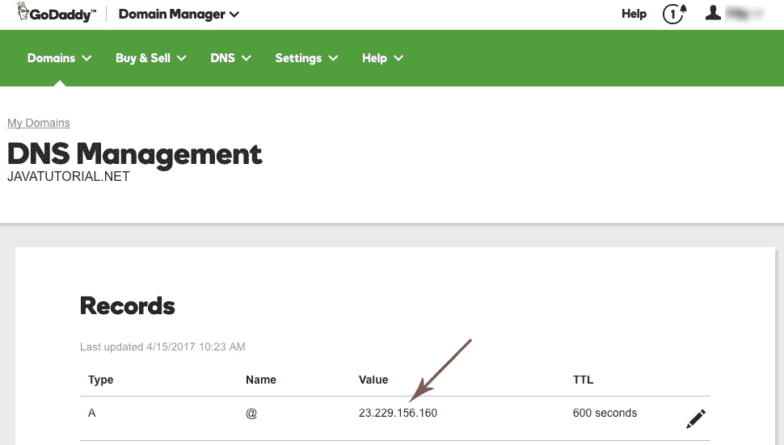

# 如何在 Ubuntu 上为多个站点配置 Apache

> 原文： [https://javatutorial.net/configure-apache-multiple-sites-ubuntu](https://javatutorial.net/configure-apache-multiple-sites-ubuntu)

在本教程中，我将向您展示如何配置单个 Apache 2 Web 服务器以在 Ubuntu 16.04 LTS 上运行多个网站（虚拟主机）。

有时您可能想将不同的域指向单个虚拟主机。 这是价格有效的，并且可以通过简单的配置来完成。 您需要的是对 Ubuntu 服务器的 root 访问权限。


## 前提条件

本教程假定您已经在 Linux 主机上启动并运行了 Apache 2。 本教程还显示了如何为您的站点设置不同的 MySQL 用户，因此，如果要执行此步骤，则还应在服务器上安装 MySQL。

## 域名

首先，需要将您的域指向例如 [https://javatutorial.net](https://javatutorial.net) 的 Web 服务器 IP 地址。

*   使用以下命令`curl ipinfo.io/ip`查找服务器的公共 IP 地址
*   登录到您的域提供商（例如 GoDaddy 或您用来注册域的任何服务）
*   转到 DNS 并更改 A 记录以指向您的服务器 IP



更改 DNS A 记录

我将此步骤列为＃1，因为 DNS 刷新可能需要数小时或数天。 请耐心等待，不要期望您的域会立即被重定向。

## 创建目录结构和用户权限

默认情况下，您的 Web 服务器为您的网站提供一个根目录，即`/var/www/html/`。 我们将对此进行更改，并为每个要添加的网站创建单独的文件夹。 例如`/var/www/javatutorial`

制作单独的文件夹

```java
sudo mkdir /var/www/javatutorial
```

将目录的所有权授予 Apache Web 用户（即 _www-data_ ）

```java
sudo chown YOUR_USER_NAME_HERE:www-data -R /var/www/javatutorial
```

将您的用户名添加到网络组

```java
sudo usermod -aG www-data YOUR_USER_NAME_HERE
```

## 将虚拟主机添加到 Apache

转到 Apache 的配置文件夹`/etc/apache2/sites-available` 并创建一个名为 `javatutorial.conf`的新文件。

编辑`javatutorial.conf`的内容

```java
<VirtualHost *:80>
    ServerAdmin admin@javatutorial.net
    ServerName javatutorial.net
    ServerAlias www.javatutorial.net
    DocumentRoot /var/www/javatutorial
    ErrorLog ${APACHE_LOG_DIR}/error.log
    CustomLog ${APACHE_LOG_DIR}/access.log combined
</VirtualHost>
```

启用新配置

```java
sudo a2ensite javatutorial.conf
```

重新加载 Apache 以激活新配置

```java
service apache2 reload
```

## 为新站点创建 MySQL 数据库和用户

我们将创建一个新的 MySQL 数据库和用户，并遵循以下凭据：

*   数据库名称：javatut
*   数据库用户：tutuser
*   用户密码：tutpass123

以 root 身份登录到 MySQL

```java
mysql -u root -p
```

现在，我们创建新的数据库和用户。 为用户设置密码，并授予该新用户使用数据库的权限

```java
mysql> CREATE DATABASE javatut;
mysql> CREATE USER tutuser@localhost;
mysql> SET PASSWORD FOR dbuser@localhost= PASSWORD("tutpass123");
mysql> GRANT ALL PRIVILEGES ON javatut.* TO tutuser@localhost IDENTIFIED BY 'tutpass123';
mysql> FLUSH PRIVILEGES;
```