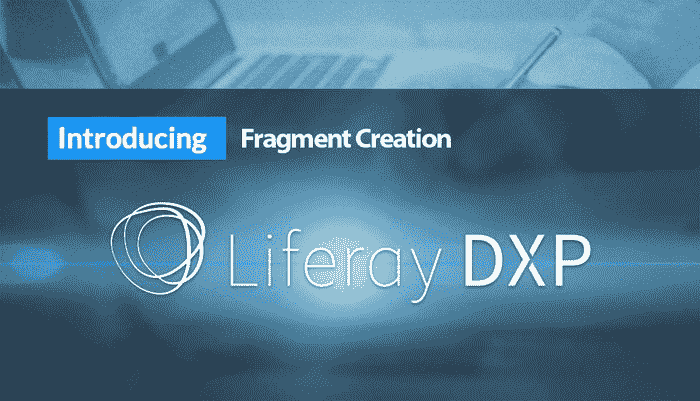

# 如何在 Liferay DXP 中替代现成的（OOTB）模块

> [https://javatutorial.net/override-out-of-the-box-ootb-modules-in-liferay-dxp](https://javatutorial.net/override-out-of-the-box-ootb-modules-in-liferay-dxp)

该博客涵盖有关在 Liferay DXP 中创建**片段以及如何执行所需的覆盖的详细信息。**



Liferay DXP 是最受欢迎的开放源代码之一，具有许多现成的（OOTB）模块，有时根据我们的特定要求，我们需要覆盖它们。 通常，使用 OSGi 片段是执行此类覆盖的方法。

## 该博客包括

什么是片段？

如何在 Liferay 7 中创建片段

片段在 Liferay 7 DXP 中的用途是：

*   覆盖 Liferay OOTB 模块的 JSP
*   覆盖语言属性
*   用 Servlet 过滤器覆盖 HTTP 请求
*   覆盖 Liferay Struts 动作
*   替代 Liferay 模态侦听器

## **什么是片段？**

Fragment 是 OSGi 模块的一种，类似于 mvcportlet，服务，激活器，面板应用程序等。可以说 Fragment 是主机模块的扩展。

对于 Liferay 7 之前的所有版本，都使用 Hook 覆盖 Liferay Portlet。 但是对于 Liferay 7，我们必须使用 Fragment 作为 Hook。 请注意，片段是扩展的主机模块，并且在部署时，片段模块定义将合并在主机模块中（仅当片段模块不与主机模块产生任何冲突时）。 如果发生任何类型的冲突，则直到其解决之前，片段都不会包含在主机模块中。 片段没有加载自己的类或捆绑程序激活器。

Fragment jar 有自己的 OSGi 清单文件，该文件包含有关 OSGi 的信息。 请在下面找到 MANIFEST.MF 的重要信息：

清单版本：1.0

Bundle-ManifestVersion：2

捆绑名称：Liferay 片段

Bundle-SymbolicName：azilen.login.fragment.module

捆绑版本：1.0.0

捆绑包所需的执行环境：JavaSE-1.6

片段主机：com.liferay.login.web;捆绑版本= 1.0.5

导入包：org.apache.commons.logging; version =“ 1.0.4”

导出包：com.azilen.training; version =“ 1.0.0”

请在下面找到其关键属性的详细信息。

Fragment-Host：主机模块的捆绑符号名称

捆绑软件版本：捆绑软件的初始版本

Bundle-Version：人类可读的片段模块名称

Bundle-SymbolicName：唯一标识 OSGi 容器中的片段。

Import-Package：片段中使用的外部软件包

导出包：对其他模块可见的片段包

**Liferay 7 使用 Fragment 来执行诸如以下操作：**

1.  覆盖 Liferay OOTB 模块的 JSP
2.  覆盖语言属性
3.  用 Servlet 过滤器覆盖 HTTP 请求
4.  覆盖 Liferay Struts 动作
5.  替代 Liferay 模态侦听器
6.  覆盖 Liferay 动作命令

## **如何在 Liferay 7 中创建片段**

要将 Liferay 片段创建为模块，请使用以下命令

```java
blade create -t fragment [-h hostBundleName] [-H hostBundleVersion] projectName
```

请注意，我们必须使用-t 参数将刀片模块的类型指定为片段。 而-h 参数将需要主机捆绑包符号名称和-H 参数将需要将被覆盖的主机模块版本。 最后一个 projectName 是人类友好的片段模块名称。

## **如何覆盖 Liferay OOTB 模块的 JSP**

让我们来看一个用例：我想覆盖 Liferay 登录模块，并且要根据自己的需求自定义外观。 因此，要创建的 blade 命令如下：

```java
blade create -t fragment -h com.liferay.login.web -H 1.0.5 login-fragment-module
```

现在它将创建一个片段的骨架结构，您可以在`bnd.bnd`文件中看到主机模块（登录模块）的符号名称和版本。 可能会有一个查询，说明如何查找主机模块的符号名称和版本。 为了获得这些详细信息，我们必须使用编写的命令连接 gogo shell

```java
telnet localhost 11311
```

然后运行`lb`命令，它将列出服务器中部署的所有模块。 您可以找到带有其状态和版本的主机模块。

```java
219|Active | 10 | Liferay Login Web (1.0.5)
```

现在我们的片段结构已经准备就绪，我们都可以重写主机模块 jsp。 由于我们需要覆盖`login.jsp`，因此请从

`Liferay-src/modules/apps/foundation/login/loginweb/src/main/resources/METAINF/resources/login.jsp`

并将其粘贴到`login-fragmentmodule/src/main/resources/META-INF/resources/`中。

现在根据需要修改`login.jsp`并部署 login-fragment-module，成功部署后，您应该在 OOTB 登录模块中进行更改

## **如何覆盖 Liferay DXP 的语言属性**

Liferay 支持多种语言。 因此，我们具有 OOTB 模块的语言属性。 假设我们要更改某些标签，错误消息，成功消息等的属性值。我们可以灵活地覆盖这些属性值，并且可以根据我们的要求进行更改。

让我们来看一个用例：我们要更改登录 Portlet 身份验证失败消息。 该消息的属性是：`authentication-failed`。 我们想用我们的自定义消息覆盖这些属性。

```java
blade create -t mvcportlet -p com.azilen.fragment.language -c CustomLanguageComponent languagefragment-module
```

请注意，此处创建的是-t mvcportlet 而不是-t 片段，因为此处将使用 Resource bundle 类覆盖语言属性。

```java
CustomLanguageComponent.Java
@Component(
    property = { "language.id=en_US" },
    service = ResourceBundle.class
)
public class CustomLanguageComponent extends ResourceBundle {
    ResourceBundle bundle = ResourceBundle.getBundle("content.Language",UTF8Control.INSTANCE);

    @Override
    protected Object handleGetObject(String key) {
        System.out.println("getting key"+key);
        return bundle.getObject(key);
    }
    @Override
    public Enumeration<String> getKeys() {
        return bundle.getKeys();
    }
}
```

可以看出，我们正在创建扩展了`ResourceBundle`的自定义类`CustomLanguageComponent`，并在@Component 批注中指定了属性= {“ language.id = en_US”}。 我们指出要覆盖`Language_en.properties`文件。

现在，在`/language-fragmentmodule/src/main/resources/content`下创建`Language_en.properties`，并使用我们的自定义消息添加身份验证失败的属性。

```java
authentication-failed=Authentication failed. Please try again (customized).
```

现在部署 language-fragment-module，并且在登录模块中登录过程失败时，您将获得自定义消息。

## **如何使用 Servlet 过滤器覆盖**

有时，我们需要拦截 http 请求，并需要在该请求上编写逻辑。 因此，我们可以使用 BaseFilter 实现它。

在这里，我们将拦截每个请求，仅在 processFilter 方法中打印日志。

```java
blade create -t mvcportlet -p com.azilen.custom.filter -c CustomFilterPortlet custom filterfragment-module
CustomFilterPortlet.java

@Component(
    immediate = true,
    property = {
        "dispatcher=REQUEST", "dispatcher=FORWARD",
        "servlet-context-name=",
        "servlet-filter-name=Custom Filter",
        "url-pattern=/*"
    },
    service = Filter.class
)
public class CustomFilterPortlet extends BaseFilter {
    private static final Log _log = LogFactoryUtil.getLog(CustomFilterPortlet.class);

    @Override
    protected void processFilter(HttpServletRequest request, HttpServletResponse response,
        FilterChain filterChain)throws Exception {
        log.info(“Intercept request successfully !!!”);
        filterChain.doFilter(request, response);
    }
}
```

在这里，CustomFilterPortlet 扩展了 BaseFilter 并覆盖了 processFilter 方法，我们可以在其中编写逻辑，并且必须在@Component 属性中将 url 模式指定为 url-pattern = / *。

## **如何覆盖 Liferay Struts 动作**

在 Liferay 6.2 和其他早期版本中，所有 Liferay 操作都由`struts-config.xml`中定义的 struts 操作处理。 另一方面，在 Liferay 7 DXP 中，大多数操作都在`ActionCommand`中进行了转换。 Still Liferay 7 具有`struts-config.xml`中定义的一些支撑动作。

如果要覆盖该特定操作，则可以使用`StrutsAction.class`覆盖它。 请注意，`StrutsAction.class`只能覆盖`struts-config.xml`文件中定义的 struts 动作。

在这里，我们将覆盖“条款和条件”操作，该操作在用户首次登录且必须接受条款和条件时执行。

```java
blade create -t mvcportlet -p com.azilen.custom.struts.action -c
CustomTermsOfUseActionPortlet struts-action-fragment
CustomTermsOfUseActionPortlet.Java
@Component(
    immediate=true,
    property={
        "path=/portal/update_terms_of_use"
    },
    service = StrutsAction.class
)
public class CustomTermsOfUseActionPortlet extends BaseStrutsAction {
    private static final Log _log =
        LogFactoryUtil.getLog(CustomTermsOfUseActionPortlet.class);
    @Override
    public String execute(StrutsAction originalStrutsAction, HttpServletRequest request,
        HttpServletResponse response)throws Exception {
        log.info("Calling Custom Termsof Use Action");
        //you logic goes here
        return originalStrutsAction.execute(request, response);
    }
}
```

在这里，CustomTermsOfUseActionPortlet 扩展了 BaseStrutsAction 并覆盖了 executes 方法，我们可以在其中编写自定义逻辑。 我们需要在@Component 的属性“ path = / portal / update_terms_of_use”中指定要覆盖的 struts 操作路径。

## **如何覆盖 Liferay 模态侦听器**

有时，我们可能需要覆盖 Liferay 的 OOTB 实体，例如 User，Group，DLFileEntry 等，以执行 onAfterUpdate 或 onBeforeUpdate 之类的操作。 我们可以使用`BaseModelListener&lt;T&gt;`类覆盖这些方法。

在这里，我们将覆盖 Liferay User 的 onAfterUpdate 方法，该方法将在更新任何用户时执行。

```java
blade create -t mvcportlet -p com.azilen.modal.listener.portlet –c CustomUserModalListerPortlet custom-model-listener-module
@Component(
    immediate = true,
    service = ModelListener.class
)
public class CustomUserModalListerPortlet extends BaseModelListener<User> {

    @Override
    public void onAfterUpdate(User model) throws ModelListenerException {
        _log.info("user is updateing... !!!!");
        super.onAfterUpdate(model);
    }
    private static final Log _log =
        LogFactoryUtil.getLog(CustomUserModalListerPortlet.class);
}

```

在这里`CustomUserModalListerPortlet`扩展了`BaseModelListener&lt;User&gt;`并覆盖了 onAfterUpdate 方法，在这里我们可以编写自定义逻辑。 我们需要在@Component 中将服务属性值定义为`ModelListener.class`。

自定义 Liferay DXP 开放源代码以开发高度可扩展的现代应用程序具有极大的可能性。 程序员发现 Lifera 7 非常有趣，因为它使编码成为基于创意和逻辑思考的过程。 结果， [Liferay DXP 开发](http://www.azilen.com/technology/enterprise-web/liferay/)在开发人员和行业中都越来越受欢迎。

**作者简介：**

Sandip Patel 是一名技术爱好者，并且是拥有 7 年以上经验的 Liferay & MongoDB 认证专家。 他正在与 [Azilen Technologies](http://www.azilen.com/) 合作，并且喜欢随时了解最新的 Liferay 技术和创新。