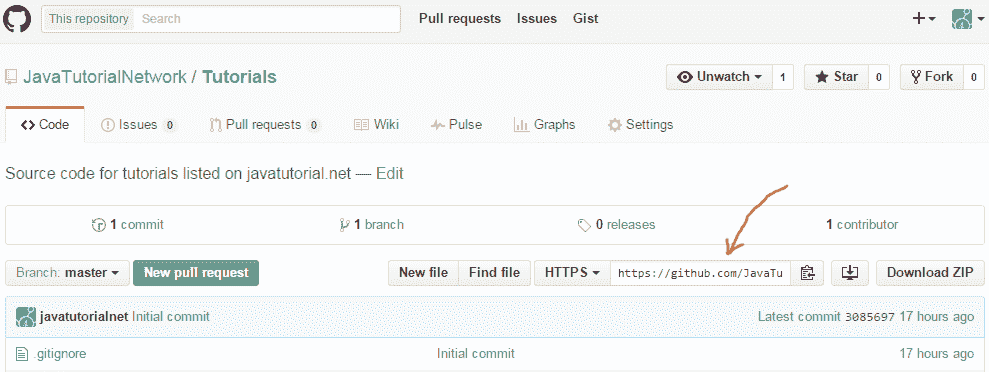

# 简单的 Git 教程

> 原文： [https://javatutorial.net/simple-git-tutorial](https://javatutorial.net/simple-git-tutorial)

在本教程中，您将学习非常基本的 Git 命令，使您可以在几分钟内运行 Git。

## 什么是 Git？

**Git** 是广泛使用的分布式修订控制系统。 它最初于 2005 年开发，自 2015 年 10 月 4 日以来最新版本是 2.7。 所有主要操作系统（如 Linux，OSX 和 Microsoft Windows）均支持该功能。

[在 OSX](https://code.google.com/archive/p/git-osx-installer/downloads) 上安装 Git

[在 Windows](https://git-for-windows.github.io/) 上安装 Git

或在 Linux 上安装 git，运行以下命令：

```java
$ sudo yum install git-all
```

或在基于 Debian 的发行版（如 Ubuntu）上使用

```java
$ sudo apt-get install git-all
```

## 创建新的 Git 存储库

您可以通过在 hardrive 上创建一个文件夹来创建本地存储库，导航到该文件夹​​并执行：

```java
git init
```

尽管使用本地存储库在许多方面都非常熟练，并且您可以尝试使用它，但是我强烈建议使用远程 Git 服务器并托管 [GitHub](https://github.com) 等。 GitHub 有一个不错的界面来管理，创建和维护您的存储库，以及用于监视贡献和用户的高级工具。

## Git 工作流程

有三种方法可以将代码从工作目录带到远程存储库：


Git 工作流程

**工作目录** –它包含实际文件

**索引** –是标记代码更改的登台区域

**HEAD** –保存您所做的最后一次提交

**远程服务器** –是代码所在的最终目的地，因此您的更改可供其他开发人员使用

## 检出 Git 存储库

要制作现有存储库的工作本地副本，请执行以下操作：

```java
git clone {path_to_repository}
```

这将在当前目录中下载存储库的副本。

例如，如果要克隆托管在 GitHub 中的存储库，请运行以下命令：

```java
git clone https://github.com/JavaTutorialNetwork/Tutorials.git
```

在 GitHub 中，您可以在此处找到存储库路径：



GitHub 存储库路径

## 更新您的本地存储库

在开始对代码进行更改之前，最好先检查团队中其他开发人员所做的代码更新，这是一个好习惯。 为此，请执行：

```java
git pull
```

## 第 1 步 – 将更改添加到索引

您可以使用以下任一方法将代码更改提交到索引：

```java
git add <filename>
```

用于特定文件或

```java
git add *
```

提交所有文件

## 第 2 步 – 将更改提交到`HEAD`

在此步骤中，您实际上将更改提交到 HEAD。 在这之后，所有的工作都准备好转移到远程存储库中了

```java
git commit -m "Message explaining your changes"
```

## 第 3 步-将更改推送到远程服务器

在这一步中，您将对远程 Git 服务器进行更改，以供其他开发人员使用

```java
git push origin master
```

这会将更改推送到 master 分支（默认为一个）。 如果您想将它们推到另一个分支，只需更改名称

## 撤消本地更改

在某些情况下，例如您做错了一些事情，您将希望用 Git 远程存储库中的代码替换并覆盖本地更改。 为此，请执行：

```java
git fetch origin
git reset --hard origin/master
```

这将清除所有本地工作（尚未推送到远程服务器的工作），并将工作目录同步到当前回购状态。

一如既往欢迎评论🙂