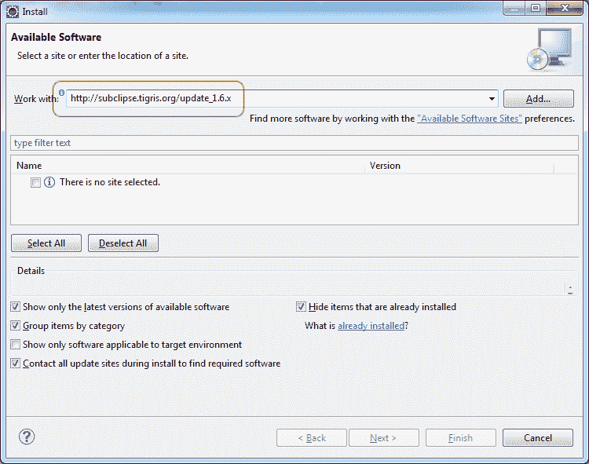
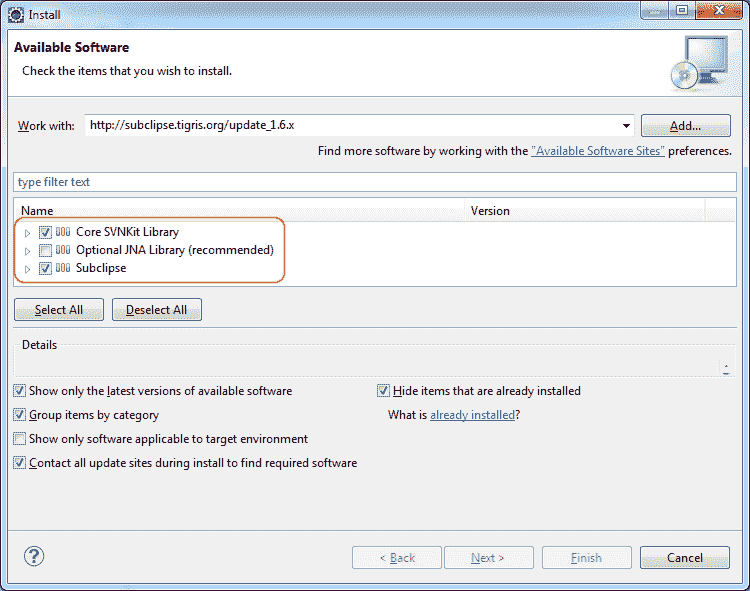
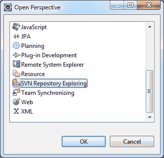
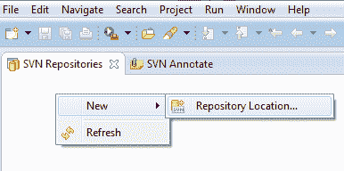

# 在 Eclipse 中安装 SVN

> 原文： [https://javatutorial.net/install-svn-eclipse](https://javatutorial.net/install-svn-eclipse)

**默认情况下，Eclipse** 不支持 **SVN** 存储库浏览。 幸运的是，有几个插件使之成为可能。

在本教程中，我将向您展示如何安装 Tigris 的 Subclipse 插件。 这简单！

**1\.** 启动 Eclipse

**2\.** 转到帮助-&gt;安装新软件

**3** 。 在“使用”字段中输入 Eclipse 更新站点 URL。 如果您使用 Eclipse KEPLER，请使用 1.10.x 版。 对于早期的 Eclipse 版本，建议您使用 1.6.x 版本。 它与大多数 SVN 服务器兼容。

1.10.x 版本的链接： [http://subclipse.tigris.org/update_1.10.x](http://subclipse.tigris.org/update_1.10.x)

1.8.x 版本的链接： [http://subclipse.tigris.org/update_1.8.x](http://subclipse.tigris.org/update_1.8.x)

1.6.x 版本的链接： [http://subclipse.tigris.org/update_1.6.x](http://subclipse.tigris.org/update_1.6.x)

1.4.x 版本的链接： [http://subclipse.tigris.org/update_1.4.x](http://subclipse.tigris.org/update_1.4.x)

**4\.** 按下[Enter]键，不久您将看到要安装的组件列表。 选择第一个和第三个，然后单击“下一步”按钮（我在具有 JNA 库的 64 位计算机上遇到了一些问题，这就是为什么我不安装它）

**5\.** 在下一个屏幕上，再次单击“下一步”，同意许可协议，然后单击“完成”按钮

**6\.** 等待一段时间，直到下载并安装了软件包。 您将需要重新启动 Eclipse 才能使更改生效。

**7\.** 单击 Eclipse 右上角的“打开透视图”按钮

...并在此窗口中选择“ SVN 存储库浏览”

**8\.** 右键单击“ SVN 存储库”视图，然后选择“新建-&gt;存储库位置…”。

**9\.** 在下一个窗口中，输入要浏览/使用的 SVN 存储库 URL