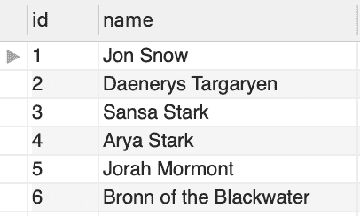

# SQL 内连接示例

> 原文： [https://javatutorial.net/sql-inner-join-example](https://javatutorial.net/sql-inner-join-example)

本文介绍了 SQL `INNER JOIN`语法，并提供了有关如何使用`INNER JOIN`的示例

最常用的连接是`INNER JOIN`。 它通过组合两个或多个表的列值来创建新的结果表。

您可以使用以下链接查看不同类型的 SQL `JOIN`：

1.  [内连接](https://javatutorial.net/sql-inner-join-example)
2.  [左连接](https://javatutorial.net/sql-left-join-example)
3.  [右连接](https://javatutorial.net/sql-right-join-example)
4.  [外连接](https://javatutorial.net/sql-outer-join-example)

## 内连接视觉表示


SQL 内连接

## 内连接语法

该查询将返回左表（表 A）中所有与右表（表 B）中具有匹配记录的记录。 此连接的编写方式如下：

```java
SELECT Table_A.column1, Table_B.column2...
FROM Table_A A
INNER JOIN Table_B B
ON A.Key = B.Key
```

## 内连接示例

我们将创建 3 个表

1.  `CUSTOMER`
2.  `PRODUCT`
3.  `ORDER`

客户可以订购产品。 在`ORDER`表中，我们保存了客户 ID 和客户已订购的每种产品的数量。


数据库图显示客户，产品和订单关系

使用以下 SQL 脚本创建三个表。

创建`CUSTOMER`表

```java
CREATE TABLE `CUSTOMER` (
  `id` INT NOT NULL,
  `name` VARCHAR(45) NOT NULL,
  PRIMARY KEY (`id`));
```

创建`PRODUCT`表

```java
CREATE TABLE `PRODUCT` (
  `id` INT NOT NULL,
  `name` VARCHAR(45) NOT NULL,
  `price` DECIMAL(7,2) NOT NULL,
  PRIMARY KEY (`id`));
```

创建`ORDER`表

```java
CREATE TABLE `ORDER` (
  `id` INT NOT NULL,
  `date` DATETIME NOT NULL,
  `customer_id` INT NOT NULL,
  `product_id` INT NOT NULL,
  `quantity` INT NOT NULL,
  PRIMARY KEY (`id`),
  INDEX `product_id_idx` (`product_id` ASC) VISIBLE,
  INDEX `customer_id_idx` (`customer_id` ASC) VISIBLE,
  CONSTRAINT `customer_id`
    FOREIGN KEY (`customer_id`)
    REFERENCES `CUSTOMER` (`id`),
  CONSTRAINT `product_id`
    FOREIGN KEY (`product_id`)
    REFERENCES `PRODUCT` (`id`));
```

在`CUSTOMER`表中插入数据

```java
INSERT INTO `CUSTOMER` (`id`, `name`) VALUES ('1', 'Jon Snow');
INSERT INTO `CUSTOMER` (`id`, `name`) VALUES ('2', 'Daenerys Targaryen');
INSERT INTO `CUSTOMER` (`id`, `name`) VALUES ('3', 'Sansa Stark');
INSERT INTO `CUSTOMER` (`id`, `name`) VALUES ('4', 'Arya Stark');
INSERT INTO `CUSTOMER` (`id`, `name`) VALUES ('5', 'Jorah Mormont');
INSERT INTO `CUSTOMER` (`id`, `name`) VALUES ('6', 'Bronn of the Blackwater');

```

在`PRODUCT`表中插入数据

```java
INSERT INTO `PRODUCT` (`id`, `name`, `price`) VALUES ('1', 'Dragon', '5000');
INSERT INTO `PRODUCT` (`id`, `name`, `price`) VALUES ('2', 'Castle', '1000');
INSERT INTO `PRODUCT` (`id`, `name`, `price`) VALUES ('3', 'Sword', '5');
```

在`ORDER`表中插入数据

```java
INSERT INTO `ORDER` (`id`, `date`, `customer_id`, `product_id`, `quantity`) VALUES ('1', '2019-01-08 00:00:00', '2', '1', '3');
INSERT INTO `ORDER` (`id`, `date`, `customer_id`, `product_id`, `quantity`) VALUES ('2', '2019-01-22 00:00:00', '6', '3', '1');
INSERT INTO `ORDER` (`id`, `date`, `customer_id`, `product_id`, `quantity`) VALUES ('3', '2019-02-15 00:00:00', '6', '2', '1');
INSERT INTO `ORDER` (`id`, `date`, `customer_id`, `product_id`, `quantity`) VALUES ('4', '2019-02-16 00:00:00', '1', '3', '1');

```

### 数据库表

现在这就是我们表中的内容：



客户表


产品表


订单表

### 内连接表

现在，让我们使用`INNER JOIN`连接这些表

该查询返回客户详细信息，购买日期和数量

```java
SELECT C.id, C.name, O.date, O.quantity
FROM `CUSTOMER` C
INNER JOIN `ORDER` O
ON C.id = O.customer_id;
```


内连接结果集

## 连接多个表

下一个示例显示如何将 3 个表连接到一个结果集中。 以下查询将返回连接的整个购买，显示客户名称，购买日期，产品名称和数量

```java
SELECT C.name, O.date, P.name, O.quantity
FROM `ORDER` O 
JOIN `CUSTOMER` C ON O.customer_id = C.id 
JOIN `PRODUCT` P ON O.product_id = P.id;
```

查询执行的结果：


连接多个表

**免责声明**：上面显示的示例已经在 MySQL 上进行了测试。 根据您的 SQL 数据库，`CREATE TABLE`语法可能有所不同。