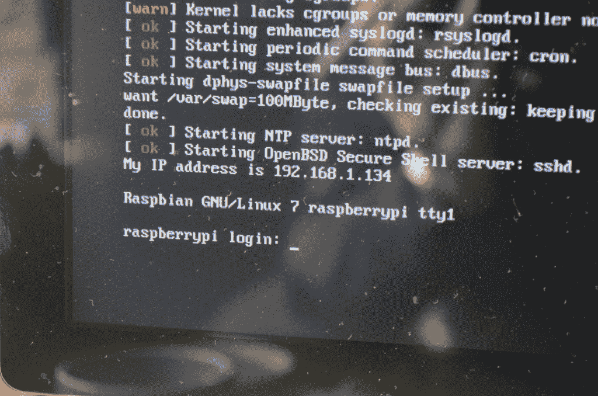
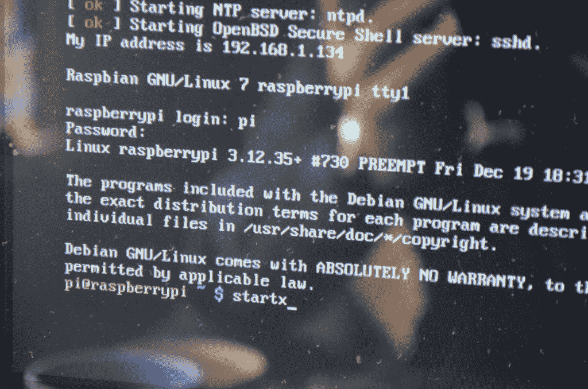

# Raspberry Pi 首次启动

> 原文： [https://javatutorial.net/raspberry-pi-first-start](https://javatutorial.net/raspberry-pi-first-start)

本教程介绍了如何为首次启动准备 Raspberry Pi，如何连接外围设备并首次启动 Raspbian。

## 你需要什么

1\. USB 滑鼠

2\. USB 键盘

3.局域网电缆

4\. HDMI 线

5\. HDMI 监视器或电视

6.已安装 Raspbian 的 SD 卡（有关详细信息，请阅读[本教程](http://javatutorial.net/install-raspbian-to-sd-card "Install Raspbian to SD Card")）

7.微型 USB 电源适配器。 您可以使用手机电源适配器执行此操作，也可以使用 USB 转 micro USB 电缆连接到计算机。 但是，某些计算机 USB 希望为您的 Raspberry 提供足够的电源。

## 连接电缆并开始


1.根据上图连接鼠标和键盘

2.使用局域网电缆将 Raspberry 连接到路由器

3.插入装有 Raspbian 映像的 SD 卡（请阅读[本教程](http://javatutorial.net/install-raspbian-to-sd-card "Install Raspbian to SD Card")，以了解如何在 SD 卡上安装 Raspbian）

4.使用 HDMI 电缆将 Raspberry 连接到显示器或电视

5.将电源连接到 Raspberry micro USB 端口。 当给树莓供电时，它会自动启动。 您可以拔下电缆以将其关闭。

## 树莓第一次开始

首次使用 Raspbian OS 启动 Raspberry 时，将看到以下屏幕

注意：如果第一次启动时未显示该屏幕，则可以使用以下命令进行调用：

```java
sudo raspi-config
```


我在这里要做的是按键盘上的 Enter 键，并选择选项 1 –扩展文件系统。 展开完成后，您可能需要浏览其他选项，例如更改 root 密码等。

完成后，使用键盘上的 Tab 键转到&lt;。完成&gt;，然后按 Enter。

操作系统将重新启动，几秒钟后，您将看到登录提示



默认的 Raspbian 用户是：pi

密码为：树莓

而已！ 如果需要，现在可以通过键入以下内容来启动图形界面 GUI：

```java
startx
```



您还可以通过运行以下命令来检查软件更新：

```java
sudo apt-get update && sudo apt-get upgrade
```

在我的下一个教程中，我将向您展示如何使用 SSH 和 PuTTY 远程连接到 Raspberry。