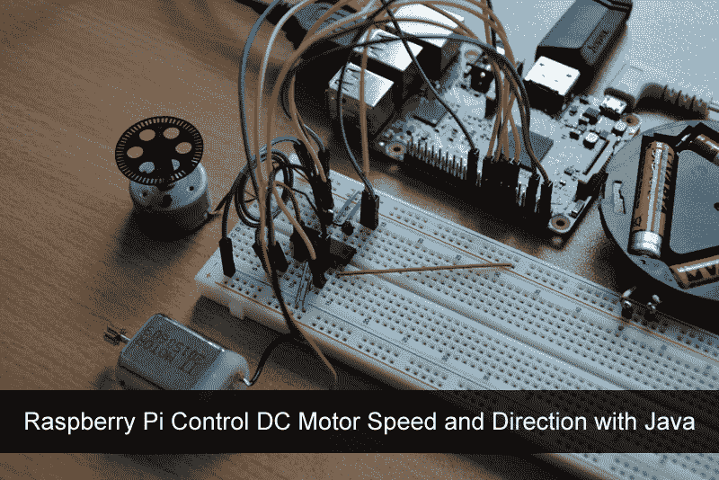
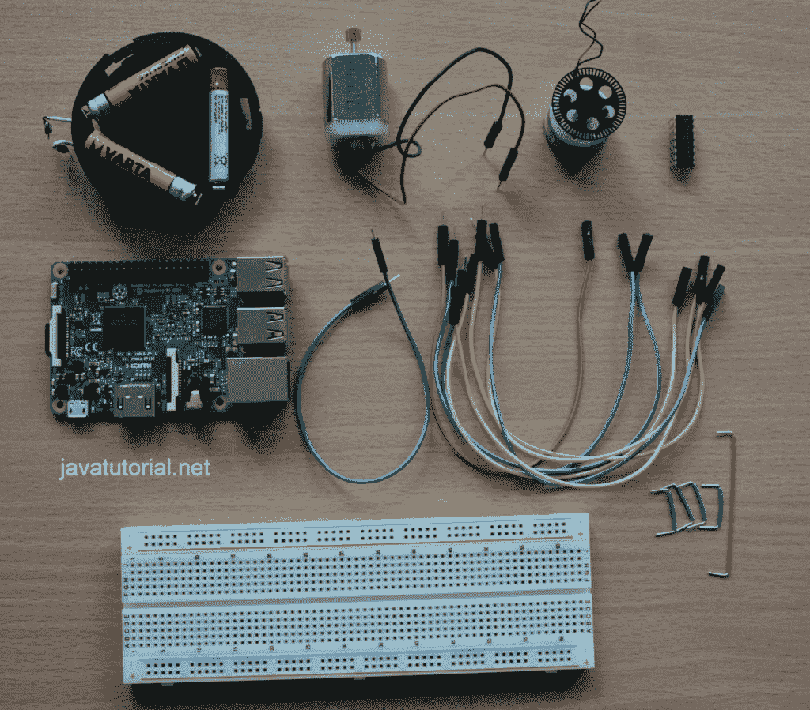
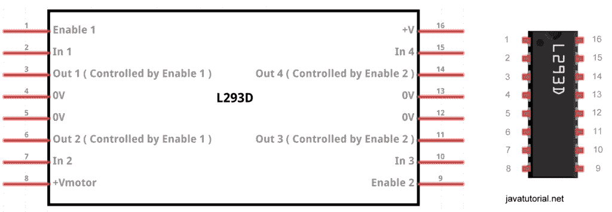
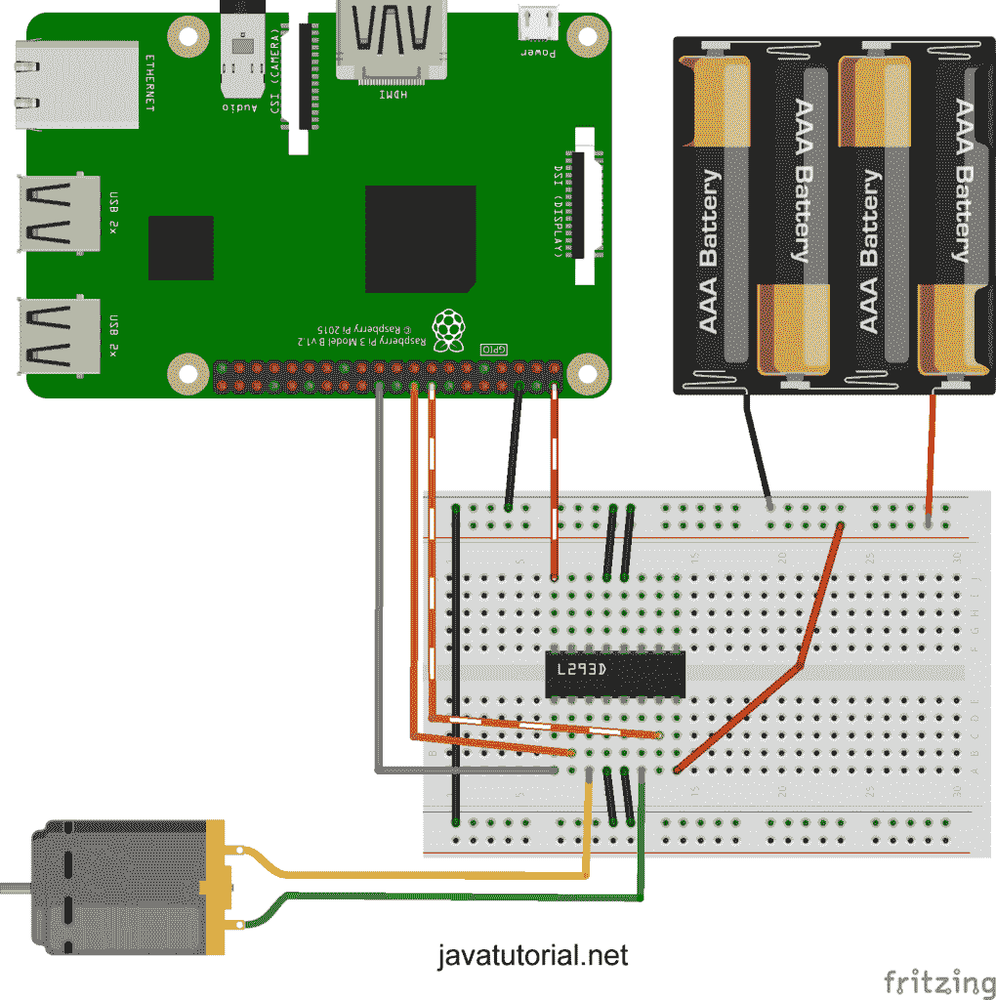
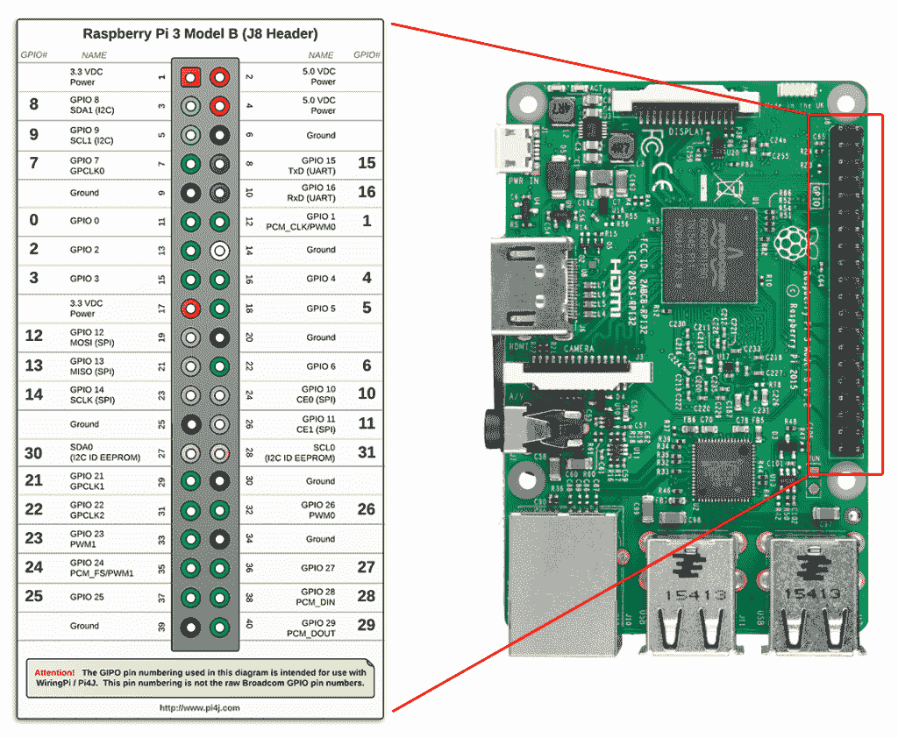
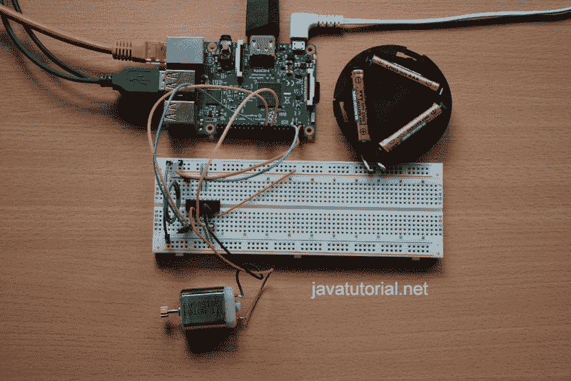
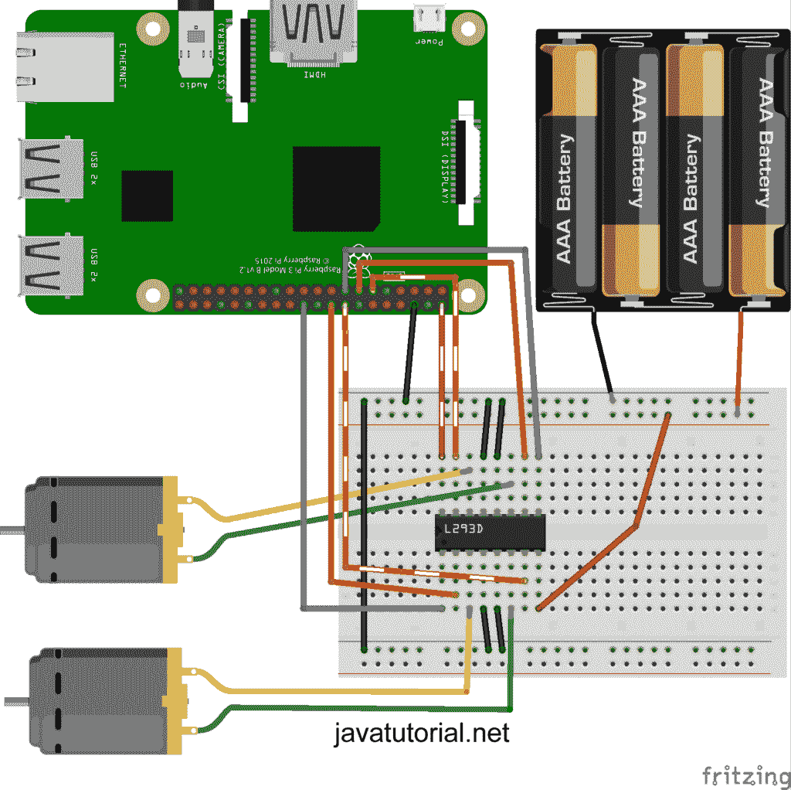
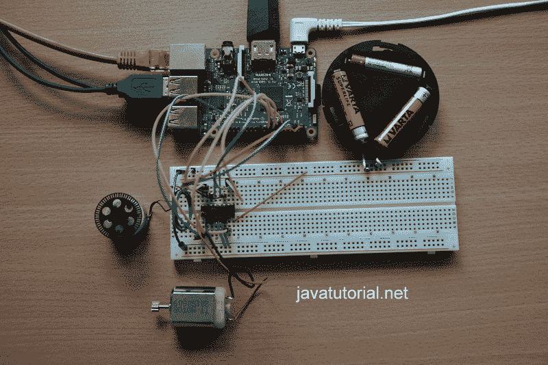

# Raspberry Pi 用 Java 控制直流电机的速度和方向

> [https://javatutorial.net/raspberry-pi-control-dc-motor-speed-and-direction-java](https://javatutorial.net/raspberry-pi-control-dc-motor-speed-and-direction-java)

在本教程中，我将向您展示如何使用 Raspberry Pi 和 Java 控制直流电机的方向和速度。

我收到了一些要求创建有关使用 Raspberry Pi 和 Java 控制电机速度和方向的教程的请求，所以我们开始吧！ 在本教程中，我将向您展示如何使用 L293D 芯片同时控制和两个电机的**的方向和速度。**



## 硬体需求

您将需要以下组件来遵循本教程：

*   已安装最新 Raspbian 的 Raspberry Pi（了解如何[安装和配置 Raspbian](https://javatutorial.net/install-raspbian-to-sd-card "Install Raspbian to SD Card") ）
*   用于连接所有组件的面包板
*   一颗 L293D 芯片
*   1 或 2 个直流电机（第二个为可选），额定电压为 4.5V 至 36V
*   电池组可为您的电机提供正确的电压
*   几根电缆可以连接一切



硬件部件

## L293D

L293D 是用于直流或步进电机的双 H 桥电机驱动器，这意味着您可以双向驱动两个直流电机或一个步进电机。 L293D 的优点在于，它内置有回弹保护功能，可防止损坏 Raspberry Pi。

**切勿将电机直接连接到 Raspberry Pi。 这可能会严重损坏您的 Pi！**



L293D 资料表

该芯片有两个+ V 引脚。 引脚号 8（+ Vmotor）为电机供电，而引脚 16 为芯片本身供电。 我们将引脚 8 连接到电池组，将引脚 16 连接到 Raspberry 的 5V 引脚。

## 选择合适的直流电机

您需要选择 4.5V 至 36V 的直流电机。 L293D 无法在 3V 电机上正常工作，并且每个通道的限制为 600mA。

## 软件需求

我的所有教程都使用 [Pi4J](http://pi4j.com/) 。 Pi4J 是一个很棒的库，您可以使用 Java 编程语言来控制 Pi 的 GPIO 引脚。 您可以在 [Raspberry Pi Java 教程](https://javatutorial.net/raspberry-pi-java-tutorial)入门中找到有关如何在 Raspberry 和 IDE 上安装和配置 Pi4J 的详细说明。

## 组装电路

组装电路时，请务必断开 Raspberry Pi 的电源！ 否则可能会损坏 Pi 或组件。 插入 Pi 之前，请务必仔细检查接线！

请使用下图组装电路。



Raspberry Pi 3 的硬件设置，以通过 L293D 和 Java 双向控制一台直流电机

在本教程中，我将使用 GPIO 引脚的物理编号。 物理编号指的是通过简单地从左上角的插针 1 算起并向下计数的插针。

查看下图，该图显示了物理引脚编号和 Pi4J 映射。 例如，物理针脚编号 12 在 Pi4J 中被命名为针脚＃1。 在本教程后面的部分中编写 Java 程序时，请牢记这一点。 您可以在 Pi4J 官方网站中找到有关[引脚编号的更多详细信息。](http://pi4j.com/pins/model-3b-rev1.html)



Raspberry Pi 3 Model B 引脚和 Pi4J 映射

注意：本教程是针对 Raspberry Pi 3 B 型制作的，当然，您可以在 Raspberry Pi 1 或 2 中构建相同的电路并使用相同的 Java 代码-只需注意引脚编号即可。

1.  将 L293D 引脚＃16 连接到 Pi 物理引脚＃2（5.0 VDC 电源）
2.  将 L293D 的针脚 4，针脚 5，针脚 12 和针脚 13 连接到 Pi 物理针脚 6（接地）
3.  将 L293D 的 8 号针脚连接到电池组
4.  将 L293D 的针脚＃3 和＃6 连接到电机
5.  将 L293D 引脚 1 连接到 Pi 物理引脚 22
6.  将 L293D 引脚 2 连接到 Pi 物理引脚 18
7.  将 L293D 针脚＃7 连接到 Pi 物理针脚＃16

我还将在此处发布电路原理图以供参考


Raspberry Pi 和 L293D 一台电机原理图

具有 1 个电机的组装电路的照片



1 电机设置的图片

## Java 程序：控制一台直流电机的方向

这里是有趣的部分。 连接完所有内容后，您可以打开自己喜欢的 Java IDE 并编写代码。 下面的代码将使电机沿一个方向旋转 3 秒钟，然后使电机沿相反方向旋转 6 秒钟。

```java
import com.pi4j.io.gpio.GpioController;
import com.pi4j.io.gpio.GpioFactory;
import com.pi4j.io.gpio.GpioPinDigitalOutput;
import com.pi4j.io.gpio.RaspiPin;

/**
 * Controls motor direction of a single motor
 * @author https://javatutorial.net
 */
public class ControlOneMotorDirection {

	public static void main(String[] args) throws InterruptedException {
		// get a handle to the GPIO controller
		final GpioController gpio = GpioFactory.getInstance();

		final GpioPinDigitalOutput pinA = gpio.provisionDigitalOutputPin(RaspiPin.GPIO_04, "PinA");
		final GpioPinDigitalOutput pinB = gpio.provisionDigitalOutputPin(RaspiPin.GPIO_05, "PinB");
		final GpioPinDigitalOutput pinE = gpio.provisionDigitalOutputPin(RaspiPin.GPIO_06, "PinE");

		System.out.println("rotate motor clockwise for 3 seconds");
		pinA.high();
		pinB.low();
		pinE.high();

		// wait 3 seconds
		Thread.sleep(3000);

		System.out.println("rotate motor in oposite derection for 6 seconds");
		pinA.low();
		pinB.high();

		// wait 6 seconds
		Thread.sleep(6000);

		// stop motor
		System.out.println("Stopping motor");
		pinE.low();

		gpio.shutdown();
	}
}

```

首先，我们将数字输出 pinA 映射到 GPIO 引脚 4，将 pinB 映射到 GPIO 引脚 5，将 pinE 映射到 GPIO 引脚 6。 如果您想知道为什么在代码中使用引脚 4、5 和 6，请再次查看上面发布的 Pi4J 映射图。 pinE 名称来自“ pin enable”。

如果 pinE 为高电平，则说明电机已打开。 将 pinE 置于低电平将关闭电机。 我们通过将引脚 A 或 B 之一切换到高电平并将另一个引脚切换到低电平来确定旋转方向。 例如，如果我们将 pinA 设置为高电平并将 pinB 设置为低电平，则电机将顺时针旋转。 交换销钉，电机将以相反的方向旋转。

使用以下命令在 Raspberry 上执行程序

```java
sudo java -classpath .:classes:/opt/pi4j/lib/'*' ControlOneMotorDirection
```

以下视频演示了结果

&lt;iframe allowfullscreen="allowfullscreen" frameborder="0" height="315" src="https://www.youtube.com/embed/pim_hLJD5IE" width="560"&gt;&lt;/iframe&gt;

## 添加第二台电机（可选）

使用 L293D，我们可以独立控制 2 个电机的方向，那么为什么不尝试这样做呢？ 在电路中添加第二个电机很容易–只需将第二个电机插入面包板，并使用 3 条额外的电缆将 L293D 芯片的另外 3 个引脚连接到 Raspberry Pi。



树莓派控制 2 台电机

这是组装电路的图片– 2 个电机设置



具有 L293D 和两个直流电机的 Raspberry Pi 电路

## Java 程序：控制两个直流电机的方向

我们将我们的第一电机称为`motor1`，第二个电机称为`motor2`。 我们为 Raspberry Pi 分配了 3 个 GPIO 引脚，分别是 0、2 和 3。

下面的 Java 程序将两个电机沿一个方向旋转 3 秒钟，然后将第一电机反向旋转 3 秒钟，将第二电机旋转 6 秒钟。

```java
import com.pi4j.io.gpio.GpioController;
import com.pi4j.io.gpio.GpioFactory;
import com.pi4j.io.gpio.GpioPinDigitalOutput;
import com.pi4j.io.gpio.RaspiPin;

/**
 * Controls motor direction of a two DC motors
 * @author https://javatutorial.net
 */
public class ControlTwoMotorsDirection {

	public static void main(String[] args) throws InterruptedException {
		// get a handle to the GPIO controller
		final GpioController gpio = GpioFactory.getInstance();

		final GpioPinDigitalOutput motor1pinA = gpio.provisionDigitalOutputPin(RaspiPin.GPIO_04, "m1A");
		final GpioPinDigitalOutput motor1pinB = gpio.provisionDigitalOutputPin(RaspiPin.GPIO_05, "m1B");
		final GpioPinDigitalOutput motor1pinE = gpio.provisionDigitalOutputPin(RaspiPin.GPIO_06, "m1E");
		final GpioPinDigitalOutput motor2pinA = gpio.provisionDigitalOutputPin(RaspiPin.GPIO_00, "m2A");
		final GpioPinDigitalOutput motor2pinB = gpio.provisionDigitalOutputPin(RaspiPin.GPIO_02, "m2B");
		final GpioPinDigitalOutput motor2pinE = gpio.provisionDigitalOutputPin(RaspiPin.GPIO_03, "m2E");

		System.out.println("rotate both motors clockwise for 3 seconds");
		motor1pinA.high();
		motor1pinB.low();
		motor1pinE.high();
		motor2pinA.high();
		motor2pinB.low();
		motor2pinE.high();

		// wait 3 seconds
		Thread.sleep(3000);

		System.out.println("rotate motor 1 in oposite derection for 3 seconds "
				+ "and motor 2 in oposite direction for 6 seconds");
		motor1pinA.low();
		motor1pinB.high();
		motor2pinA.low();
		motor2pinB.high();

		// wait 3 seconds
		Thread.sleep(3000);
		System.out.println("Stopping motor 1");
		motor1pinE.low();

		// wait 3 seconds
		Thread.sleep(3000);
		System.out.println("Stopping motor 2");
		motor2pinE.low();

		gpio.shutdown();
	}
}

```

我们在此处使用相同的规则：如果 pinE（启用）为高，则表明电机已打开。 将 pinE 置于低电平将关闭电机。 我们通过将引脚 A 或 B 之一切换到高电平并将另一个引脚切换到低电平来确定旋转方向。

使用以下命令在 Raspberry 上执行程序

```java
sudo java -classpath .:classes:/opt/pi4j/lib/'*' ControlTwoMotorsDirection
```

以下视频演示了结果

&lt;iframe allowfullscreen="allowfullscreen" frameborder="0" height="315" src="https://www.youtube.com/embed/b7Fx7Q_qfUs" width="560"&gt;&lt;/iframe&gt;

## Java 程序：控制两个直流电机的速度和方向

最后，我将向您展示如何控制两个直流电机的**速度和方向**。 我们将为两个电机设置使用相同的电路。 另外，我们将以编程方式依靠 Soft PWM 来控制电机的速度。 您可以在我的教程中阅读有关 PWM 的更多信息。[具有 PWM 和 Java 的 Raspberry Pi 调光 LED](https://javatutorial.net/raspberry-pi-dim-led-pwm-java)

看下面的 java 代码。 注意，电机 1 和 2 的引脚 A 和 B 设置为 Soft PWM 引脚。 对于使能引脚（`motor1pinE`和`motor2pinE`），我们使用与先前代码完全相同的定义。

一旦执行，程序将：

1.  以 15% 的速度顺时针旋转电机 1 2 秒钟
2.  以 60% 的速度顺时针旋转电机 1 2 秒钟
3.  以全速将电机 1 顺时针旋转 2 秒
4.  以 50% 的速度沿相反方向旋转电机 1 3 秒钟
5.  停止马达 1
6.  以 30% 的速度顺时针旋转电机 2 2 秒
7.  以相反的方向将电机 2 全速旋转 3 秒钟
8.  停止马达 2

```java
import com.pi4j.io.gpio.GpioController;
import com.pi4j.io.gpio.GpioFactory;
import com.pi4j.io.gpio.GpioPinDigitalOutput;
import com.pi4j.io.gpio.RaspiPin;
import com.pi4j.wiringpi.SoftPwm;

/**
 * Controls motor speed and direction of two DC motors
 * @author https://javatutorial.net
 */
public class ControlMotorsDirectionAndSpeed {

	private static int MOTOR_1_PIN_A = 4;
	private static int MOTOR_1_PIN_B = 5;
	private static int MOTOR_2_PIN_A = 0;
	private static int MOTOR_2_PIN_B = 2;

	public static void main(String[] args) throws InterruptedException {
		// get a handle to the GPIO controller
		final GpioController gpio = GpioFactory.getInstance();

		// init soft PWM pins
		// softPwmCreate(int pin, int value, int range)
		// the range is set like (min=0 ; max=100)
		SoftPwm.softPwmCreate(MOTOR_1_PIN_A, 0, 100);
		SoftPwm.softPwmCreate(MOTOR_1_PIN_B, 0, 100);
		SoftPwm.softPwmCreate(MOTOR_2_PIN_A, 0, 100);
		SoftPwm.softPwmCreate(MOTOR_2_PIN_B, 0, 100);

		// init GPIO pins
		final GpioPinDigitalOutput motor1pinE = gpio.provisionDigitalOutputPin(RaspiPin.GPIO_06, "m1E");
		final GpioPinDigitalOutput motor2pinE = gpio.provisionDigitalOutputPin(RaspiPin.GPIO_03, "m2E");

		System.out.println("rotate motor 1 clockwise at 15% speed for 2 seconds");
		motor1pinE.high();
		SoftPwm.softPwmWrite(MOTOR_1_PIN_A, 15);

		// wait 2 seconds
		Thread.sleep(2000);

		System.out.println("rotate motor 1 clockwise at 60% speed for 2 seconds");
		SoftPwm.softPwmWrite(MOTOR_1_PIN_A, 60);

		// wait 2 seconds
		Thread.sleep(2000);

		System.out.println("rotate motor 1 clockwise at full speed for 2 seconds");
		SoftPwm.softPwmWrite(MOTOR_1_PIN_A, 100);

		// wait 2 seconds
		Thread.sleep(2000);

		System.out.println("rotate motor 1 in opposite direction at 50% speed for 3 seconds");
		SoftPwm.softPwmWrite(MOTOR_1_PIN_A, 0);
		SoftPwm.softPwmWrite(MOTOR_1_PIN_B, 50);

		// wait 3 seconds
		Thread.sleep(3000);

		// disable motor 1
		SoftPwm.softPwmWrite(MOTOR_1_PIN_B, 0);
		motor1pinE.low();

		System.out.println("rotate motor 2 clockwise at 30% speed for 2 seconds");
		motor2pinE.high();
		SoftPwm.softPwmWrite(MOTOR_2_PIN_A, 30);

		// wait 2 seconds
		Thread.sleep(2000);

		System.out.println("rotate motor 2 in opposite direction at 100% speed for 3 seconds");
		SoftPwm.softPwmWrite(MOTOR_2_PIN_A, 0);
		SoftPwm.softPwmWrite(MOTOR_2_PIN_B, 100);

		// wait 3 seconds
		Thread.sleep(3000);

		// disable motor 2
		SoftPwm.softPwmWrite(MOTOR_2_PIN_B, 0);
		motor2pinE.low();

		gpio.shutdown();
	}
}
```

使用以下命令在 Raspberry 上执行程序

```java
sudo java -classpath .:classes:/opt/pi4j/lib/'*' ControlMotorsDirectionAndSpeed
```

运行程序时，您应该看到此控制台输出


程序控制台输出

以下视频演示了结果

&lt;iframe allowfullscreen="allowfullscreen" frameborder="0" height="315" src="https://www.youtube.com/embed/Jfuu-h_NYY0" width="560"&gt;&lt;/iframe&gt;

## 结论

你还在读这个吗？ 谢谢！ 这是一个很长的教程🙂现在，在您知道如何使用 Raspberry Pi 控制电机之后，也许您可​​以考虑构建一些很酷的项目甚至是一个小型机器人并与我们分享结果🙂

与往常一样，我喜欢阅读您的评论并回答您的问题。 如果您喜欢本教程或其他教程，请传播！

您可以在 GitHub 中找到所有项目文件： [https://github.com/JavaTutorialNetwork/Tutorials/tree/master/RaspberryPiControlMotors](https://github.com/JavaTutorialNetwork/Tutorials/tree/master/RaspberryPiControlMotors)

资料来源：

[使用 Pi 和 Python 控制直流电机](https://business.tutsplus.com/tutorials/controlling-dc-motors-using-python-with-a-raspberry-pi--cms-20051)