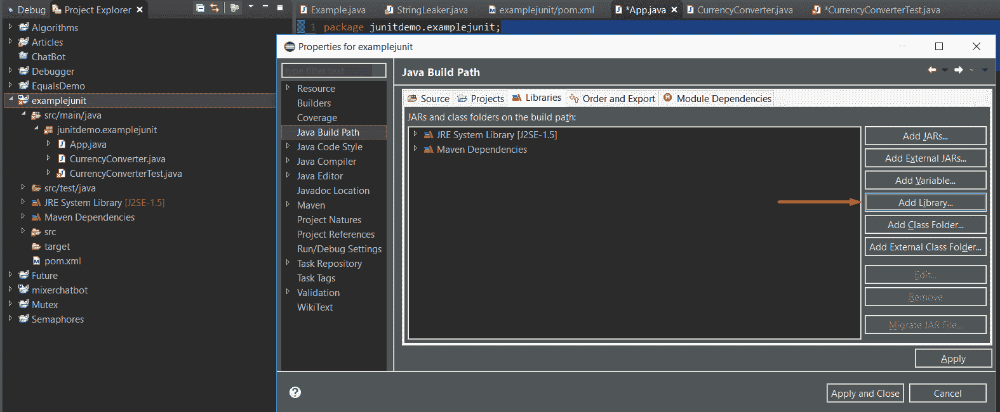
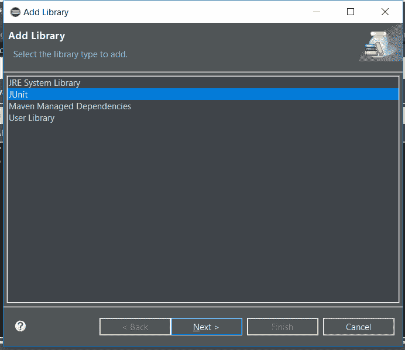
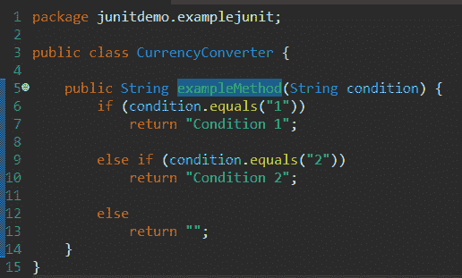
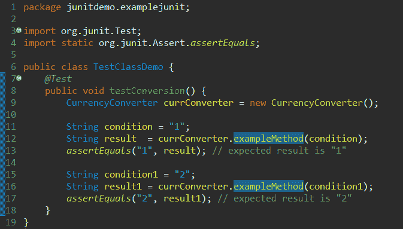
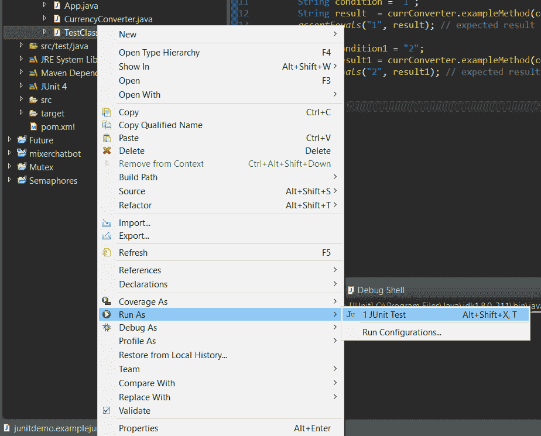

# 如何使用 JUnit 进行单元测试

> 原文： [https://javatutorial.net/how-to-use-junit-for-unit-testing](https://javatutorial.net/how-to-use-junit-for-unit-testing)

## 什么是软件测试，为什么有用？

最简单的测试软件是评估其是否满足所有要求，并检查与当前状态相关的任何不良行为和错误。

## 用 Java 测试

Java 有多种可用的测试框架，但是，在本教程中，我们将重点介绍 JUnit，因为它是最受欢迎的框架之一。

## 关于 JUnit 的一些知识

[JUnit](https://javatutorial.net/how-to-use-junit-for-unit-testing) 是一个 Java 框架，它允许我们编写和运行自动测试。 随着框架的最新更新，JUnits 的可读性大大提高。

## 设置 JUnit

如果您使用的是通用的 [IDE](https://javatutorial.net/choose-your-java-ide-eclipse-netbeans-and-intellij-idea) ，例如 Eclipse，IntelliJ 或 NetBeans，则默认情况下已安装 JUnit。 如果您不使用 IDE，而仅使用 Maven 或 Gradle，则需要在`pom.xml`或 gradle 文件中将其安装。

如果在 Eclipse 中创建 [Maven](https://javatutorial.net/how-to-install-maven-on-windows-linux-and-mac) 项目，然后选择`archetype-quickstart`并导航到`pom.xml`文件，您将看到 Eclipse 自动将 JUnit 添加为依赖项。

但是，版本是 3.8.1。 我们不想要那样，我们想要 JUnit 4 或 JUni5。

### JUnit 4

因此，让我们删除默认版本，然后将其替换为较新的版本，如下所示：

但是，在将其添加为依赖项并且无法识别`org.junit`之后，请执行以下操作：

在 Eclipse 中：属性 -&gt; Java 构建路径 -&gt; 库 -&gt; 添加库 -&gt; JUnit

## 如何使用 JUnit 示例

这是我的简单程序，我们将在以下程序上运行 JUnit 测试：

### 我的测试类

而已！ 我们只在`exmipeMethod`方法上运行了 2 个测试。

### 分解

注意，方法`testConversion()`带有 JUnit `@Test`注释。 这样做是为了使单元测试运行程序知道此方法代表单元测试，应该执行。 如果没有此注释，则不会将其表示为`Test`类，而且不会由测试运行者运行。

`assertEquals()`是执行实际测试的方法。 您真正关心的是第 13 和 17 行。`assertEquals()`方法有两个参数，第一个参数是预期结果，第二个参数是实际结果。 您可以看到这是多么有用并且非常容易实现。

重要的是要指出，如果预期结果与实际结果匹配，则什么也不会发生，但是，如果预期结果与实际结果不匹配，则`assertEquals`会引发异常，并且测试方法将停止进一步执行。

您可以使用任意数量的测试方法。

## 运行一个 JUnit

### 在 Eclipse 中运行

在 Eclipse 中，在 Package Explorer 上，找到 JUnit 测试，右键单击，然后选择“Run As -&gt; JUnit Test”。

### 在 Maven 中运行

如果要使用 Maven 运行 JUnit，则可以使用`mvn test`运行整个测试套件，也可以运行特定的测试：`mvn -Dtest=TestName test`。

### 在 Gradle 中运行

在 gradle 中，对于整个测试套件：`gradlew test`，对于特定测试：`gradlew -Dtest.single=testName test`。