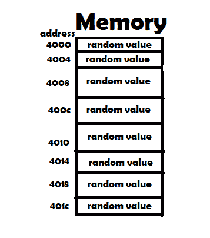
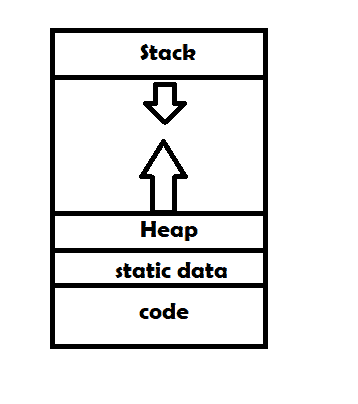
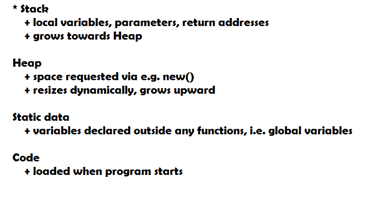

# Java 内存模型解释示例

> 原文： [https://javatutorial.net/java-memory-examples](https://javatutorial.net/java-memory-examples)

内存可以描述为字节数组，您可以在其中单独访问每个字节。 就像在 Java 中的[数组](https://javatutorial.net/java-array)中一样，在内存中的每个字节或更确切的位置上，都有可以访问的数据。 在 32 位体系结构中，每个内存“插槽”包含 32 位，也称为 1 个字，或仅 4 个字节。




记忆视觉表现

在上面的表示中，4000、4004、4008 等表示内存插槽的地址，或者在与数组，数据的索引或内存位置进行的比较中。 这些“随机值”中的每一个代表 32 位。 由于每个内存插槽占用 32 位或 4 个字节，因此内存地址每次增加 4。

通常，在 Java 和一般的编程中，有两种类型的可变范围– **全局**和**局部**。 全局变量是可以从程序中的任何地方访问的变量，而局部变量是只能在给定函数中创建它们的地方访问的变量。 因此，这两种不同类型的变量作用域存储在不同的存储区域中-**堆栈**和**数据。**





## 堆

```java
public void doSomething() {
   int v = 0;
   System.out.println(v);
}
```

在上面的简单 Java 示例中， v 存储在堆栈存储区域中。 这是因为 v 是局部变量。

## 静态数据

```java
public class Example {
   int globalVar = 3;

   public int showVar() {
       return globalVar;
   }
}
```

在上面的 Java 示例中，globalVar 位于静态数据存储区中。 因为如您所见，即使未在其中创建方法，也可以通过该方法进行访问。 此外，可以在整个程序中对其进行访问。

## 堆

```java
public class Person {
    int pid;
    String name;

    public Person(int id, String name) {
       this.pid = id;
       this.name = name;
    }
}

```

```java
public class Driver {
    public static void main(String[] args) {
        int id = 1;
        String pName = "Rick";
        Person p = new Person(id, pName);
    }
}
```

在上面的 Java 示例中，我们创建了 Person 类的新实例并将其存储在“ p”中，实际上，我们使用 Heap 区域为动态分配我们创建此类内存所需的内存。 使用 **新** 关键字的实例。 换句话说，它不固定为一定大小。 无论实例有多少字节，如果有足够的内存（可能），将创建该实例，并且该实例将仅保留创建该实例所需的字节数。

Java 在动态内存分配方面为我们省去了很多麻烦，因为在某些其他语言（例如 C）中，您必须手动分配内存并在不再需要该内存时手动“释放”相同的内存， 而在 Java 中，一切都在幕后发生，只需调用关键字 **new。**

我将建议以下有关如何调整 JVM 以使用特定内存量的教程

> [Java 增加内存](https://javatutorial.net/java-increase-memory)

&lt;iframe class="wp-embedded-content" data-secret="E5Uq3UeE34" frameborder="0" height="338" marginheight="0" marginwidth="0" sandbox="allow-scripts" scrolling="no" security="restricted" src="https://javatutorial.net/java-increase-memory/embed#?secret=E5Uq3UeE34" style="position: absolute; clip: rect(1px, 1px, 1px, 1px);" title="“Java Increase Memory” — Java Tutorial Network" width="600"&gt;&lt;/iframe&gt;