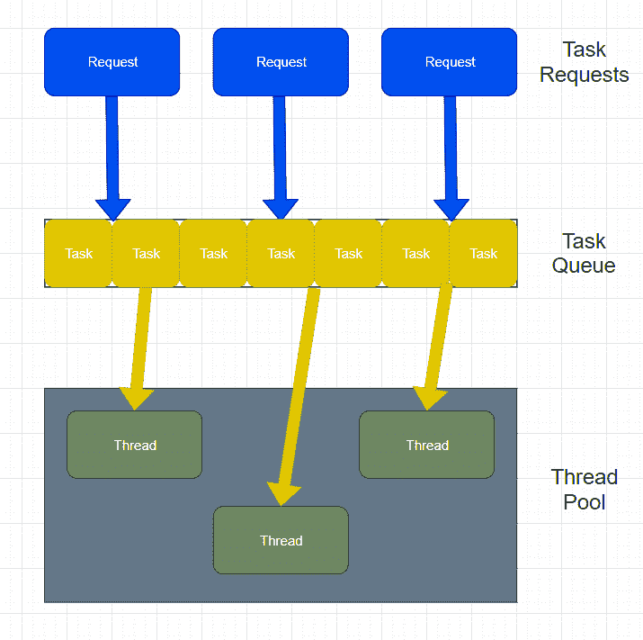

# Java 线程池示例

> 原文： [https://javatutorial.net/java-thread-pool-example](https://javatutorial.net/java-thread-pool-example)

活动线程消耗系统资源，这可能导致 [JVM](https://javatutorial.net/jvm-explained) 创建太多线程，这意味着系统将很快用尽内存。


这就是 Java 中的线程池有助于解决的问题。

## 线程池如何工作？

线程池将先前创建的线程重用于当前任务。 这就解决了需要太多线程的问题，因此内存不足不是一个选择。 您甚至可以将线程池​​视为回收系统。 它不仅消除了用尽内存的选项，而且还使应用程序非常快速地响应，因为当请求到达时已经存在一个线程。



上图的工作流不仅可以控制应用程序正在创建的线程数，还可以控制计划任务的执行并将传入的任务保持在队列中。

## 执行者，执行者和执行者服务

Java 提供了 Executor 框架，这意味着您只需要实现 Runnable 对象并将其发送给 executor 即可执行。

要使用线程池，首先我们需要创建一个 ExecutorService 对象并将任务传递给它。 ThreadPoolExecutor 类设置核心和最大池大小。 然后，可运行对象将顺序执行。

## 不同的执行器线程池方法

```java
newFixedThreadPool(int size) - creates a fixed size thread pool

newCachedThreadPool() - creates a thread pool that creates new threads if needed but will also use previous threads if they are available

newSingleThreadExecutor() - creates a single thread
```

ExecutorService 接口包含许多方法，这些方法用于控制任务的进度并管理服务的终止。 您可以使用 Future 实例控制任务的执行。 有关如何使用 Future 的示例：

```java
ExecutorService execService = Executors.newFixedThreadPool(6);
Future<String> future = execService.submit(() -> "Example");
String result = future.get();
```

ThreadPoolExecutor 使您可以实现具有许多参数的可扩展线程池，这些参数包括 corePoolSize，maximumPoolSize，keepAliveTime，unit，workQueue，处理程序，threadFactor。 但是，corePoolSize，maximumPoolSize 和 keepAliveTime 是主要变量，因为它们在每个构造函数中都使用。

corePoolSize 是要保留在池中的线​​程数，即使它们处于空闲状态，除非设置了 allowCoreThreadTimeOut。

maximumPoolSize 是池中允许的最大线程数。

keepAliveTime 是当线程数大于内核数时，这是多余的空闲线程将在终止之前等待新任务的最长时间。

有关其他参数的更多信息，请访问[原始 Oracle 文档](https://docs.oracle.com/javase/7/docs/api/java/util/concurrent/ThreadPoolExecutor.html)。

## 线程池实现示例

工作流程步骤：

1.  创建要执行的任务
2.  使用执行程序创建执行程序池
3.  将任务传递给执行程序池
4.  关闭执行程序池

**Task.java**

```java
import java.text.SimpleDateFormat;  
import java.util.Date; 
import java.util.concurrent.ExecutorService; 
import java.util.concurrent.Executors; 

// (Step 1) 
public class Task implements Runnable    { 
    private String name; 

    public Task(String name) { 
        this.name = name; 
    } 

    public void run() { 
        try {
            for (int i = 0; i < 5; i++) { 
                if (i == 1) { 
                    Date date = new Date(); 
                    SimpleDateFormat ft = new SimpleDateFormat("hh:mm:ss"); 
                    System.out.println("Time initialization for task " + this.name + " is " + ft.format(date));    
                } 
                else { 
                    Date date = new Date(); 
                    SimpleDateFormat ft = new SimpleDateFormat("hh:mm:ss"); 
                    System.out.println("Execution time for task " + this.name + " is " + ft.format(date));    
                } 
                Thread.sleep(1000); 
            } 
        } 
        catch(InterruptedException error) { 
            error.printStackTrace(); 
        } 
        System.out.println(this.name + " completed"); 
    } 
} 

```

**Main.java**

```java
import java.text.SimpleDateFormat;  
import java.util.Date; 
import java.util.concurrent.ExecutorService; 
import java.util.concurrent.Executors; 

public class Main { 
    public static void main(String[] args) { 
        Runnable task1 = new Task("task 1"); 
        Runnable task2 = new Task("task 2"); 
        Runnable task3 = new Task("task 3"); 
        Runnable task4 = new Task("task 4"); 
        Runnable task5 = new Task("task 5");       

        // (Step 2) 
        ExecutorService pool = Executors.newFixedThreadPool(3);   

        // (Step 3) 
        pool.execute(task1); 
        pool.execute(task2); 
        pool.execute(task3); 
        pool.execute(task4); 
        pool.execute(task5);  

        // (Step 4) 
        pool.shutdown();     
    } 
} 

```

**输出：**

```java
Time initialization for task task 2 is 10:18:40
Time initialization for task task 1 is 10:18:40
Time initialization for task task 3 is 10:18:40
Execution time for task task 3 is 10:18:41
Execution time for task task 1 is 10:18:41
Execution time for task task 2 is 10:18:41
Execution time for task task 2 is 10:18:42
Execution time for task task 3 is 10:18:42
Execution time for task task 1 is 10:18:42
Execution time for task task 1 is 10:18:43
Execution time for task task 3 is 10:18:43
Execution time for task task 2 is 10:18:43
Execution time for task task 3 is 10:18:44
Execution time for task task 1 is 10:18:44
Execution time for task task 2 is 10:18:44
task 2 completed
task 1 completed
task 3 completed
Time initialization for task task 4 is 10:18:45
Time initialization for task task 5 is 10:18:45
Execution time for task task 4 is 10:18:46
Execution time for task task 5 is 10:18:46
Execution time for task task 4 is 10:18:47
Execution time for task task 5 is 10:18:47
Execution time for task task 5 is 10:18:48
Execution time for task task 4 is 10:18:48
Execution time for task task 4 is 10:18:49
Execution time for task task 5 is 10:18:49
task 4 completed
task 5 completed

```

**上面的代码实现的细分：**

Task.java 表示任务类。 每个任务都有一个名称实例变量，并且每个任务都使用构造函数实例化。 此类有 1 个方法，称为运行。 在 run 方法的主体内，有一个 for 循环，该循环根据存在的任务数进行迭代。 在我们的例子中，有 5 个任务，这意味着它将运行 5 次。 第一次迭代，显示当前任务初始化的时间。 其他迭代，打印执行时间。 打印完成后，有一个 Thread.sleep（）方法调用，该方法用于以 1 秒的延迟显示每个迭代消息。 **注意**，像这样调用的方法名称“ run” 非常重要，因为它是来自 Task 类正在实现的 Runnable 的抽象方法。

仅在池中的某个胎面变得空闲时才执行任务 4 和 5。 在此之前，额外的任务将放置在队列中。

执行完所有任务后，请关闭线程池。

## 线程池何时有用

组织服务器应用程序时。 如本文开头所述，在组织服务器应用程序时非常有用，因为使用线程池非常有效，就像有许多任务一样，它会自动将它们放入队列中。 不仅如此，它还可以防止内存不足，或者至少可以显着减慢这样做的速度。 使用 ExecutorService 使其更易于实现。