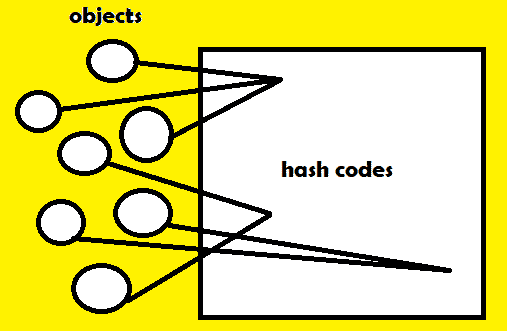

# Java `hashCode()`方法示例

> 原文： [https://javatutorial.net/java-hashcode-method-example](https://javatutorial.net/java-hashcode-method-example)

Java **java.lang.Object** 中的超类提供了两种比较对象的重要方法： **equals（）**和 **hashcode（）。** 当面对实现类之间的交互时，这些方法被广泛使用。 在本教程中，我们仅看一下 hashCode（）。


## 方法定义与实现

**hashCode（）：**默认情况下，此方法返回每次都是唯一的随机整数。 例如，如果第二次执行应用程序，则该值将不同。 hashCode 值主要用于哈希格式的集合中，例如 [HashSet](https://javatutorial.net/java-hashset-example) ， [HashMap](https://javatutorial.net/java-hashmap-example) 等。请注意，在覆盖 equals（）方法的每个类中都必须覆盖此方法**。**



hashCode 的简单说明

## `hashCode()`可以使用的集合列表

*   [哈希集](https://docs.oracle.com/javase/7/docs/api/java/util/HashSet.html)
*   [树集](https://docs.oracle.com/javase/7/docs/api/java/util/TreeSet.html)
*   [LinkedHashSet](https://docs.oracle.com/javase/7/docs/api/java/util/LinkedHashSet.html)
*   [CopyOnWriteArraySet](https://docs.oracle.com/javase/8/docs/api/java/util/concurrent/CopyOnWriteArraySet.html)

## 什么时候应该使用`hashCode()`方法

如果我们想执行 equals（）方法，则需要确保这些对象具有相同的**唯一哈希码 ID。** 当哈希码 ID 不同时，我们永远不要执行 equals（）。

**注意**：当 hashCode（）比较返回**为假**时，equals（）方法还必须返回**为假**。 如果哈希码与**不同**，则对象**不等于**。

## `hashCode()`和`equals()`的实际示例

```java
import java.lang.*;
public class hashCodeExample {
    public static void main(String[] args){ 
        Car BMW = new Car(1, "BMW"); // 1 --> ID, 2 --> the name of the car brand
        Car mercedes = new Car(2, "Mercedes"); // 1 --> ID, 2 --> the name of the car brand

        boolean isHashcodeEqual = BMW.hashCode() == mercedes.hashCode();

        if (isHashcodeEqual) {
            System.out.println("Equal");
        } else {
            System.out.println("No need to compare with equals() method as it is clear " +
            "that the id of these objects is not equal.");
        }
    }

    static class Car {
        int id;
        String brand;

        public Car (int id, String brand) {
            this.id = id;
            this.brand = brand;
        }

        @Override
        public boolean equals(Object obj) {
            if(this == obj) {
                return true;
            }
            else if(obj == null || getClass() != obj.getClass()) {
                return false;
            }
            Car car = (Car) obj;
            return id == car.id && brand.equals(car.brand);
        }

        @Override
        public int hashCode() {
            return id;
        }
    }
}
```

### 上面代码的简要分解

在前几行中，我们将创建两个“ Car”对象，并传递一个 id 和一个品牌名称。

```java
Car BMW = new Car(1, "BMW"); // 1 --> ID, 2 --> the name of the car brand
Car mercedes = new Car(2, "Mercedes"); // 1 --> ID, 2 --> the name of the car brand
```

然后，我们将一个布尔值存储在名为 isHashCodeEqual 的变量中，该变量根据两个对象的 ID 是否相等而为 true 或 false。

```java
boolean isHashcodeEqual = BMW.hashCode() == mercedes.hashCode();
```

在那之后，我们有一个条件可以检查 isHashCodeEqual 是 true 还是 false。 如果为 true，则表示两个对象的 ID 相等。 如果不是，则意味着相反。 如果它们相等，我们只需打印“相等”。 如果不是，我们将打印一条有用的消息，该消息基本上会说，如果它们不相等，则无需使用相等进行检查，因为这两个对象不共享相同的 ID。

```java
        if (isHashcodeEqual) {
            System.out.println("Equal");
        } else {
            System.out.println("No need to compare with equals() method as it is clear " +
            "that the id of these objects is not equal.");
        }
```

接下来是我们的静态类“汽车”。

```java
   static class Car {
        int id;
        String brand;

        public Car (int id, String brand) {
            this.id = id;
            this.brand = brand;
        }

        @Override
        public boolean equals(Object obj) {
            if(this == obj) {
                return true;
            }
            else if(obj == null || getClass() != obj.getClass()) {
                return false;
            }
            Car audi = (Car) obj;
            return id == audi.id && brand.equals(audi.brand);
        }

        @Override
        public int hashCode() {
            return id;
        }
    }
```

## `hashCode()`的常见错误

*   在 hashCode（）方法中返回一个常量值，而不是为每个对象返回唯一的值。
*   使用 HashMap 之类的哈希集合时，不覆盖 equals（）和 hashCode（）。
*   忘记使用 equals（）方法或其他方法覆盖 hashCode（）。

## 有关`hashCode()`的重要注意事项

1.  使用有效的算法，以便生成唯一的哈希码
2.  覆盖 equals（）方法时，请始终确保也覆盖了 hashCode（）方法。
3.  如果比较两个对象的哈希码的结果为 false，则 equals（）方法也应为 false。 （请参见上面的代码示例）
4.  如果在起诉哈希集合时没有覆盖 equals（）和 hashCode（），则该集合将具有重复项。