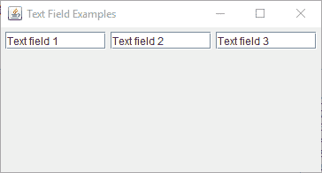
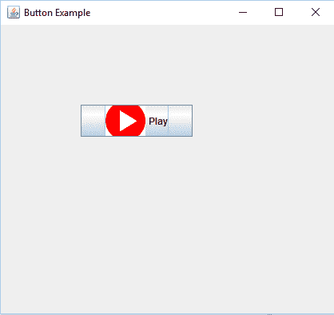
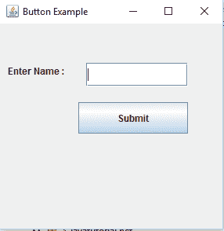

# 与`JFrame`交互 – 按钮，监听器和文本区域

> 原文： [https://javatutorial.net/jframe-buttons-listeners-text-fields](https://javatutorial.net/jframe-buttons-listeners-text-fields)

本教程说明了如何通过使用按钮，监听器和文本区域与 [JFrame](https://javatutorial.net/swing-jframe-basics-create-jframe) 进行交互。

## 背景

交互性是用户在每个应用程序中想要的。 为了在程序中增加交互性，Java 为我们提供了一种非常简单的方法。 Javax.swing.JButton calss 为我们提供了一种添加按钮的方法，并且在单击按钮后发生事件。 同样，借助 javax.swing.JTextfield 的帮助，我们可以向 [JFrame](https://javatutorial.net/swing-jframe-basics-create-jframe) 添加文本区域。

## 添加文本区域

您可以使用 JTextfield（）方法创建一个文本区域。 此类具有许多构造函数，如 JTextField（）：构造一个新的文本区域

JTextField（字符串文本）：使用指定的文本构造一个文本区域。

JTextField（字符串文本，int 列）：它使用指定的文本和列数创建一个新的文本区域。

以下程序显示了向 JFrame 添加文本区域的示例。

```java
package javatutorial.net;
import java.awt.FlowLayout;
import javax.swing.JFrame;
import javax.swing.JTextField;

public class Example {

	static JTextField textfield1, textfield2, textfield3;

	 public static void main(String[] args) {

		    JFrame f = new JFrame("Text Field Examples");
		    f.getContentPane().setLayout(new FlowLayout());
		    textfield1 = new JTextField("Text field 1",10);
		    textfield2 = new JTextField("Text field 2",10);
		    textfield3 = new JTextField("Text field 3",10);
		    f.getContentPane().add(textfield1);
		    f.getContentPane().add(textfield2);
		    f.getContentPane().add(textfield3);

		    f.pack();
		    f.setVisible(true);
		  }
}

```

这是此代码的输出



TextField 示例

您可以使用 JTextfield 提供的不同方法进行自定义。

JTextField.setfont（字体 f）; 它设置文本的字体

JTextField.setHorizo​​ntalAlignment（int alignment）; 它设置文本的水平对齐方式。

JTextFieldsetScrollOffset（int scrolloffset）; 它以像素为单位设置滚动偏移量。

## 添加按钮并应用动作监听器

同样，您可以在 JFrame 中添加按钮。 JButton 为我们提供了一种添加按钮和动作监听器的简便方法。 它有很多像

JButton（）; 创建一个没有文本且没有图标的按钮。

JButton（String text）：创建一个带有指定文本的按钮。

JButton（图标图示）; 创建一个带有指定图标的按钮。

JButton（字符串文本，图标图标）; 创建带有指定文本和图标的按钮。

这是带有图像图标的 JButton 的简单示例。

```java
package javatutorial.net;
import javax.swing.ImageIcon;
import javax.swing.JButton;
import javax.swing.JFrame;

public class SimpleJButton {

	SimpleJButton(){    
		JFrame f=new JFrame("Button Example");            
		JButton b=new JButton("Play", new ImageIcon("play.png"));    
		b.setBounds(100,100,140, 40);    
		f.add(b);    
		f.setSize(300,400);    
		f.setLayout(null);    
		f.setVisible(true);    
		f.setDefaultCloseOperation(JFrame.EXIT_ON_CLOSE);    
		}         
		public static void main(String[] args) {    
		    new SimpleJButton();    
		}    
 }

```

这是此代码的输出



带有图标的按钮

## 添加动作监听器

在 JButton 上添加动作监听器非常简单。 JButton 类提供方法 JButton.addActionListener（），该方法实现重写方法 actionPerformed（）。 在下面的示例中，我编写了一个简单的程序，要求用户输入名称，当用户单击“提交”按钮时，将显示一条消息“名称已提交。”。 这是代码。

```java
package javatutorial.net;
import java.awt.event.ActionEvent;
import java.awt.event.ActionListener;

import javax.swing.JButton;
import javax.swing.JFrame;
import javax.swing.JLabel;
import javax.swing.JTextField;

public class SimpleJButton {

	SimpleJButton(){    
		JFrame f=new JFrame("Button Example"); 
					//submit button
		JButton b=new JButton("Submit");    
		b.setBounds(100,100,140, 40);    
					//enter name label
		JLabel label = new JLabel();		
		label.setText("Enter Name :");
		label.setBounds(10, 10, 100, 100);
					//empty label which will show event after button clicked
		JLabel label1 = new JLabel();
		label1.setBounds(10, 110, 200, 100);
					//textfield to enter name
		JTextField textfield= new JTextField();
		textfield.setBounds(110, 50, 130, 30);
					//add to frame
		f.add(label1);
		f.add(textfield);
		f.add(label);
		f.add(b);    
		f.setSize(300,300);    
		f.setLayout(null);    
		f.setVisible(true);    
		f.setDefaultCloseOperation(JFrame.EXIT_ON_CLOSE);   

							//action listener
		b.addActionListener(new ActionListener() {

			@Override
			public void actionPerformed(ActionEvent arg0) {
					label1.setText("Name has been submitted.");				
			}          
	      });
		}         

		public static void main(String[] args) {    
		    new SimpleJButton();    
		}    
 }

```

这是此代码的输出



行动听众

这是完整代码的[链接](https://github.com/NeelumAyub/Tutorials/tree/master/InteractiveJFrame)，您可以下载。