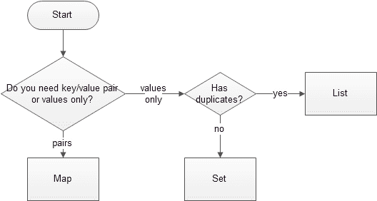

# 选择合适的 Java 集合

> 原文： [https://javatutorial.net/choose-the-right-java-collection](https://javatutorial.net/choose-the-right-java-collection)

Java 为您提供了多种收集实现供您选择。 通常，您将始终为您的编程任务寻找性能最佳的集合，在大多数情况下为 [ArrayList](https://javatutorial.net/java-arraylist-example) ， [HashSet](https://javatutorial.net/java-concurrenthashset-example) 或 [HashMap](https://javatutorial.net/java-identityhashmap-example) 。 但是请注意，如果您需要某些特殊功能（例如排序或排序），则可能需要进行特殊的实现。 该 Java 集合教程不包括 [WeakHashMap](https://javatutorial.net/java-weakhashmap-example) 等很少使用的类，因为它们是为非常特定或特殊任务设计的，因此在 99% 的情况下都不应该选择它们。

如果您需要深入了解特定集合的实现方式，则可能需要阅读官方的[集合框架教程](http://docs.oracle.com/javase/7/docs/technotes/guides/collections/index.html "Collections Framework Tutorial")。

首先让我们看下面的流程图。 它将帮助您根据要存储到此集合中的数据确定要使用的集合接口。

这里的主要规则是：如果您需要存储映射了键的值，请转到 Map 接口，否则，请使用 List 表示可能重复的值，如果您不想在集合中使用重复的值，请最终使用 Set 接口。

## 选择正确的 Java `Map`接口

[**HashMap**](https://javatutorial.net/java-identityhashmap-example) –如果迭代时项目的顺序对您不重要，请使用此实现。 与 TreeMap 和 [LinkedHashMap](https://javatutorial.net/java-linkedhashmap-example) 相比，HashMap 具有更好的性能。

[**TreeMap**](https://javatutorial.net/java-treemap-example) –已排序和排序，但比 HashMap 慢。 [TreeMap](https://javatutorial.net/java-treemap-example) 根据其比较器具有键的升序

[**LinkedHashMap**](https://javatutorial.net/java-linkedhashmap-example) –在插入过程中按键对项目排序

## 选择正确的 Java `List`接口

[**ArrayList**](https://javatutorial.net/java-arraylist-example) –插入期间对项目进行排序。 与对 LinkedLists 的搜索操作相比，对 ArrayLists 的搜索操作更快

[**LinkedList**](https://javatutorial.net/java-linkedlist-example) –已快速添加到列表的开头，并通过迭代从内部快速删除

## 选择正确的 Java `Set`接口

[**HashSet**](https://javatutorial.net/java-concurrenthashset-example) –如果迭代时项目的顺序对您不重要，请使用此实现。 与 TreeSet 和 LinkedHashSet 相比，HashSet 具有更好的性能

**LinkedHashSet** –在插入过程中订购商品

[**TreeSet**](https://javatutorial.net/java-treeset-example) –根据其比较器，键的升序