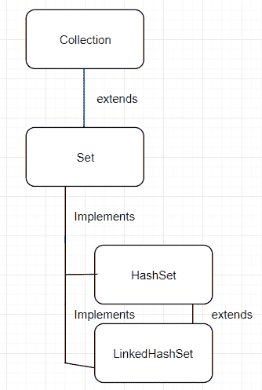

# Java `LinkedHashSet`示例

> 原文： [https://javatutorial.net/java-linkedhashset-example](https://javatutorial.net/java-linkedhashset-example)

Java 中的`LinkedHashSet`类与[`HashSet`](https://javatutorial.net/java-hashset-example)不同，因为其实现维护了所有元素上的双链表。 此链表定义了迭代顺序，即将元素插入到集合中的顺序。 这称为插入顺序。 如果将元素重新插入到集合中，则插入顺序不受其影响。 某些人更喜欢此实现，因为它使用户摆脱了[`HashSet`](https://javatutorial.net/java-hashset-example)提供的未指定且混乱的排序。


## `LinkedHashSet`的优点

*   `LinkedHashSet`维护元素的插入顺序
*   插入，删除和检索操作的时间复杂度为`O(1)`（恒定时间）。
*   `LinkedHashSet`允许 1 个`null`元素。
*   `LinkedHashSet`使用`equals()`和`hashCode()`，因此可以删除可能的重复元素。

## 继承图



`LinkedHashSet`的继承图

## `LinkedHashSet`中的构造方法

1.  `LinkedHashSet()`：初始化一个新的链接哈希集，默认初始容量为 16，负载因子为 0.75。
2.  `LinkedHashSet（Collection <? extends E> c）`：使用与指定集合相同的元素初始化一个新的链接哈希集。
3.  `LinkedHashSet(int initialCapacity)`：使用指定的初始容量初始化一个新的链接哈希集。
4.  `LinkedHashSet(int initialCapacity, float loadFactor)`：使用指定的容量和负载因子初始化一个新的链接哈希集。

## `LinkedHashSet`中的方法

1.  从类`java.util.HashSet`继承的方法：[`add`](https://docs.oracle.com/javase/7/docs/api/java/util/HashSet.html#add(E))，[`clear`](https://docs.oracle.com/javase/7/docs/api/java/util/HashSet.html#clear())，[`clone`](https://docs.oracle.com/javase/7/docs/api/java/util/HashSet.html#clone())，[`contains`](https://docs.oracle.com/javase/7/docs/api/java/util/HashSet.html#contains(java.lang.Object))， [`isEmpty`](https://docs.oracle.com/javase/7/docs/api/java/util/HashSet.html#isEmpty()) ， [`iterator`](https://docs.oracle.com/javase/7/docs/api/java/util/HashSet.html#iterator())，[`remove`](https://docs.oracle.com/javase/7/docs/api/java/util/HashSet.html#remove(java.lang.Object))，[`size`](https://docs.oracle.com/javase/7/docs/api/java/util/HashSet.html#size())
2.  从类`java.util.AbstractSet`继承的方法：[`equals`](https://docs.oracle.com/javase/7/docs/api/java/util/AbstractSet.html#equals(java.lang.Object))， [`hashCode`](https://docs.oracle.com/javase/7/docs/api/java/util/AbstractSet.html#hashCode()) ， [`removeAll`](https://docs.oracle.com/javase/7/docs/api/java/util/AbstractSet.html#removeAll(java.util.Collection))
3.  从类`java.util.AbstractCollection`继承的方法： [`addAll`](https://docs.oracle.com/javase/7/docs/api/java/util/AbstractCollection.html#addAll(java.util.Collection)) ， [`containsAll`](https://docs.oracle.com/javase/7/docs/api/java/util/AbstractCollection.html#containsAll(java.util.Collection)) ， [`keepAll`](https://docs.oracle.com/javase/7/docs/api/java/util/AbstractCollection.html#retainAll(java.util.Collection)) ， [`toArray`](https://docs.oracle.com/javase/7/docs/api/java/util/AbstractCollection.html#toArray()) ， [`toArray(T[])`](https://docs.oracle.com/javase/7/docs/api/java/util/AbstractCollection.html#toArray(T[])) ， [`toString`](https://docs.oracle.com/javase/7/docs/api/java/util/AbstractCollection.html#toString())
4.  从类`java.lang.Object`继承的方法：[`finalize`](https://docs.oracle.com/javase/7/docs/api/java/lang/Object.html#finalize())， [`getClass`](https://docs.oracle.com/javase/7/docs/api/java/lang/Object.html#getClass()) ，[`notify`](https://docs.oracle.com/javase/7/docs/api/java/lang/Object.html#notify())， [`notifyAll`](https://docs.oracle.com/javase/7/docs/api/java/lang/Object.html#notifyAll()) ， [`wait`](https://docs.oracle.com/javase/7/docs/api/java/lang/Object.html#wait()) ， [`wait(long)`](https://docs.oracle.com/javase/7/docs/api/java/lang/Object.html#wait(long))，[`wait(long, int)`](https://docs.oracle.com/javase/7/docs/api/java/lang/Object.html#wait(long,%20int))
5.  从接口`java.util.Set`继承的方法： [`add`](https://docs.oracle.com/javase/7/docs/api/java/util/Set.html#add(E)) ， [`addAll`](https://docs.oracle.com/javase/7/docs/api/java/util/Set.html#addAll(java.util.Collection)) ，[`clear`](https://docs.oracle.com/javase/7/docs/api/java/util/Set.html#clear())，[`contains`](https://docs.oracle.com/javase/7/docs/api/java/util/Set.html#contains(java.lang.Object))， [`containsAll`](https://docs.oracle.com/javase/7/docs/api/java/util/Set.html#containsAll(java.util.Collection)) ， [`equals`](https://docs.oracle.com/javase/7/docs/api/java/util/Set.html#equals(java.lang.Object))， [`hashCode`](https://docs.oracle.com/javase/7/docs/api/java/util/Set.html#hashCode()) ， [`isEmpty`](https://docs.oracle.com/javase/7/docs/api/java/util/Set.html#isEmpty()) ，[`iterator`](https://docs.oracle.com/javase/7/docs/api/java/util/Set.html#iterator())，[`remove`](https://docs.oracle.com/javase/7/docs/api/java/util/Set.html#remove(java.lang.Object))， [`removeAll`](https://docs.oracle.com/javase/7/docs/api/java/util/Set.html#removeAll(java.util.Collection)) ， [`retainAll`](https://docs.oracle.com/javase/7/docs/api/java/util/Set.html#retainAll(java.util.Collection)) ，[`size`](https://docs.oracle.com/javase/7/docs/api/java/util/Set.html#size())， [`toArray`](https://docs.oracle.com/javase/7/docs/api/java/util/Set.html#toArray()) ， [`toArray(T[])`](https://docs.oracle.com/javase/7/docs/api/java/util/Set.html#toArray(T[]))

有关所有方法的文档，请访问 [Oracle 官方文档页面](https://docs.oracle.com/javase/7/docs/api/java/util/LinkedHashSet.html)。

## 使用`Iterator()`迭代`LinkedHashSet`

```java
import java.util.*;  
class LinkedHashSetExample{  
     public static void main(String args[]){  
        LinkedHashSet<String> animals=new LinkedHashSet();  
               animals.add("Elephant");    
               animals.add("Tiger");    
               animals.add("Lion");   

               Iterator<String> iterator=animals.iterator();  
               while(iterator.hasNext())  {  
                     System.out.println(iterator.next());  
               }  
      }  
}
```

**输出：**

```java
Elephant
Tiger
Lion
```

## 使用`Fo​​r`循环遍历`LinkedHashSet`

```java
LinkedHashSet<String> linkedHashSet = new LinkedHashSet<String>();
for (int i = 0; i < linkedHashSet.size(); i++) {
    System.out.println(linkedHashSet.get(i));
}
```

## 使用增强`For`循环遍历`LinkedHashSet`

```java
for (String temp : linkedHashSet) {
    System.out.println(temp);
}
```

## 使用`While`循环遍历`LinkedHashSet`

```java
int i = 0;
while (i < linkedHashSet.size()) {
    System.out.println(linkedHashSet.get(i));
    i++;
}
```

## `LinkedHashSet`的示例程序

```java
import java.util.LinkedHashSet;   
public class LinkedHashSetExample  
{   
    public static void main(String[] args)  
    {   
        LinkedHashSet<String> coins =  
                           new LinkedHashSet<String>();   

        // Adding element to LinkedHashSet   
        coins.add("5");   
        coins.add("10");   
        coins.add("20");   
        coins.add("50"); 
        coins.add("100"); 

        // Adding a duplicate would result in no addition of the element  
        coins.add("5");
        // Adding another coin value
        coins.add("75");   

        System.out.println("Size of the list = " + 
                                    coins.size());   
        System.out.println("Original LinkedHashSet:" + coins);   
        System.out.println("Removing 75 from LinkedHashSet: " + 
                            coins.remove("75"));    
        System.out.println("Checking if 50 is present=" +  
                            coins.contains("50")); 
        System.out.println("Updated LinkedHashSet: " + coins);   
    }   
}
```

**输出：** 

```java
Size of LinkedHashSet=5
Original LinkedHashSet:[5, 10, 20, 50, 75, 100]
Removing 75 from LinkedHashSet: true
Checking if 50 is present=true
Updated LinkedHashSet:[5, 10, 20, 50, 100]
```