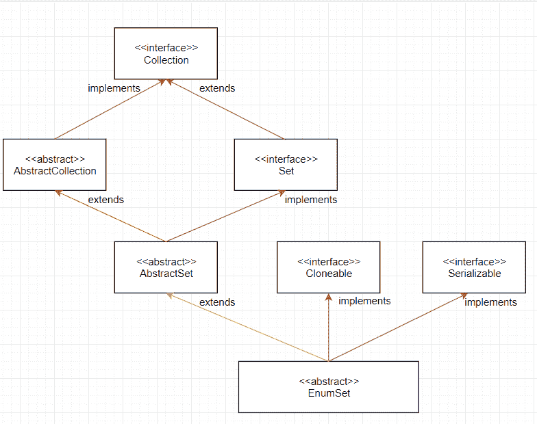

# Java `EnumSet`示例

> 原文： [https://javatutorial.net/java-enumset-example](https://javatutorial.net/java-enumset-example)

Java `EnumSet`类实现[`Set`](https://docs.oracle.com/javase/7/docs/api/java/util/Set.html)并将其与枚举类型一起使用。`EnumSet`（顾名思义）只能包含枚举值，并且所有值都属于同一个枚举。 此外，`EnumSet`不允许使用空值，这意味着它会抛出`NullPointerException`尝试添加空值。 它不是线程安全的，这意味着，如果需要，我们需要在外部进行同步。


## 继承图



枚举集

## 为什么使用`EnumSet`

每当我们必须存储枚举值时，`EnumSet`应该始终是最佳的`Set`实现。 所有基本操作都以固定的`time(1)`复杂度执行，这非常快。 这是由于`EnumSet`类中的所有方法都是使用算术按位运算（`<<`，`>>`，`&`等）实现的。 总而言之，`EnumSet`非常有效，因为它使用较少的内存并且速度也很快。

## `EnumSet`中的方法

1.  `EnumSet<E> close()`：返回当前集合的副本。
2.  `static <E extends Enum<E>> EnumSet<E> allOf(Class<E> elementType)`：创建一个枚举集，该枚举集包含该枚举中的所有元素 指定的元素类型。
3.  `static <E extends Enum<E>> EnumSet<E> complementOf(EnumSet<E> s)`：创建与指定元素类型相同的枚举集 枚举集合，最初包含此类型的所有元素，这些元素不包含在指定集合中。
4.  `static <E extends Enum<E>> EnumSet<E> copyOf(Collection<E> c)`：创建一个从指定集合初始化的集合。
5.  `static <E extends Enum<E>> EnumSet<E> copyOf(EnumSet<E> s)`：创建一个与指定元素类型相同的枚举集，包含相同的元素（如果有）。
6.  `static <E extends Enum<E>> EnumSet<E> of(E e)`：创建一个包含指定元素的枚举集。
7. `atic <E extends Enum<E>> EnumSet<E> range(E from, E to)`：创建一个枚举集，该枚举集包含在由两个参数指定的范围内的所有元素。

**从类[`java.util.AbstractSet`](https://docs.oracle.com/javase/7/docs/api/java/util/AbstractSet.html)继承的方法**：

[`equals`](https://docs.oracle.com/javase/7/docs/api/java/util/AbstractSet.html#equals(java.lang.Object))， [`hashCode`](https://docs.oracle.com/javase/7/docs/api/java/util/AbstractSet.html#hashCode()) ， [`removeAll`](https://docs.oracle.com/javase/7/docs/api/java/util/AbstractSet.html#removeAll(java.util.Collection))

**从类[`java.util.AbstractCollection`](https://docs.oracle.com/javase/7/docs/api/java/util/AbstractCollection.html "class in java.util")继承的方法**：

[`add`](https://docs.oracle.com/javase/7/docs/api/java/util/AbstractCollection.html#add(E))， [`addAll`](https://docs.oracle.com/javase/7/docs/api/java/util/AbstractCollection.html#addAll(java.util.Collection)) ，[`clear`](https://docs.oracle.com/javase/7/docs/api/java/util/AbstractCollection.html#clear())，[`include`](https://docs.oracle.com/javase/7/docs/api/java/util/AbstractCollection.html#contains(java.lang.Object))， [`containsAll`](https://docs.oracle.com/javase/7/docs/api/java/util/AbstractCollection.html#containsAll(java.util.Collection)) ， [`isEmpty`](https://docs.oracle.com/javase/7/docs/api/java/util/AbstractCollection.html#isEmpty()) ，[`iterator`](https://docs.oracle.com/javase/7/docs/api/java/util/AbstractCollection.html#iterator())，[`remove`](https://docs.oracle.com/javase/7/docs/api/java/util/AbstractCollection.html#remove(java.lang.Object))， [`keepAll`](https://docs.oracle.com/javase/7/docs/api/java/util/AbstractCollection.html#retainAll(java.util.Collection)) ，[`size`](https://docs.oracle.com/javase/7/docs/api/java/util/AbstractCollection.html#size())， [`toArray`](https://docs.oracle.com/javase/7/docs/api/java/util/AbstractCollection.html#toArray()) ， [`toArray(T[])`](https://docs.oracle.com/javase/7/docs/api/java/util/AbstractCollection.html#toArray(T[])) ， [`toString`](https://docs.oracle.com/javase/7/docs/api/java/util/AbstractCollection.html#toString())

**从类[`java.lang.Object`](https://docs.oracle.com/javase/7/docs/api/java/lang/Object.html "class in java.lang")继承的方法**：

[`finalize`](https://docs.oracle.com/javase/7/docs/api/java/lang/Object.html#finalize())， [`getClass`](https://docs.oracle.com/javase/7/docs/api/java/lang/Object.html#getClass()) ，[`notify`](https://docs.oracle.com/javase/7/docs/api/java/lang/Object.html#notify())， [`notifyAll`](https://docs.oracle.com/javase/7/docs/api/java/lang/Object.html#notifyAll()) ，[`wait`](https://docs.oracle.com/javase/7/docs/api/java/lang/Object.html#wait())，[`wait(long)`](https://docs.oracle.com/javase/7/docs/api/java/lang/Object.html#wait(long))。

### 从接口[`java.util.Set`](https://docs.oracle.com/javase/7/docs/api/java/util/Set.html "interface in java.util")继承的方法：

[`add`](https://docs.oracle.com/javase/7/docs/api/java/util/Set.html#add(E))， [`addAll`](https://docs.oracle.com/javase/7/docs/api/java/util/Set.html#addAll(java.util.Collection)) ，[`clear`](https://docs.oracle.com/javase/7/docs/api/java/util/Set.html#clear())，[`contains`](https://docs.oracle.com/javase/7/docs/api/java/util/Set.html#contains(java.lang.Object))， [`containsAll`](https://docs.oracle.com/javase/7/docs/api/java/util/Set.html#containsAll(java.util.Collection)) ， [`isEmpty`](https://docs.oracle.com/javase/7/docs/api/java/util/Set.html#isEmpty()) ，[`iterator`](https://docs.oracle.com/javase/7/docs/api/java/util/Set.html#iterator())，[`remove`](https://docs.oracle.com/javase/7/docs/api/java/util/Set.html#remove(java.lang.Object))， [`retainAll`](https://docs.oracle.com/javase/7/docs/api/java/util/Set.html#retainAll(java.util.Collection)) ，[`size`](https://docs.oracle.com/javase/7/docs/api/java/util/Set.html#size())， [`toArray`](https://docs.oracle.com/javase/7/docs/api/java/util/Set.html#toArray()) ， [`toArray(T[])`](https://docs.oracle.com/javase/7/docs/api/java/util/Set.html#toArray(T[]))

有关`EnumSet`主要方法的更多信息，请随时访问原始 [Oracle 文档](https://docs.oracle.com/javase/7/docs/api/java/util/EnumSet.html)。

```java
import java.util.EnumSet; 

enum Student  
{ 
    NAME, AGE, MAJOR, YEAR 
}; 
public class EnumSetExample
{ 
    public static void main(String[] args)  
    { 
        // initializing set
        EnumSet<Student> set1, set2, set3;

        // populating the sets using of(E e)
        enumSet1 = EnumSet.of(Student.NAME, Student.MAJOR, Student.YEAR);
        // will get all of the properties that have not been initialized to the 
        // specified set (if any) 
        enumSet2 = EnumSet.complementOf(enumSet1); 
        // will get all of the properties that are present in the enumset
        enumSet3 = EnumSet.allOf(Student.class); 
        // will get from age to year and everything in between the properties of the 
        // enumset class
        enumSet4 = EnumSet.range(Student.AGE, Student.YEAR); 
        System.out.println("Set 1: " + enumSet1); 
        System.out.println("Set 2: " + enumSet2); 
        System.out.println("Set 3: " + enumSet3); 
        System.out.println("Set 4: " + enumSet4); 
    } 
}
```

**输出**： 

```java
Set 1: {NAME, MAJOR, YEAR}
Set 2: {AGE}
Set 3: {NAME, AGE, MAJOR, YEAR}
Set 4: {AGE, MAJOR, YEAR}
```