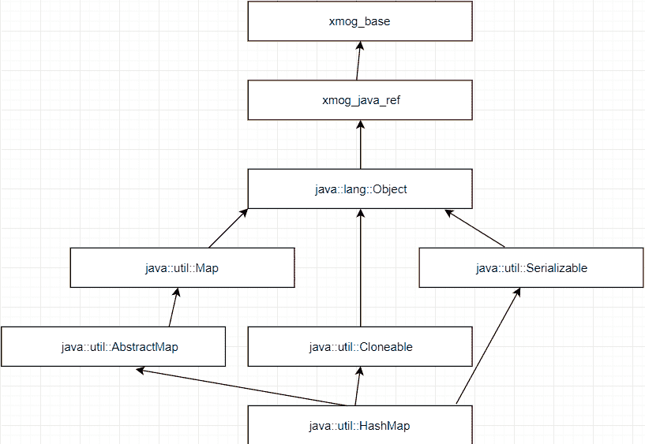

# Java HashMap 示例

> 原文： [https://javatutorial.net/java-hashmap-example](https://javatutorial.net/java-hashmap-example)

数组的项目存储为有序集合，我们可以通过索引访问它们。 另一方面，Java 中的 HashMap 类将项存储为组对，即键/值。 可以通过其他类型的索引访问它们。 此类不能保证随着时间的流逝会有恒定的顺序。 假设正确实现，HashMap 可为诸如 get and put 之类的基本操作提供恒定时间的性能。 就像 [HashSet](https://javatutorial.net/java-hashset-example) 类一样，HashMap 具有初始容量和负载因子。 容量是哈希表中的存储桶数，负载因子只是衡量哈希表在自动增加其容量之前可以容纳多少的度量。 像 [HashSet](https://javatutorial.net/java-hashset-example) 一样，默认加载因子为 0.75。


## 为什么 HashMap 重要和有用

*   由于其键/值对，因此易于组织数据。
*   HashMap 允许 1 个 null 键和多个 null 值。
*   HashMap 不允许重复的键，但允许重复的值。
*   HashMap 扩展了抽象类 AbstractMap。

## 继承图



## HashMap 中的构造方法摘要

1.  HashMap（）：使用默认的初始容量 16 和默认的加载因子 0.75 初始化一个空的 HashMap。
2.  HashMap（int initialCapacity）：使用指定的初始容量和默认加载因子 0.75 初始化一个空的 HashMap。
3.  HashMap（int initialCapacity，float loadFactor）：使用指定的初始容量和负载因子初始化一个空的 HashMap。
4.  HashMap（Map &lt;？扩展 K，？扩展 V &gt; m）：使用与指定 Map 相同的映射初始化一个新的 HashMap。

## HashMap 类中的方法

1.  void clear（）：从此映射中删除所有映射。
2.  Object clone（）：克隆另一个 HashMap，但是不会克隆键和值本身。
3.  boolean containsKey（Object key）：如果 key 在哈希图中，则返回 true，否则返回 false。
4.  boolean containsValue（Object value）：如果值在哈希映射中的任何键中，则返回 true，否则返回 false。
5.  V get（Object key）：返回指定键所映射到的值；如果此映射不包含该键的映射，则返回 null。
6.  boolean isEmpty（）：如果地图不包含任何元素，则返回 true。
7.  V put（K 键，V 值）：将指定的值添加到指定的键。
8.  V remove（Object key）：从哈希图中删除键。
9.  V replace（K 键，V 值）：仅当当前映射到某个值时，才替换指定键的条目。
10.  int size（）：返回此映射中的键/值对的数量。

### **使用 HashMap 进行基本方法操作以及它们如何工作以及如何相互交互**

```java
import java.util.HashMap;

public class HashMapExample {
  public static void main(String[] args) {
    HashMap<String, String> animals = new HashMap<String, String>();

    // putting a key-value pairs within a HashMap
    // animal -> name
    animals.put("Elephant", "Dicky");
    animals.put("Tiger", "Sammy");
    animals.put("Lion", "Sim");

    System.out.println(animals); 

    // accessing an item using get()
    // gives back the value to the specified key, which means it will return back "Sim"
    System.out.println("The name of 'Lion' is: " + animals.get("Lion");

    // removing an item using remove()
    animals.remove("Elephant");

    // getting the size of the hash map
    System.out.println("The size of the hash map before clearing: " + animals.size());

    // clearing/deleting a whole hash map using clear()
    animals.clear()

    // getting the size of the hash map
    System.out.println("The size of the hash map after clearing: " + animals.size());
  }
}
```

**输出：**

```java
[Lion=Sam, Tiger=Sammy, Elephant=Dicky]
The name of 'Lion' is: Sam
The size of the hash map before clearing: 2
The size of the hash map after clearing: 0
```