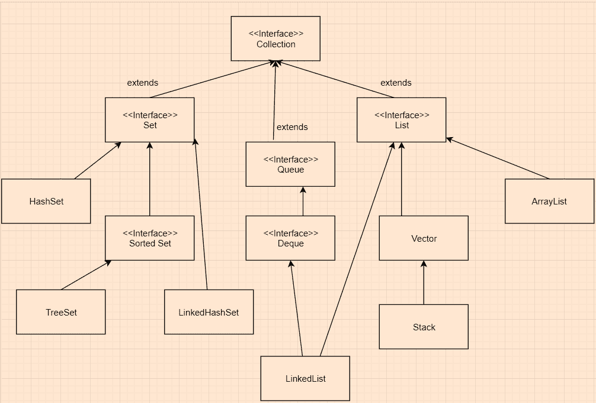

# Java LinkedHashMap 示例

> 原文： [https://javatutorial.net/java-linkedhashmap-example](https://javatutorial.net/java-linkedhashmap-example)

LinkedHashMap 是哈希表和链接列表的组合，以可预测的迭代顺序实现 Map 接口。 [HashMap](https://javatutorial.net/java-hashmap-example) 和 LinkedHashMap 之间的区别在于 LinkedHashMap 维护着一个双向链接列表，该列表允许来回扫描所有条目。 顺序保持不变，这意味着将键插入映射的顺序。 如果将重新插入到地图中，则**的顺序不会受到** **的影响。 LinkedHashMap 提供所有可选的 Map 操作，还允许空元素。 就时间复杂度而言，就像 [HashMap](https://javatutorial.net/java-hashmap-example) 一样，它为诸如 add，包含和 remove 之类的基本操作提供了恒定时间的性能。 LinkedHashMap 有两个影响其性能的参数，它们是初始容量和负载系数。 此类中的迭代不受容量的影响，因此在为初始容量选择过高的值方面，它比 HashMap 效率更高。**


## 为什么 LinkedHashMap 有用

1.  它将按照输入到地图中的顺序遍历所有条目。
2.  就像在 HashMap 中一样，允许使用空值。
3.  使用双向链接的链表，使扫描效率更高。
4.  它对添加或访问项目的顺序有额外的了解。

## 继承图



继承图

## LinkedHashMap 中的构造方法摘要

1.  LinkedHashMap（）：构造一个空的插入顺序的 LinkedHashMap，其默认初始容量（16）和默认负载因子（0.75）。
2.  LinkedHashMap（int initialCapacity）：构造一个空的插入顺序的 LinkedHashMap，并将容量设置为指定的 initialCapacity 参数和默认负载因子（0.75）。
3.  LinkedHashMap（int initialCapacity，float loadFactor）：使用指定的容量和负载因子构造一个空的插入顺序的 LinkedHashMap。
4.  LinkedHashMap（int initialCapacity，float loadFactor，boolean accessOrder）：使用指定的初始容量，负载系数和排序方式构造一个空的 LinkedHashMap 实例。
5.  LinkedHashMap（Map &lt;？扩展 K，？扩展 V &gt; m）：构造一个插入顺序的 LinkedHashMap 实例，该实例具有与指定映射相同的映射。

## LinkedHashMap 类中的方法

1.  void clear（）：从此映射中删除所有映射。
2.  boolean containsValue（Object value）：如果 LinkedHashMap 包含指定的值，则返回 true，否则返回 false。
3.  设置&lt; Map.Entry &lt; K，V &gt; &gt; entrySet（）：返回当前映射中包含的映射的设置视图。
4.  V get（Object key）：返回指定键所映射到的值；如果该映射不包含该键的映射，则返回 null。
5.  V getOrDefault（Object key，V defaultValue）：返回指定键所映射到的值；如果该映射不包含该键的映射，则返回 defaultValue。
6.  设置&lt; K &gt; keySet：返回此映射中包含的键的设置视图。
7.  protected boolean removeEldestEntry（Map。Entry &lt; K，V &gt; eldest）：返回此映射中包含的值的集合视图。
8.  void put（K key，V value）：将指定的 Value 与指定的 Key 相关联。 （它是从 Java 中的 Map 类继承的）

有关 EnumSet 主要方法的更多信息，请随时访问原始 [Oracle 文档](https://docs.oracle.com/javase/8/docs/api/java/util/LinkedHashMap.html)。

### 获取 LinkedHashMap 的大小，检查其在特定键中是否包含某个值，并检查其是否为空，最后从 LinkedHashMap 中删除键：

```java
import java.util.*; 

public class LinkedHashMapExample
{ 
    public static void main(String args[]) 
    { 
        LinkedHashMap<String, String> student = 
                       new LinkedHashMap<String, String>(); 
        student.put("name", "Joe"); 
        student.put("major", "Computer Science"); 
        student.put("marital status", "Single"); 

        System.out.println(student); 
        // printing the value of the key called name
        System.out.println("Key 'name's value: " + student.get("name")); 

        // getting the size of the linkedHashMap (size() is inherited from Map)
        System.out.println("Size of the LinkedHashMap: " + student.size()); 

        // checking whether the map is empty or not
        System.out.println("Is the map empty: " + student.isEmpty()); 

        // checking whether the linkedHashMap contains the key specified as an argument
        System.out.println("Does it contain 'marital status'? "+  student.containsKey("marital status")); 

        // deleting/removing an element from the linkedHashMap works by using the 
        //remove method
        System.out.println("Deleting element 'name': " + student.remove("name")); 
    } 
}
```

**输出：**

```java
{name=Joe, major=Computer Science, marital status = Single}
Key 'name's value: Joe
Size of the LinkedHashMap: 3
Is the map empty: false
Does it contain 'marital status'? true
Deleting element 'name': "Joe"
```

### 使用 clear（）清除 LinkedHashMap

```java
import java.util.*; 

public class LinkedHashMapExample { 
    public static void main(String[] args) 
    { 
        LinkedHashMap<String, String> student = 
        new LinkedHashMap<String, String>(); 

        li_hash_map.put("name", "Joe"); 
        li_hash_map.put("major", "Computer Science"); 
        li_hash_map.put("marital status", "Single"); 

        System.out.println("Current stage of linkedHashMap: " + student); 

        // Clearing the linked hash map using clear() 
        li_hash_map.clear(); 

        System.out.println("Stage after the clear() method: " + student); 
    } 
}
```

**输出：** 

```java
Current stage of linkedHashMap: {"name"="Joe", "major"="Computer Science", "marital status ="Single"}
Stage after the clear() method: {}
```