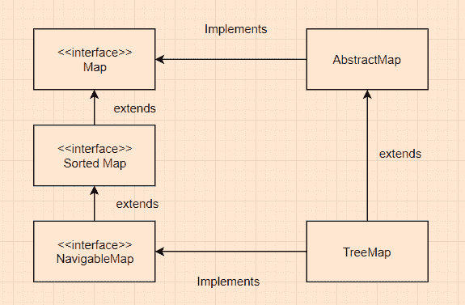

# Java `TreeMap`示例

> 原文： [https://javatutorial.net/java-treemap-example](https://javatutorial.net/java-treemap-example)

TreeMap 实现了 Map 接口，还实现了 NavigableMap 以及 Abstract 类。 映射是根据其键的自然顺序或通过提供初始化时间的[比较器](https://docs.oracle.com/javase/8/docs/api/java/util/Comparator.html)进行排序的。 就时间复杂度而言，此实现为 containsKey，get，put 和 remove 操作提供了 log（n）成本。 请务必注意，TreeMap 不会同步，因为如果地图被多个线程访问，并且如果至少胎面在结构上修改了地图，则必须在外部进行同步。


## 有关`TreeMap`的要点

*   TreeMap 实现 Map 接口。
*   TreeMap 不允许使用空键。 而是，抛出 NullPointerException。 虽然，多个空值可以与不同的键关联。
*   TreeMap 是 [Java Collections Framework](https://docs.oracle.com/javase/8/docs/technotes/guides/collections/index.html) 的成员。

## `TreeMap`的继承图



TreeMap 继承图

## `TreeMap`中的构造方法摘要

1.  TreeMap（）：使用其键的自然顺序构造一个新的空树图。
2.  TreeMap（Comparator &lt;？super K &gt;比较器）：构造一个新的空树图，根据给定的比较器排序。
3.  TreeMap（Map &lt;？扩展 K，？扩展 V &gt; m）：构造一个新的树图，该树图包含与给定图相同的映射，并根据其键的自然顺序进行排序。
4.  TreeMap（SortedMap &lt; K ，?扩展 V &gt; m）：构造一个新的树图，该树图包含与指定排序图相同的映射并使用相同的排序。

## `TreeMap`类中的方法

1.  void clear（）：删除树形图中的所有元素。
2.  Object clone（）：返回 TreeMap 实例的浅表副本。
3.  编译器&lt;？ super K &gt;比较器：返回用于对当前映射中的键进行排序的比较器；如果映射使用其键的[自然排序](https://docs.oracle.com/javase/8/docs/api/java/lang/Comparable.html)，则返回 null。
4.  boolean containsKey（Object key）：如果当前树图中存在指定的键，则返回 true。
5.  boolean containsValue（Object value）：如果当前任意一个地图键都存在指定值，则返回 true。
6.  V put（K 键，V 值）：将指定的值放入指定的键。
7.  V remove（Object key）：从当前映射中删除指定的键。
8.  V replace（K 键，V 值）：仅当当前映射到某个值时，才替换指定键的条目。
9.  int size（）：获取当前树形图具有的元素数。
10.  集合&lt; V &gt; values（）：返回当前映射中包含的值的[集合](https://docs.oracle.com/javase/8/docs/api/java/util/Collection.html)视图。

有关 EnumSet 主要方法的更多信息，请随时访问原始 [Oracle 文档](https://docs.oracle.com/javase/8/docs/api/java/util/TreeMap.html)。

### 使用`containsKey()`和`containsValue()`检查当前树形图是否包含指定的键或值，并使用`put()`填充`TreeMap`

```java
import java.util.*; 

public class TreeMapExample { 
    public static void main(String[] args) 
    { 
        TreeMap<Integer, String> treeMapExample =  
        new TreeMap<Integer, String>(); 

        // assing values to keys
        treeMapExample.put(5, "java"); 
        treeMapExample.put(15, "tutorial"); 
        treeMapExample.put(20, "dot"); 
        treeMapExample.put(25, "net"); 

        System.out.println("Current stage of the treeMap: " + treeMapExample); 

        // Checking for the key '15' 
        System.out.println("Is key 15 present in the map: " +  
        treeMapExample.containsKey(15); 

        // Checking for the key '5' 
        System.out.println("Is the key 5 present? " +  
        treeMapExample.containsKey(5)); 

        // Checking for value "java"
        System.out.println("Is the value 'java' present? " +  
        treeMapExample.containsValue("java")); 

        // Checking for value "tutorial"
        System.out.println("Is the value 'tutorial' present? " +  
        treeMapExample.containsValue("tutorial"));
    } 
}
```

**输出：** 

```java
Is the key 15 present? true
Is the key 5 present? true
Is the value 'java' present? true
Is the value 'tutorial' present? true

```

### 使用`remove()`从`TreeMap`中删除元素

```java
import java.util.*;  
public class treeMapExample {  
   public static void main(String args[]) {  
    TreeMap<Integer,String> treeMap=new TreeMap<Integer,String>();    
      // populating the tree map using put()
      map.put(5,"Joe");    
      map.put(10,"Mike");    
      map.put(15,"Antony");    
      System.out.println("Before remove(): ");  
      // looping through the tree map so we can get each element
      for(Map.Entry m:map.entrySet())  
      {  
          // print key and value
          System.out.println(m.getKey()+" "+m.getValue());      
      }  
      map.remove(15);      
      System.out.println("After remove(): ");  
      for(Map.Entry m:map.entrySet())  
      {  
           // print key and value
          System.out.println(m.getKey()+" "+m.getValue());      
      }  
      }  
}
```

**输出：** 

```java
Before remove:
5 Joe
10 Mike
15 Antony
After Remove
5 Joe
10 Mike
```