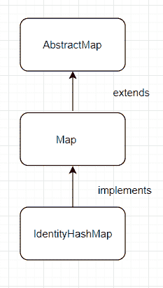

# Java IdentityHashMap 示例

> 原文： [https://javatutorial.net/java-identityhashmap-example](https://javatutorial.net/java-identityhashmap-example)

IdentityHashMap 实现 [Map](https://docs.oracle.com/javase/7/docs/api/java/util/Map.html) 接口，并且当检查为 k1 == k2 时，两个键被认为是相等的（不是通过使用等于方法）。 这本身违反了 Map 的一般合同，这意味着 IdentityHashMap 显然不是而非通用 Map 的实现。 在很多情况下，此类会很有用。


IdentityHashMap 允许空值和空键以及所有可选的映射操作。 但是，此类不能保证顺序会随着时间的推移保持恒定。

就时间复杂度而言，此类为基本操作提供了恒定时间的性能（例如 get 和 put）。

另外，需要注意的是，在必须指定最大大小的意义上，此类不是动态（就像在数组中一样）。 如果地图的大小被充分超过，它将非常昂贵，因此这就是始终提供较大的最大大小的一个好主意。 （比简单的错误要便宜得多！）



IdentityHashMap：实现和扩展的内容。

## IdentityHashMap 中的构造方法

1.  IdentityHashMap（）：创建一个新的身份哈希映射，默认最大大小为 21。
2.  IndetityHashMap（int ExpectedMaxSize）：创建一个具有预期最大大小的新空地图。
3.  IdentityHashMap（Map &lt;？扩展 K，？扩展 V &gt; m）：创建一个新的 Identity，其映射包含与指定映射相同的映射。

## IdentityHashMap 中的方法

1.  void clear（）：从此映射中删除所有映射。
2.  Object clone（）：返回此标识哈希图的副本（重要的是要注意，键和值本身未克隆）。
3.  boolean containsKey（Object key）：如果映射包含指定的键，则返回 true，否则返回 false。
4.  boolean containsValue（Object value）：如果映射包含指定值，则返回 true，否则返回 false。
5.  boolean equals（Object o）：比较指定对象与此映射是否相等。
6.  V get（Object key）：返回指定键所映射到的值；如果映射不包含对该键的映射，则返回 null。
7.  int hashCode（）：返回此映射的哈希码值。
8.  boolean isEmpty（）：如果地图为空，则返回 true，否则返回 false。
9.  V put（K 键，V 值）：将指定值与映射中的指定键关联。
10.  V remove（Object key）：删除到映射中指定键的映射（如果存在）。
11.  int size（）：返回此标识哈希图中的键值映射数。

有关所有方法的文档，请访问 [Oracle 官方文档页面](https://docs.oracle.com/javase/7/docs/api/java/util/IdentityHashMap.html)。

### 使用上述大多数方法的程序示例：

```java
import java.util.Map; 
import java.util.HashMap; 
import java.util.IdentityHashMap; 

public class IdentityHashMapExample  
{ 
    public static void main(String[] args)  
    { 
        Map identityHashMap = new IdentityHashMap(); 

        identityHashMap.put("key", "value");  
        System.out.println("Size of IdentityHashMap: " + identityHashMap.size());  

        identityHashMap.put("key1", "value1");
        System.out.println("Size of IdentityHashMap: " + identityHashMap.size());  

        System.out.println("Does it contain key 'key1': " + identityHashMap.containsKey("key1"));

        System.out.println("Value of key 'key1': " + identityHashMap.get("key1"));

        System.out.println("Size of map before clear: " + identityHashMap.size());

        identityHashMap.clear();

        System.out.println("Size of map after clear: " + identityHashMap.size());
    } 
}
```

**输出：**

```java
Size of IdentityHashMap: 1
Size of IdentityHashMap: 2
Does it contain key 'key1': true
Value of key 'key1': value1
Size of map before clear: 2
Size of map after clear: 0
```