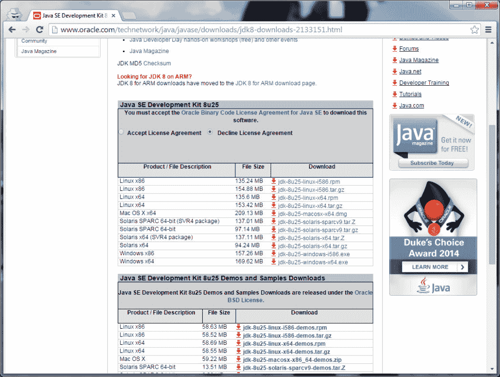

# 简单的 Java 示例

> 原文： [https://javatutorial.net/simple-java-example](https://javatutorial.net/simple-java-example)

本教程将说明如何在计算机上下载和安装 Java。 我们还将向您展示编写有效的 Java 程序有多么简单。

## 下载并安装 Java

Java 可以从 Oracle 网站免费下载。 您需要 Java JDK 才能编写自己的 Java 程序。 JDK 代表 Java Development Kit，它包含完成小型或大型项目所需的一切。

如果您需要在 Ubuntu Linux 或 LinuxMint 上安装 Java，请查看 [Java Ubuntu 安装指南](https://javatutorial.net/install-java-8-jdk-on-ubuntu)

在本教程中，我将向您展示如何安装 Java 版本 8。首先转到 [http://www.oracle.com/technetwork/java/javase/downloads/jdk8-downloads-2133151.html](http://www.oracle.com/technetwork/java/javase/downloads/jdk8-downloads-2133151.html "Java download")

向下滚动到 Java SE Development Kit。



现在，单击操作系统旁边的下载链接以下载安装文件。 请注意，您必须接受许可协议才能执行此操作。 下载后，开始安装并进入安装向导。 注意安装 Java 的路径。

安装向导将在您的计算机上安装 JDK 和 JRE。 JDK 是您需要编写自己的 Java 程序的程序，而 JRE（Java 运行时环境）是在计算机上执行 Java 程序的解释程序。 您需要这两个示例都可以工作。

安装完成后，在 PC（或 Mac 和 Linux 等基于 UNIX 的系统上的终端）上打开命令提示符。 输入

```java
java -version
```

如果该命令返回内部版本号（请参见下面的屏幕截图），则一切正常。


Windows 上的 Java -version 命令的结果

## 您的第一个 Java 程序

现在您可以编写第一个 Java 程序了。 打开您喜欢的文本编辑器程序。 请不要使用 Microsoft Word 之类的程序进行富文本编辑。 使用记事本（或记事本++，UltraEdit，gEdit 等）。

将以下代码写入新文件并将其另存为 MyFirstJavaProgram.java。 注意文件扩展名必须是.java

```java
public class MyFirstJavaProgram {
	public static void main(String[] args) {
		System.out.println("Hello, this is my first java program");
	}
}
```

我们将使用 **javac** （Java 编译器）来构建此程序。 现在再次打开命令提示符并输入：

```java
C:\>d:\Development\Java\jdk8\bin\javac.exe d:\Development\javatutorial.net\MyFir
stJavaProgram.java
```

第一个命令是 javac.exe（java 编译器）的路径，在我的情况下为`D:\Development\Java\jdk8\bin\javac.exe`，第二个命令是您的.java 文件的路径。

您必须知道的一件事-文件名和 Java 类名**必须是相同的**。 在本教程中，它是 MyFirstJavaProgram

现在您可以执行第一个程序了。 仍然在命令提示符下浏览到您的工作文件夹（在我的情况下是`D:\Development\javatutorial.net`），然后键入：

```java
java MyFirstJavaProgram
```

您应该看到以下结果


执行我们的第一个 Java 程序的结果

## 解释守则

现在让我们回到示例的源代码并仔细查看。

```java
public class MyFirstJavaProgram
```

在 Java 中，您需要一个公共类来使程序可执行。 Java 中的所有内容都基于类和接口。 您将在我们的下一个教程中了解有关此的更多信息。

```java
public static void main(String[] args) {
```

这是我们程序的主要方法。 执行程序时，Java 会自动调用它。 在您编写的每个 Java 程序中，它都必须具有上面显示的结构。

```java
System.out.println("Hello, this is my first java program");
```

`System.out.println`在控制台中显示文本，并在其后添加新行。

在我们的下一个教程 [Java Eclipse 教程](https://javatutorial.net/java-eclipse-tutorial "Java Eclipse Tutorial")中，我将向您展示如何使用 Eclipse IDE 简化 Java 程序的代码编写，构建和执行。