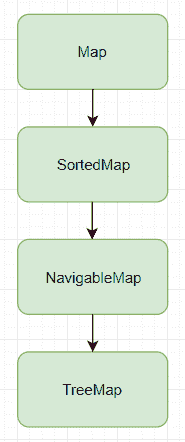

# Java SortedMap 示例

> 原文： [https://javatutorial.net/java-sortedmap-example](https://javatutorial.net/java-sortedmap-example)

SortedMap 接口扩展了[映射](https://docs.oracle.com/javase/7/docs/api/java/util/Map.html)，并确保所有条目都按升序排列（因此，SortedMap）。


如果要按降序排列它，则需要重写 SortedMap 中的 Compare 方法，我们将在稍后进行操作。 [TreeMap](https://javatutorial.net/java-treemap-example) 实现 SortedMap，并按其自然顺序或指定的比较器对键进行排序。在 [TreeMap](https://javatutorial.net/java-treemap-example) 中，不允许使用空键和空值。



## **方法摘要**

1.  比较器&lt;？ super K &gt;比较器（）：返回用于对当前映射中的键进行排序的比较器；如果当前映射使用其键的自然顺序，则返回 null。
2.  Set &lt; Map.Entry &lt; K，V &gt; &gt; entrySet（）：返回当前地图中包含的映射的 Set 视图。
3.  K firstKey（）：返回地图中当前的第一个键（最低还是最高，取决于实现地图的方式（升序还是降序）。
4.  SortedMap &lt; K，V &gt; headMap（K toKey）：返回当前地图中其键严格小于 toKey 的部分的视图。
5.  Set &lt; K &gt; keySet（）：返回当前映射中包含的键的 Set 视图
6.  K lastKey（）：返回地图中当前的最后一个（最高或最低）键
7.  SortedMap &lt; K，V &gt; subMap（K fromKey，K toKey）：返回当前地图的部分 g 的视图，其有效范围从 fromKey 到 toKey
8.  SortedMap &lt; K，V &gt; tailMap（K fromKey）：返回当前地图中键大于或等于 fromKey 的部分的视图
9.  集合&lt; V &gt; values（）：返回当前地图中包含的值的[集合](https://docs.oracle.com/javase/7/docs/api/java/util/Collection.html)视图

有关这些方法的更多详细信息，请查阅官方 [Oracle 文档](https://docs.oracle.com/javase/7/docs/api/java/util/SortedMap.html)。

**代码实现**

```java
import java.util.*;

public class SortedHashMapExample {
   public static void main(String args[]) {
      Map<Double, String> players = new TreeMap<Double, String>();

      // health, name
      players.put(new Double(100.00), "Hill");
      players.put(new Double(120.00), "John");
      players.put(new Double(150.00), "Sabrina");
      players.put(new Double(105.00), "Caitlyn");
      players.put(new Double(110.00), "Rachel");
      players.put(new Double(130.00), "Michael");
      players.put(new Double(140.00), "Mark");

      // get a set of the entries
      Set setOfEntries = players.entrySet();

      // get an iterator
      Iterator iterator = setOfEntries.iterator();

      while(iterator.hasNext()) {
          // create an entry of the map
         Map.Entry entry = (Map.Entry)iterator.next();
         System.out.println("Key: " + entry.getKey());
         System.out.println("Value: " + entry.getValue());
      }
   }
}
```

**输出**

```java
Key: 100.0
Value: Hill
Key: 105.0
Value: Caitlyn
Key: 110.0
Value: Rachel
Key: 120.0
Value: John
Key: 130.0
Value: Michael
Key: 140.0
Value: Mark
Key: 150.0
Value: Sabrina

```

如您所见，它将自动按升序对它们进行分组。 它的生命值从 100.00 开始，直到 150.00。 我将健康作为关键，并将名称作为值的原因只是为了向您表明它提升了他们。

但是，如果我们希望按降序排列它们怎么办？

**使用降序实现**

```java
import java.util.*;

public class SortedHashMapExample {
   public static void main(String args[]) {
      Map<Double, String> players = new TreeMap<Double, String>(new Comparator<Double>() {

        @Override
        public int compare(Double x, Double y) {
          return y.compareTo(x);
        }

      });

      // name, health
      players.put(new Double(100.00), "Hill");
      players.put(new Double(120.00), "John");
      players.put(new Double(150.00), "Sabrina");
      players.put(new Double(105.00), "Caitlyn");
      players.put(new Double(110.00), "Rachel");
      players.put(new Double(130.00), "Michael");
      players.put(new Double(140.00), "Mark");

      // get a set of the entries
      Set setOfEntries = players.entrySet();

      // get an iterator
      Iterator iterator = setOfEntries.iterator();

      while(iterator.hasNext()) {
          // create an entry of the map
         Map.Entry entry = (Map.Entry)iterator.next();
         System.out.println("Key: " + entry.getKey());
         System.out.println("Value: " + entry.getValue());
      }
   }
}
```

**输出**

```java
Key: 150.0
Value: Sabrina
Key: 140.0
Value: Mark
Key: 130.0
Value: Michael
Key: 120.0
Value: John
Key: 110.0
Value: Rachel
Key: 105.0
Value: Caitlyn
Key: 100.0
Value: Hill
```

妳去 再简单不过了吧？ 我们所做的只是覆盖比较方法，而不是 x = &gt; y（升序），我们将其更改为 y = &gt; x（降序）。