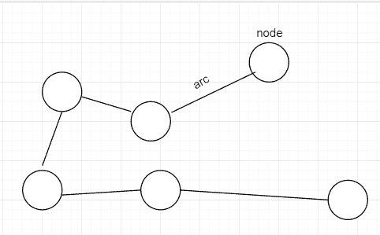
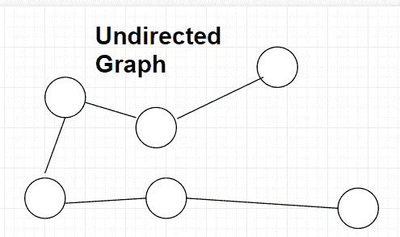
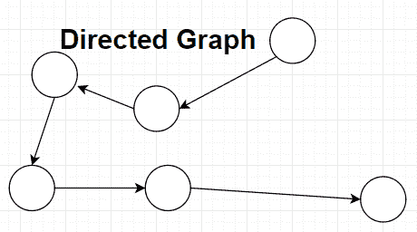

# 图形 Java 示例

> 原文： [https://javatutorial.net/graphs-java-example](https://javatutorial.net/graphs-java-example)

图形通常由顶点和弧线组成。 有时，它们也称为节点（而不是顶点）和边缘（而不是弧）。 为了本教程的缘故，我将使用节点和边作为参考。


图通常看起来像这样：



图形可视化

在许多情况下，节点和边被分配了值。 一个非常有用的图的著名示例是，当节点代表城市并且边沿代表这两个节点（或与此有关的城市）之间的距离时。 这样的例子可以在下面看到：


从上图判断，很容易理解它代表什么，也很容易阅读。 芝加哥到纽约的距离是 791.5 英里，纽约和华盛顿特区的距离是 227.1 英里。

这只是一个简单的示例，说明如何使用图形很有用，但是还有更多示例。

图的其他有用示例可能是表示家谱，facebook 联系人，甚至是旅行路线。

## 无向图

当图形无向时，这意味着可以在两个方向上遍历边。



无向图

## 有向图

定向图形时，这意味着只能沿其“指向”的方向遍历这些边缘。



有向图

## Java 中的图实现

**Node.java**

```java
import java.util.*; 

public class Node {
    private int id;
    private List<Edge> neighbours = new ArrayList<Edge>();

    public int getNodeId() {
        return this.id;
    }

    public void addNeighbour(Edge e) {
        if(this.neighbours.contains(e)) {
            System.out.println("This edge has already been used for this node.");
        } else {
            System.out.println("Successfully added " + e);
            this.neighbours.add(e);
        }
    }

    public void getNeighbours() {
        System.out.println("List of all edges that node " + this.id +" has: ");
        System.out.println("=================================");
        for (int i = 0; i < this.neighbours.size(); i++ ){
            System.out.println("ID of Edge: " + neighbours.get(i).getId() + "\nID of the first node: " + neighbours.get(i).getIdOfStartNode() + 
            "\nID of the second node: " + neighbours.get(i).getIdOfEndNode());
            System.out.println();
        }
        System.out.println(neighbours);
    }

    public Node(int id) {
        this.id = id;
    }
}
```

Node.java 有 3 个方法和 1 个构造函数。

**getNodeId（）**仅返回每个节点的 ID。

**addNeighbour（Edge e）**通过边缘创建连接，该边缘作为参数传递到另一个节点。 这是通过将指定的边添加到 Node 类的边列表中来完成的。 **注意**，存在一个 if 条件，用于检查此节点的当前边缘中是否已经存在指定的边缘 **e** 。

**getNeighbours（）**仅用于显示目的。 查看**输出**，以查看此方法显示信息的精确程度。

构造函数将 **id** 作为参数。

**Edge.java**

```java
public class Edge {
    private Node start;
    private Node end;
    private double weight;
    private int id;

    public int getId() {
        return this.id;
    }

    public Node getStart() {
        return this.start;
    }

    public int getIdOfStartNode() {
        return this.start.getNodeId();
    }

    public Node getEnd() { 
        return this.end; 
    }

    public int getIdOfEndNode() {
        return this.end.getNodeId();
    }

    public double getWeight() {
        return this.weight;
    }

    public Edge(Node s, Node e, double w, int id) {
        this.start = s;
        this.end = e;
        this.weight = w;
        this.id = id;
    }
}

```

Edge.java 有 6 个方法和 1 个构造函数。

**getId（）**仅返回当前边的 ID。

**getStart（）**返回边缘从其开始的 Node 对象。

**getIdOfStartNode（）**返回边缘从其开始的 Node 对象的 ID。

**getEnd（）**返回边缘“停止”在的 Node 对象。

**getIdOfEndNode（）**返回边缘“停止”在的 Node 对象的 ID。

**getWeight（）**获取当前 Node 对象的权重。

**Edge** 构造函数采用 4 个参数，并使用它们初始化构造函数。

**Graph.java**

```java
import java.util.*;

public class Graph {
    private List<Node> nodes = new ArrayList<Node>();
    private int numberOfNodes = 0;

    public boolean checkForAvailability() { // will be used in Main.java
        return this.numberOfNodes > 1;
    }

    public void createNode(Node node) {
        this.nodes.add(node);
        this.numberOfNodes++; // a node has been added
    }

    public int getNumberOfNodes() {
        return this.numberOfNodes;
    }
}
```

Graph.java 只有 3 个方法，没有构造函数。

**checkForAvailability（）**检查是否有多个节点。 如果节点数不超过 1 个，则无法建立连接，因为节点本身不能具有优势。 它**必须**与另一个节点建立连接。

**createNode（Node node）**接受类型为 Node 的参数，并将该节点添加到节点 List 中。 添加节点后，当前图形会将节点数增加 1。这样，我们就可以在某个时候将 **checkForAvailability（）**方法评估为 true。

**getNumberOfNodes（）**返回节点数。

**Main.java**

```java
public class Main {
    public static void main(String args[]) {
        Graph graph = new Graph();

        Node node1 = new Node(1); // create a new node that contains id of 1
        Node node2 = new Node(2); // create a new node that contains id of 2
        Node node3 = new Node(3); // create a new node that contains id of 3

        graph.createNode(node1); // numberOfNodes should increment by 1
        graph.createNode(node2); // numberOfNodes should increment by 1
        graph.createNode(node3); // numberOfNodes should increment by 1

        Edge e12 = new Edge(node1, node2, 5, 1); // create an edge that connects node1 to node2 and contains weight of 5
        Edge e13 = new Edge(node1, node3, 10, 2); // create an edge that connects node1 to node3 and contains weight of 10

        if (graph.checkForAvailability()) {
            // two nodes can be connected via edge
            node1.addNeighbour(e12); // connect 1 and 2 (nodes)
            node1.addNeighbour(e13);
            node1.getNeighbours();
        } else {
            System.out.println("There are less than 2 nodes. Add more to connect.");
        }
    }
}

```

Main.java 只有一个 main 方法。

在 main 方法中创建一个图形。 之后，将创建 3 个 Node 实例。 然后，使用 **createNode（Node 节点）**方法将这些 Node 实例添加到图形中。 之后，将创建 2 个 Edge 实例。 第一个将节点 1 连接到节点 2。第二个将节点 1 连接到节点 3。

此后，存在一个 if 条件，该条件检查节点数是否大于 1，如果超过，则将“ Neighbour”添加​​到 node1。 （e12 是连接 node1 和 node2 的边缘。）（e13 是连接 node1 和 node3 的边缘）。

**输出**

```java
Successfully added Edge@15db9742
Successfully added Edge@6d06d69c

List of all edges that node 1 has:
=================================
ID of Edge: 1
ID of the first node: 1
ID of the second node: 2

ID of Edge: 2
ID of the first node: 1
ID of the second node: 3

[Edge@15db9742, Edge@6d06d69c]
```

**可视化以上输出：**


**问题：**是上述程序生成的**无向**还是**有向**图？ 如果它生成未定义的**图**，您可以修改 API 来生成**定向的**图吗？ 如果生成**有向**图形，您是否可以修改 API 以生成**无向**一个？

**答案：**上面的图产生一个**定向的**图，因为顾名思义，弧线“指向”某个位置。 要使其成为**无向**，您只需删除圆弧的“箭头”，然后将其作为一条简单的线即可。 就像下面的图片代表**无向**图一样。