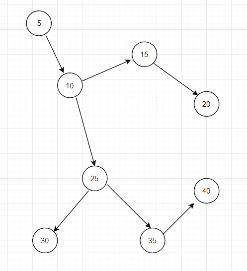

# Java 深度优先搜索示例

> 原文： [https://javatutorial.net/depth-first-search-example-java](https://javatutorial.net/depth-first-search-example-java)

当涉及从 Java 中的给定数据结构访问数据时，搜索和/或遍历同样重要。 图和树是可以使用不同方法搜索和/或遍历的数据结构的示例。


深度优先搜索（简称 DFS）从一个未访问的节点开始，然后开始选择一个相邻节点，直到没有剩余节点为止。 执行完该“过程”之后，您将回溯到另一个选择节点的选择，如果没有，则只需选择另一个未访问的节点即可。

## 使用栈实现



上图访问的节点的顺序为：5 10 25 30 35 40 15 20

### 使用栈数据结构实现 DFS

`Node.java`代表上图中的每个“球”或“圆”。 它有一个**值** ，它代表每个球的“值”。 它也有一个名为`Visited`的布尔变量，顾名思义，它表示遍历是否访问了`Node`。 第三个实例变量`Node`类具有一个`ArrayList`，它表示当前节点与的所有相邻节点（或相邻节点）。 （如果您想了解有关`ArrayList`的更多信息，可以查看[本教程](https://javatutorial.net/java-arraylist-example)。）

就此类中的方法而言，有一个简单的构造函数（该函数接受一个值并创建一个空的`ArrayList`），Setter 和 Getter 方法以及允许添加相邻`Node`的方法。

`Node.java`

```java
import java.util.*;

public class Node{
    private int val;
    private boolean visited;
    private List<Node> adjecents;

    public Node(int val) {
        this.val = val;
        this.adjecents = new ArrayList<>();
    }

    public void addAdjecents(Node n) {
        this.adjecents.add(n);
    }

    public List<Node> getAdjacenets() {
        return adjecents;
    }

    public int getVal() {
        return this.val;
    }

    public boolean isVisited() {
        return this.visited;
    }

    public void setVal(int v) {
        this.val = v;
    }

    public void setVisited(boolean visited) {
        this.visited = visited;
    }
}
```

`DFS.java`

此类只有一种方法：解决方案。

它使用栈数据结构，并以节点为元素。 它将指定的元素添加到节点，然后将其标记为已访问。 在那之后，有一个`while`循环，不断检查栈是否为空。 如果不是，则从栈中删除一个元素，获取要删除的元素的邻居。 然后，存在另一个循环，其目的是将每个邻居节点标记为已访问，并将该邻居节点添加到栈中。

```java
import java.util.*;

public class DFS {
    public void stackSolution(Node node) {
		Stack<Node> DFS_stack = new Stack<Node>();
		DFS_stack.add(node);
		node.setVisited(true);
		while (!DFS_stack.isEmpty()) {
			Node nodeRemove = DFS_stack.pop();
			System.out.print(nodeRemove.getVal() + " ");

			List<Node> adjs = nodeRemove.getAdjacenets();
			for (int i = 0; i < adjs.size(); i++) {
				Node currentNode = adjs.get(i);
				if(currentNode != null && !currentNode.isVisited()) {
					DFS_stack.add(currentNode);
					currentNode.setVisited(true);
				}
			}
		}
	}
}
```

`Main.java`

在此类中，主要方法是创建`Node`类的 8 个实例并传递一些值。 （请记住，下面的示例使用上图（图像）。我们将不同的节点作为邻居添加到不同的节点。此后，我们从`node5`开始并遍历它）。

```java
import java.util.*;

public class Main {
    public static void main(String [] args) {
        Node node5 = new Node(5);
        Node node10 = new Node(10);
        Node node15 = new Node(15);
        Node node20 = new Node(20);
        Node node25 = new Node(25);
        Node node30 = new Node(30);
        Node node35 = new Node(35);
        Node node40 = new Node(40);

        node5.addAdjecents(node10);
        node10.addAdjecents(node15);
        node15.addAdjecents(node20);
        node10.addAdjecents(node25);
        node25.addAdjecents(node35);
        node35.addAdjecents(node40);
        node25.addAdjecents(node30);

        DFS demo = new DFS();

        System.out.println("DFS traversal of above graph: ");
        demo.stackSolution(node5);
    }
}
```

**输出：**

```java
DFS traversal of above graph:
5 10 25 30 35 40 15 20
```