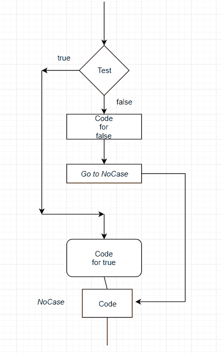
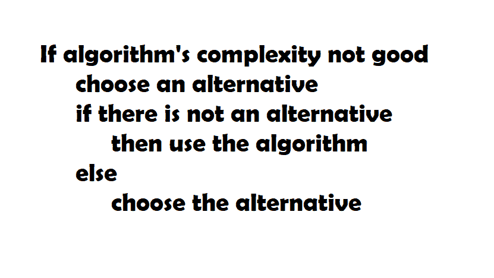
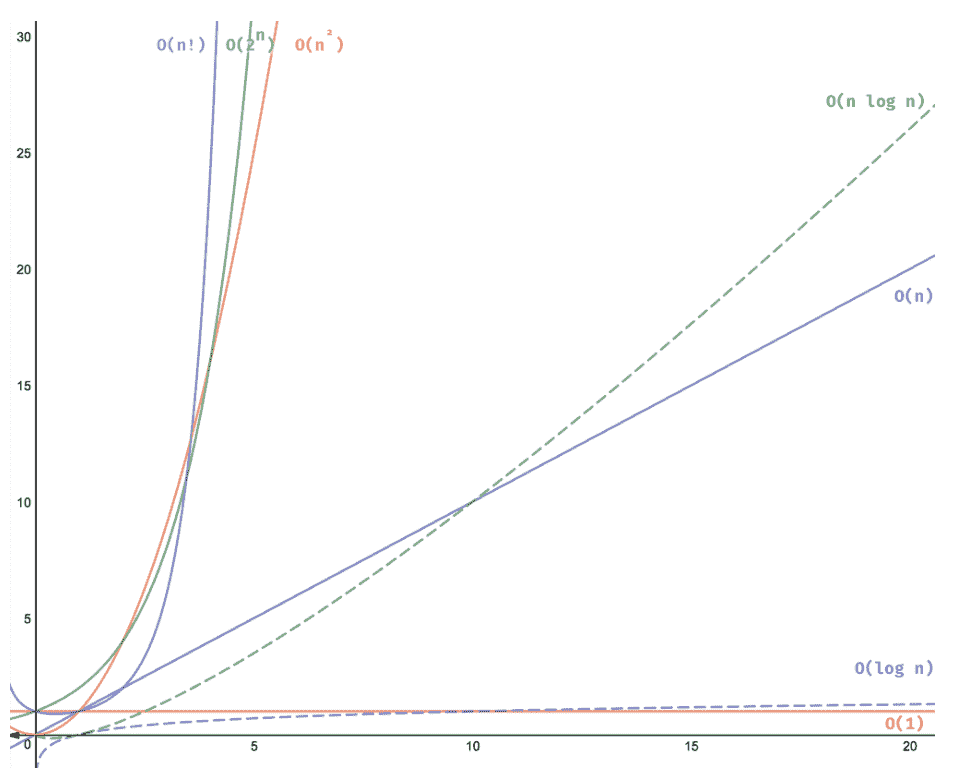

# 不同的算法时间复杂度

> 原文： [https://javatutorial.net/algorithm-time-complexities](https://javatutorial.net/algorithm-time-complexities)

在开始解释不同的时间复杂度之前，让我们首先看一下实际的算法是什么。


算法的正式定义是“在计算或其他解决问题的操作（尤其是计算机）中要遵循的过程或规则集”。 因此，换句话说，算法是定义的路径，例如计算机使用该算法来完成给定问题的解决方案。



算法工作流程

尽管听起来很简单且不复杂，但事实恰恰相反。 许多算法要花费大量时间才能完成某件事，而有些则没有。 这就是为什么了解给定算法的**复杂度**非常重要的原因。 那是因为通过了解算法的复杂度，可以使我们了解算法的“价值”，或者说效率如何。

算法示例：

*   图片搜寻
*   语音输入
*   意见建议
*   谷歌地图
*   谷歌新闻
*   等等



具有讽刺意味的算法示例

## 不同类型的算法复杂度

*   ### 恒定时间：O（1）

如果时间量不取决于输入大小，则可以说算法大小以恒定时间运行。

一个例子是从数组访问元素。 您只需“调用”数组的索引即可访问数组的元素。

*   ### 线性时间：O（n）

线性时间是指算法取决于的输入大小。 如果输入大小为 n ，则复杂度也将为 n。

具有这种时间复杂度的算法的一个著名示例是线性搜索。

*   ### 对数时间：O（log n）

如果执行时间与输入大小的对数成正比，则可以说该算法以对数时间运行。

这种时间复杂度的算法的一个著名示例是 Binary Search。

*   ### 二次时间：O（n &lt;sup&gt;2&lt;/sup&gt; ）

二次时间是指执行时间为输入大小的平方。

例如冒泡排序，选择排序，插入排序。

*   ### “大欧米茄”的定义

大欧米茄，也称为下界，用Ω符号表示。

## 大（O）

如果执行时间与输入大小的对数成正比，则可以说该算法以对数时间运行。 例如，如果 Java 中有一个数组，其中包含 5 个苹果，并且您需要打印每个苹果，则该数组将为 O（5）或换句话说，为 O（数组的长度）或 O（n）。

这种时间复杂度的算法的一个著名示例是 Binary Search。

## 大西塔

如果 T（n）是Θ（f（n）），则意味着 T（n）增长（精确）与 f（n）一样快。 n + n 仍然是 n。 是不是有点满嘴？ 让我们尝试一个更简单的解释。

您可以将 Big Theta 视为：

“花费的时间不会超过且不短于”

## 如何确定给定程序的复杂度

```java
int sumArray(int[] aiNumbers)
{
   int iSum = 0;
   for (int i=0; i<aiNumbers.length; i++)
      iSum += aiNumbers[i];
   return iSum;
}
```

该程序的复杂度只是 aiNumbers.length。 因此，如果此数组的长度为 4，则复杂度为 4。如果 aiNumbers.length 为 6，则复杂度为 6。

复杂度是 aiNumbers.length 的原因是因为它会循环 aiNumbers.length 次。 因此，复杂度为 O（N）。

```java
N = in.length;
i = 0;
while (i < N) { 
   for (int i=N-2; i<N; i++) {
      System.out.println("Do something.");
   }
}
```

上面程序的复杂度为 N * N，即 N 乘以 2 的幂。这是因为 for 循环每次将运行 N 次，而整个循环将运行 N 次。 因此，N *N。因此，该算法的复杂度是二次（O（n &lt;sup&gt;2&lt;/sup&gt; ））

```java
for (int i = 0; i < n; i++) {
   // do something
}

for (int i = 0; i < n; i++) {
   // do something
}
```

在上面的示例中，算法的时间复杂度为 n 。 这样做的原因是因为有 2 个循环 n 次循环– n + n。 简而言之，n + n 就是 n 。

## 每种算法的可视化表示



视觉修复

图片来源： [https://adrianmejia.com/most-popular-algorithms-time-complexity-every-programmer-should-know-free-online-tutorial-course/](https://adrianmejia.com/most-popular-algorithms-time-complexity-every-programmer-should-know-free-online-tutorial-course/)

在算法和复杂度方面，请尽可能尝试优化算法。 这样做的一个好方法是使用集合等在输入数据中找到共同点。请记住：内存很昂贵，您的时间也很昂贵。