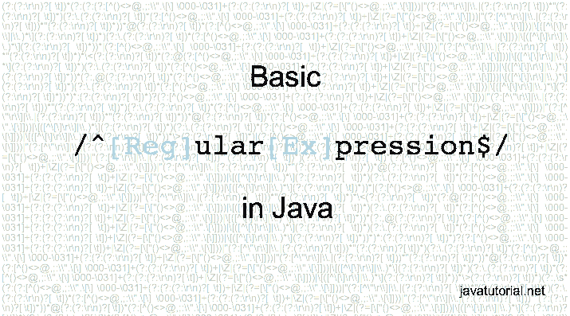

# Java 基本正则表达式

> 原文： [https://javatutorial.net/basic-java-regular-expressions](https://javatutorial.net/basic-java-regular-expressions)

今天，我将向您展示正则表达式的基础知识以及如何在 Java 中使用它们。

这不会是详尽且详细的**正则表达式教程**。 正则表达式本身就是一个巨大的话题。 我将仅向您展示基础知识，因此您可以快速开始在项目中使用正则表达式。 没有冗长的解释，没有仓促……仅举几个例子，您就可以开始了。



## 字符串类中的正则表达式方法

Java 8 中的 String 类具有一些使用正则表达式（或 regex）的方法。 这是此方法的列表。 有关更多详细信息，您可以在中检查[字符串 javadoc。](https://docs.oracle.com/javase/8/docs/api/java/lang/String.html)

*   **boolean String.matches（String regex ）** –判断此字符串是否与给定的正则表达式匹配
*   **字符串 replaceAll（字符串正则表达式，字符串替换）** –用给定的替换项替换与给定的正则表达式匹配的此字符串的每个子字符串
*   **字符串 replaceFirst（字符串正则表达式，字符串替换）** –用给定的替换替换与给定的正则表达式匹配的此字符串的第一个子字符串
*   **String [] split（String regex ）** –围绕给定正则表达式的匹配项拆分此字符串
*   **String [] split（字符串正则表达式， int 限制）** –围绕给定正则表达式的匹配项拆分此字符串。 模式被“限制”应用了次数

## 匹配一个字符

假设我们有以下字符串：“你好，是我”，我们想用空格分隔其中的单词。

```java
String str = "Hello, it's me";
String[] words = str.split(" ");
for (String word : words) {
	System.out.println(word);
}
```

这将产生以下输出

```java
Hello,
it's
me
```

但是，如果我们像这样在“它”和“我”之间放置两个空格怎么办：“你好，它是我”？

我们程序的输出将是：

```java
Hello,
it's

me
```

那么如何避免这种情况呢？ 继续阅读，您会发现🙂

## 重复

+号表示在同一行中匹配 1 个或多个。

让我们回到前面的示例“你好，它是我”，在“它”和“我”之间有两个空格。

在我们的代码中，我们将模式更改为“ +”。 在这种情况下，我们将连续匹配 1 个或多个空格

```java
String str = "Hello, it's  me";
String[] words = str.split(" +");
for (String word : words) {
	System.out.println(word);
}
```

输出为：

```java
Hello,
it's
me
```

## 连接

使用正则表达式，我们可以连续匹配一个字符串或多个字符，并以此作为正则表达式模式。 例如，模式“ ing”将匹配如下：

“赚取和钱很容易，因为和算是 1 233。不！！”

换句话说，如果在我们的字符串中提供“ ing”，则该字符串匹配。

## 结合连接和重复

模式：“ ar +”将匹配

“ 和欠 ar e 的速度不如子弹快”

## 匹配零个或多个

模式：“ it *”将匹配

“ 很有趣，只需在计算机正面学习 itti ng 和”

*（星号）将匹配“ i”，后跟零个或多个“ t”。 在我们的示例中，它将匹配“ it”，“ itt”，“ i”，“ i”

## 交替

模式：“ ea | in”将匹配

“ g 中的或 rn 等于 g 中的计数 sy 1 233。不！！”

| （竖线符号）将匹配“ ea”或“ in”。

## 字符类

模式：“ [123]”将匹配

“赚钱很容易，只需计算 1 2 33 即可。 不！

[]匹配集合中的任何字符

## 匹配范围

模式：“ [1-3]”将匹配

“赚钱很容易，只需计算 1 2 33 即可。 不！

模式：“ [a-f]”将匹配

“ E 和表示为 e y 是 a sy a 计数为 1 233。N a H！

## 排除字符

模式：“ [^ a-z123]”将匹配

“ E 赚钱很容易，因为计算 1 2 33 。 N 啊！

^表示此集合中没有任何字符

## 验证电子邮件地址正则表达式

我将举一个示例，说明如何使用 Java 验证电子邮件地址。 这更复杂，但常用的正则表达式模式：

```java
^[_A-Za-z0-9-\\+]+(\\.[_A-Za-z0-9-]+)*@[A-Za-z0-9-]+(\\.[A-Za-z0-9]+)*(\\.[A-Za-z]{2,})$;
```

和实现：

```java
String email = "info@javatutorial.net";
if (email.matches("^[_A-Za-z0-9-\\+]+(\\.[_A-Za-z0-9-]+)*@[A-Za-z0-9-]+(\\.[A-Za-z0-9]+)*(\\.[A-Za-z]{2,})$;")) {
	System.out.println(email + "is a valid e-mail address");
} else {
	System.out.println(email + "is invalid e-mail address");
}
```