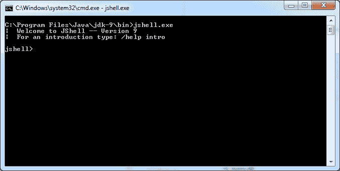
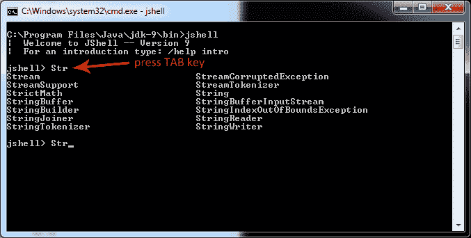
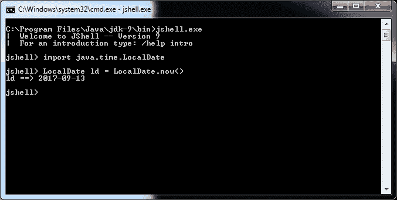
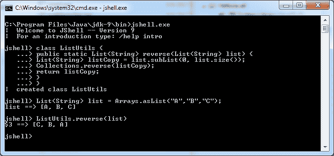

# Java 9 JShell 示例

> 原文： [https://javatutorial.net/java-9-jshell-example](https://javatutorial.net/java-9-jshell-example)

本教程说明了如何在 Java 9 中使用 JShell 工具

JShell 工具（也称为 REPL（读取评估打印循环））使您能够执行 Java 代码，并立即获得结果。 您可以快速评估表达式或简短的算法，而无需创建，编译或构建新项目。 借助 JShell，您可以执行表达式，使用导入，定义类，方法和变量以及使用导入。 请注意，JShell 是 [Java 9 JDK](https://javatutorial.net/install-java-8-jdk-on-ubuntu) 的一部分，而不是 JRE。

## 启动 JShell

打开控制台或终端（取决于您的操作系统）。 浏览到 Java 9 JDK 安装文件夹，然后将`cd`放入/ bin 文件夹。 运行 jshell 可执行文件– jshell.exe（如果在 Windows OS 上运行）



启动 JShell

## 简单的算术运算

使用 JShell，您可以通过将其输入为数学表达式来轻松测试算术运算。 以下示例演示了此概念。 您无需将分号（;）放在行尾


JShell 算术运算

注意 37/2 = 18 的输出。之所以发生这种情况，是因为 JShell 将 37 视为 Integer，因此结果强制转换为（int）。 将小数点加到 37 将产生 Double 结果

## JShell 内部变量

JShell 通过打印输入结果为您提供即时反馈。 例如：

```java
jshell> 1 + 3
$1 ==> 4
```

表达式 1 + 3 的结果为 4。JShell 还将此值分配给内部变量 **$ 1** 。 进一步的命令被分配给递增的$变量，例如$ 2，$ 3 等。

以下屏幕截图演示了 JShell 内部变量的用法：


jshell 内部变量

您可以通过输入内部变量的名称来打印它的值，如下所示：

```java
jshell> $1
$1 ==> 4
```

您可以为内部变量分配一个新值：

```java
jshell> $1 = 20
$1 ==> 20
```

表达式 1 + 3 会生成一个整数，对吗？ 那么，如果您尝试为不同类型的内部变量分配值，会发生什么？ 让我们尝试为$ 1 变量赋双精度值 15.8

```java
jshell> $1 = 15.8
```

如您在上面的屏幕截图中所见，这解决了“不兼容的类型错误”。 创建内部变量后，无法再更改类型。

内部变量不仅用于存储基本类型。 它们还可以处理对象。 在以下示例中，我们创建一个 String 类型的内部变量：

```java
jshell> new String("Hello")
$4 ==> "Hello"
```

## JShell 自动完成

JShell 具有内置的自动完成功能（也称为 Tab 补全功能），通过该功能，您只需按 Tab 键就可以最小化键入。 开始键入并按 Tab 键。 这将完成您开始键入的单词（如果只有一个选项可用）或显示可能的选项列表。 看下面的例子。 我们开始输入“ Str”，然后按 Tab 键：



jshell 自动完成功能

## JShell 自定义导入

默认情况下，以下软件包被导入到 JShell 中：

*   java.io. *
*   java.math。*
*   java.net。*
*   java.nio.file。*
*   java.util。*
*   java.util.concurrent。*
*   java.util.function。*
*   java.util.prefs。*
*   java.util.regex。*
*   java.util.stream。*

提示：您可以使用/ imports 命令列出导入

您可以轻松导入 Java SE 中的软件包。 如果要查找软件包名称，请检查[官方 Java 9 SE javadoc 网站](https://docs.oracle.com/javase/9/docs/api/jdk.javadoc-summary.html)

下面的示例演示如何导入 **java.time** .LocalDate 以创建新的 LocalDate 对象



jshell 定制导入

## JShell 示例程序

测试 List 反向方法的典型 Java 类如下所示：

```java
import java.util.Arrays;
import java.util.Collections;
import java.util.List;

public class ListUtils {
	public static void main(String[] args) {
		List<String> list = Arrays.asList("A", "B", "C");
		System.out.println(reverse(list));
	}

	public static List<String> reverse(List<String> list) {
		List<String> listCopy = list.subList(0, list.size());
		Collections.reverse(listCopy);
		return listCopy;
	}
}
```

上面显示的代码具有导入，main 方法和 System.out.println（）来显示结果。 我们可以在 JShell 中跳过所有 3 个。 这就是我们可以使用 JShell 测试相同功能的方法：



jshell 的例子

您将在上面的示例中注意到，我们照常创建类。 此外，我们的输入列表是在类之外创建的。 创建列表后查看立即输出，显示其值

```java
list ==> [A, B, C]
```

现在我们只在类中调用 Utility 方法

```java
jshell> ListUtils.reverse(list)
```

并显示结果输出：

```java
$3 ==> [C, B, A]
```

## 如何退出 JShell

您可以随时输入以下内容退出 jshell

```java
jshell> /exit
```

或按 Ctrl + C

您在此处找到的许多教程都是基于 Edward Lavieri 博士和 Peter Verhas 撰写的 [Mastering Java 9](https://www.amazon.com/Mastering-Java-reactive-modular-concurrent/dp/1786468735/ref=sr_1_3?ie=UTF8&qid=1520921208&sr=8-3&keywords=mastering+java+9) 。 本书将为您提供对 Java 9 新概念和工具的完整而深刻的理解。

如果您喜欢我的帖子或有任何问题/建议/类型错误，请给我评论。

感谢您阅读我的教程。

Java SE 9 学习愉快！