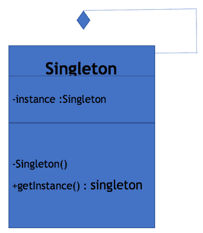

# Java Singleton 设计模式示例

> 原文： [https://javatutorial.net/java-singleton-design-pattern-example](https://javatutorial.net/java-singleton-design-pattern-example)

众所周知，设计模式是为解决特定问题而创建的。 Singleton 解决了仅创建一个类的一个对象的问题。 单例设计模式是最流行的设计模式之一，它限制任何类只能有一个对象。 并在需要时使用该对象。 在某些情况下，我们只需要一个类的对象，例如对于数据库连接，我们只需要一个对象来处理与查询相关的每个数据库，而不是每次都创建新对象。 我们仅创建一个数据库连接对象并为其分配全局访问权限，因此可以在任何地方访问它。

## 急切初始化的单例设计模式

顾名思义，**急于初始化**意味着在实际需要一个类的实例之前就已经创建了该实例。 通常，它是在系统启动时完成的。 在热切的初始化单例模式中，无论是否有其他类实际请求其实例，都将创建单例实例。 这种方法效果很好，但是有一个缺点。 不论是否在运行时都需要创建实例。 如果此实例不是大对象，并且您可以在不使用它的情况下生存下去，那么这是最好的方法。

## 具有延迟初始化的 Singleton 设计模式

正如我们非常了解**延迟初始化**一样，它仅遵循延迟人的逻辑，他从来不做任何事情，直到它迫切需要时为止，这与延迟初始化相同。 类的对象仅在需要时才创建，而不像上面那样。 因此，在单例对象中，仅在第一次需要创建对象时才创建一次。

## 使用 Singleton 设计模式的好处

**节省内存**：很明显，每当我们创建任何类的对象时，它都会占用内存空间，因此创建许多对象意味着会占用更多内存空间。 由于单例类可能只有一个对象，因此可以节省内存。

**灵活性**：由于实例化过程是由类控制的，因此，类具有更改实例化过程的灵活性。

## 此设计模式的工作方式

单例模式具有私有构造函数，因为我们知道私有只能访问其类。 因此，它限制了在类之外创建类的对象。

单例模式具有静态成员，因为静态成员仅在内存中获得一次空间。 并且此成员包含单例类的实例。

最后，单例模式具有静态工厂方法，该方法可以全局访问仅单例对象。 它负责将对象返回给调用者，以便他们可以使用它。

## 单例设计模式的现实生活场景

由于我们大家都对大学非常熟悉，其结构，几乎每个人都上过大学。 在设计大学管理系统时，副校长班将是单身。 因为一所大学只有一名语音校长，所以副校长的角色不能超过一个。 将有员工班级，员工可以是老师，牡丹，实验室助理等。  所有这些都可以具有多个对象，因为任何一所大学中都有许多老师，牡丹，实验室助手。 但是只有一位副总裁，因此通过使用 Singleton 模式，我们可以对其进行限制。

## 单例模式图



上图显示并说明了单例模式的实现

## 渴望的单例设计模式 Java 示例

```java
public class EagerSingleton {

    // private static member of class which holds the object of the class.
    private static EagerSingleton instance = new EagerSingleton ();

    // private constructor
    private EagerSingleton () {
    }

    //public method which is responsible making the global access of object  
    public static EagerSingleton get Instance () {
        return instance;
    }
}

```

## 渴望的单例设计模式 Java 示例

```java
public class Lazy Singleton {

    // private static member which will hold the object when initialized
    private static Lazy Singleton instance = null;

    // private constructor
    private LazySingleton () {
    }

    // While any request comes it checks when object is created already or else it creates
    // return the object 
    public static LazySingleton getInstance () {
        if (instance == null) {
            synchronized (LazySingleton.Class) {
                // Double check
                if (instance == null) {
                    instance = new LazySingleton ();
                }
            }
        }
        return instance;
    }
}
```